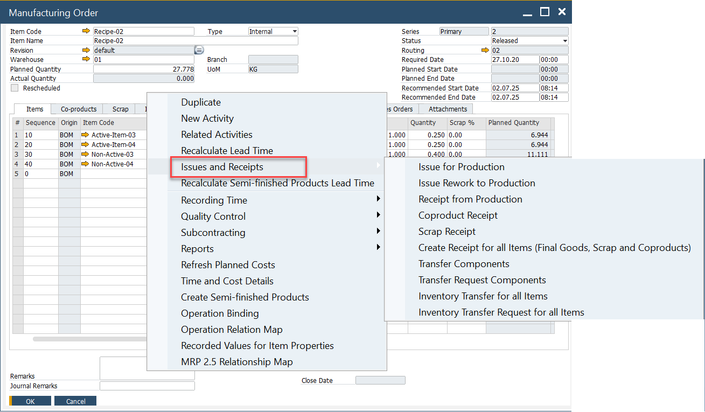
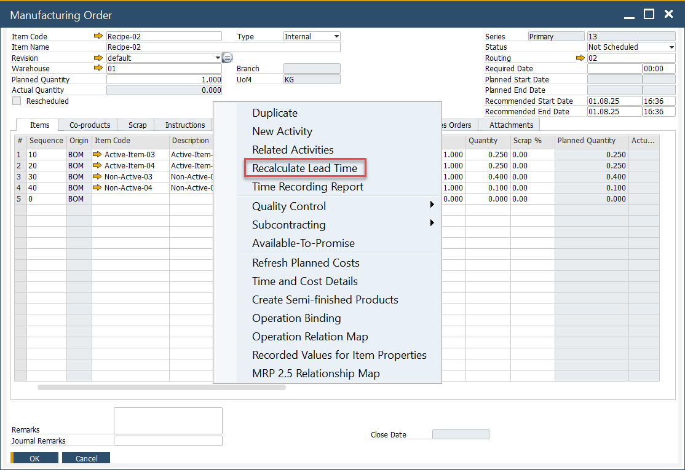
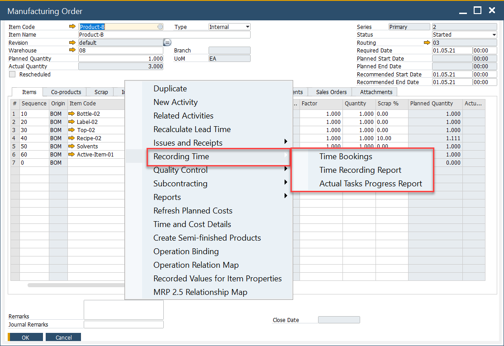
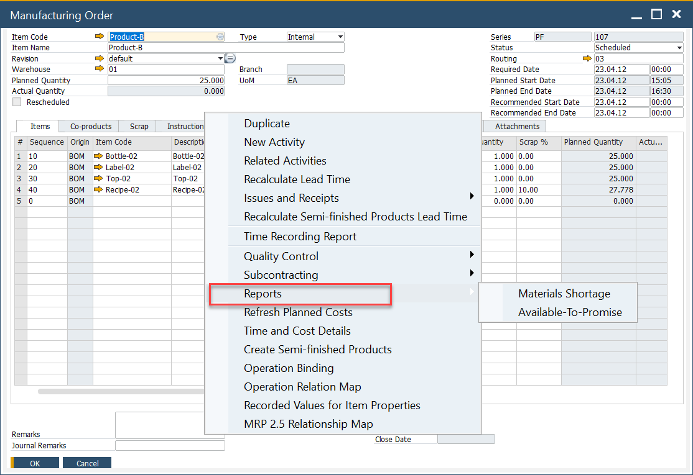
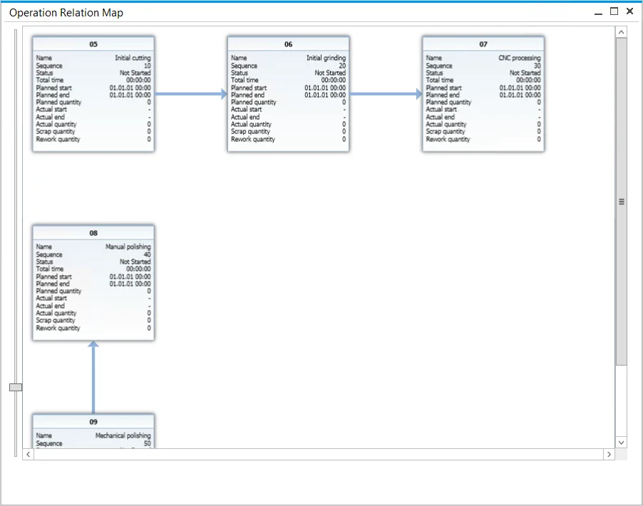

# Manufacturing Order Menus

The **Manufacturing Order (MO) menus** provide quick access to essential functions for managing production. Right-clicking on a Manufacturing Order opens a context menu with options for inventory handling, scheduling, time recording, reporting, and visualizing operation dependencies.  

This section outlines the available menus and their functionality.

---

## Issues and Receipts

The **Issues and Receipts** submenu handles all inventory-related processes, including material issues, receipts, and transfers.  
> **Note:** The Manufacturing Order must be in **Released** or **Started** status to use these functions.  

## Scheduling

The **Scheduling** menu provides tools to plan and manage production timelines, ensuring tasks are aligned with required dates.  

    

## Recording Time

The **Recording Time** menu allows users to log time spent on manufacturing tasks directly against the MO.  

    

### Actual Tasks Progress Report

From this option, users can view a list of active CompuTec PDC tasks. It gives real-time insights into ongoing work and is available when the MO is in **Released**, **Started**, or **Finished** status.  

## Reports

The **Reports** menu provides access to detailed production-related reports, enabling better visibility and analysis of manufacturing performance.  

    

## Operation Relation Chart

Selecting **Operation Relation Map** from the context menu opens a graphical chart that displays how operations in a Manufacturing Order are connected.

- Operations usually follow a linear sequence, where one step must be completed before the next begins.  
- The chart also supports more advanced structures, where operations may run **in parallel** or follow **custom dependencies**.  

### Operation Tile

Each operation is displayed as a tile containing essential details:

- Operation name and sequence number  
- Current status  
- Planned and actual start/end times  
- Total work period  

#### Operation Quantity

The latest application version introduces additional fields for operation-related **quantities**, improving the accuracy of production tracking.  

---
