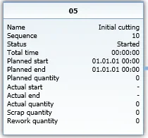

# Manufacturing Order Menus

Manufacturing Order menus provide a range of essential functions to manage production processes efficiently. Right-clicking within a Manufacturing Order opens a context menu with several key options, allowing users to navigate through inventory management, scheduling, time recording, reports, and operation relationships. Below is an overview of the available menu options.

---

## Issues and Receipts

This submenu provides access to all inventory-related functions, including material issues, receipts, and transfers. Note that the Manufacturing Order must be in Released or Started status to use these options.

## Scheduling

The Scheduling menu offers tools to plan and manage production timelines effectively.

    

## Recording Time

The Recording Time option allows users to track time spent on various manufacturing tasks.

    

### Actual Tasks Progress Report

This option opens a form displaying active CompuTec PDC tasks, providing real-time insights into ongoing work. It is accessible when the Manufacturing Order is in Released, Started, or Finished status.

## Reports

Users can generate detailed production-related reports from the Reports menu.

    

## Operation Relation Chart

To access this option, select Operation Relation Map from the Manufacturing Order's context menu.

This chart provides a visual representation of the operations involved in a specific Manufacturing Order. It illustrates the sequence of tasks within the production process, where operations typically follow a linear progression - one operation completes before the next begins. However, the chart also supports more complex relationships where operations may run in parallel or follow customized dependencies.

### Operation Tile

Apart from the basic information (Operation Name, Sequence, Status), the Tile also holds information on the operation's times: start and end times of work (both planned and actual) and period of work.

#### Operation Quantity

In the latest application version, additional details on operation-related quantities have been included to enhance production tracking.

---
