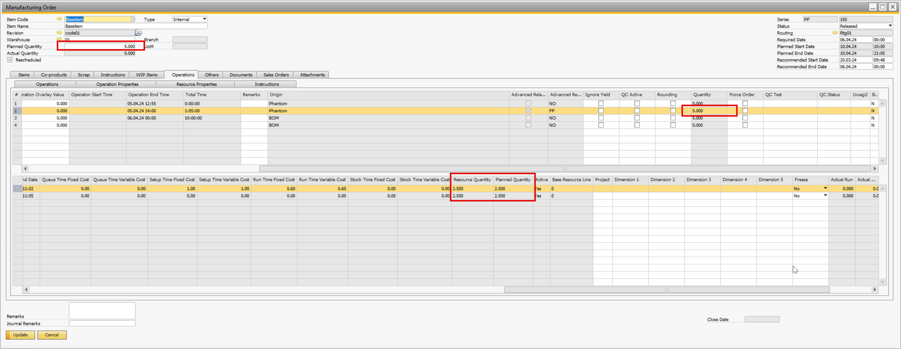
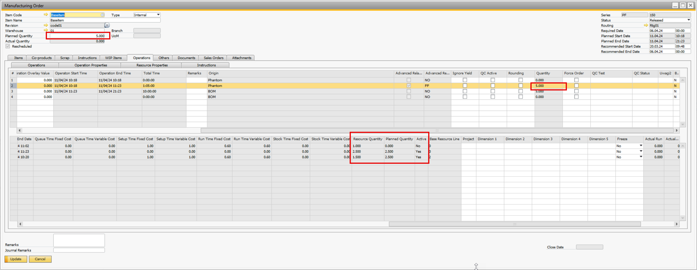

# Manufacturing Order Scheduling

Scheduling production orders efficiently is a critical element in a manufacturing environment, where precise coordination of resources ensures smooth operations. By understanding the concepts of "Planned Quantity" and "Resource Quantity," manufacturers can make informed decisions and maximize productivity.

---

## Planned Quantity

The "Planned Quantity" refers to the predetermined allocation of a specific quantity that is distributed among machine resources during the planning phase. These allocations are essential for optimizing resource usage. In cases where a resource is inactive (such as during the installation of a new production line), the allocation for that resource is set to zero.

## Resource Quantity

"Resource Quantity" represents the updated allocation following the most recent replanning session. It includes quantities that have already been recorded and any adjustments made to reflect changes in the production schedule. For inactive resources, the total registered quantities are summed up to determine the overall resource quantity.

**Example**

After the first time booking for a resource (booked 1 qty):

    

---
