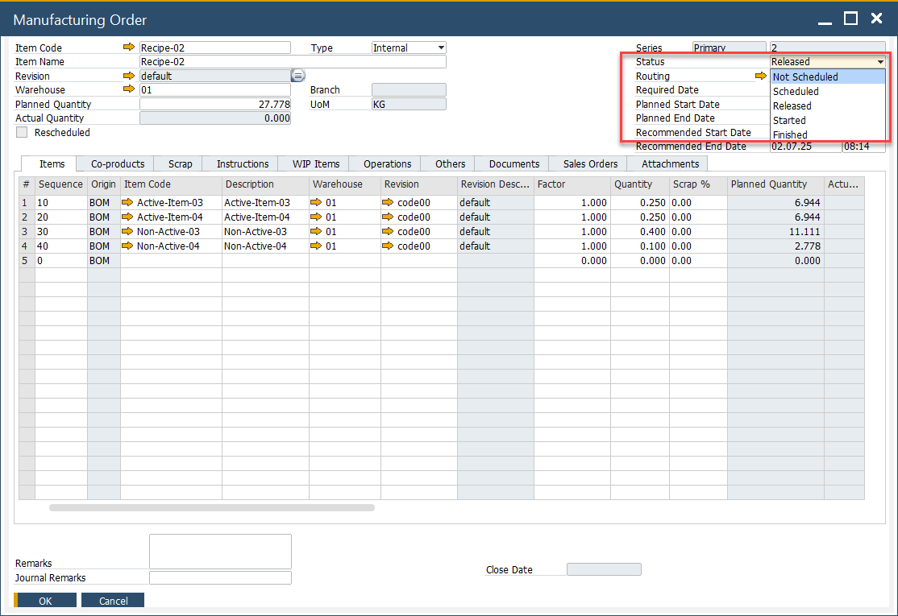

# Manufacturing Order Statuses

Each Manufacturing Order (MO) is assigned a status that defines what actions can be performed at different stages of production. The status, managed from the Manufacturing Order header, is critical for controlling and tracking production workflows.

    

---

## Available statuses

- **Not Scheduled**: The manufacturing Order has no defined due date.
- **Scheduled**: A due date is set, but materials cannot yet be issued or received for production.
- **Released**: The Manufacturing Order is prepared with defined dates. At this stage, it becomes possible to issue materials to production and record receipts.
- **Started**: The status changes automatically when an issue to production is made or an operation is started. It can also be set manually. Manufacturing Orders in this status should not be re-scheduled.
- **Finished**: The Manufacturing Order is blocked from further processing, though the status may still be changed if required.
- **Closed**: The Manufacturing Order is fully locked from editing. Optionally, closing can trigger journal entries based on MO variance (if the **Post variance on Manufacturing Order closure** option is enabled in *General Settings*).

:::info
Refer to [Status Change Rules](mass-manufacturing-order-status-change.md.md) to see which transitions are possible.
:::

You can also use the [Mass Manufacturing Order Status Change Tool](mass-manufacturing-order-status-change.md.md) to update multiple orders simultaneously.

## Status Updates through CompuTec PDC

When an operation is started in [CompuTec PDC](/docs/pdc/), the Manufacturing Order status automatically updates to **Started** in both the Resource Planning Board and Scheduling, if it was previously set to **Released**.

---
