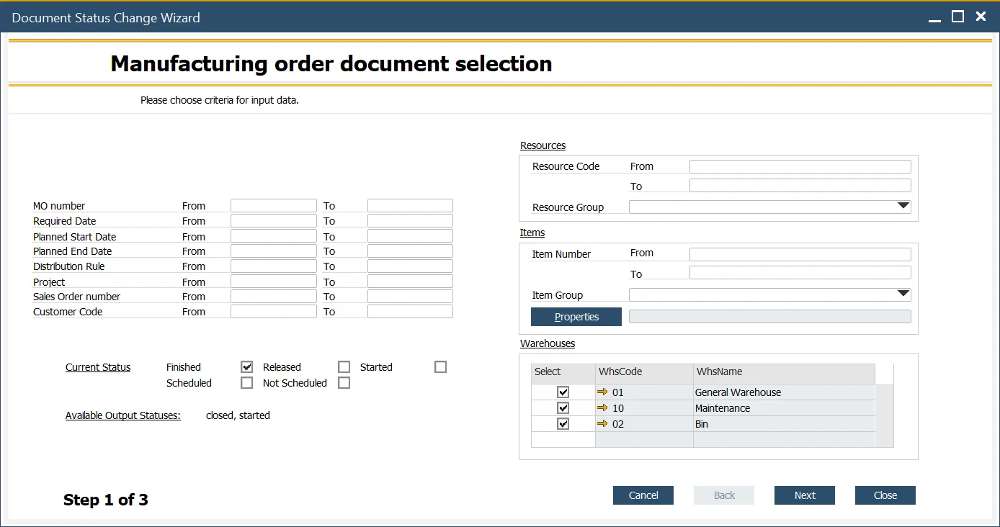
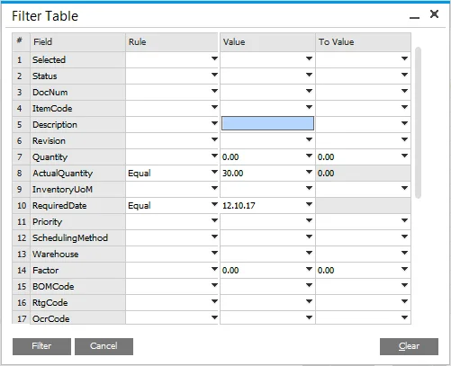
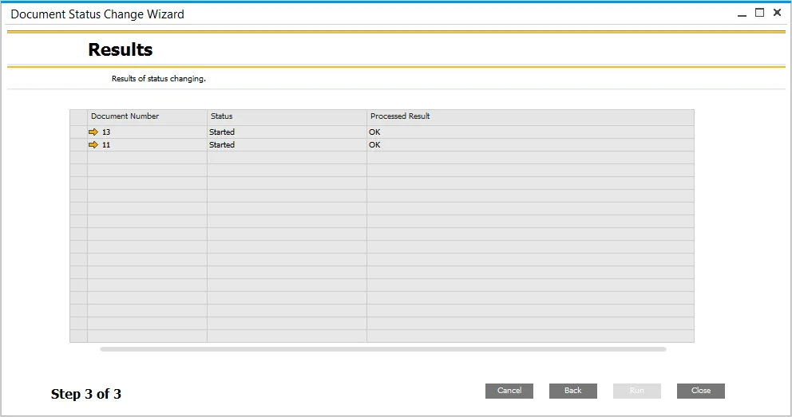

# Mass Manufacturing Order Status Change

Managing the status of multiple Manufacturing Orders (MOs) efficiently is crucial for streamlined production workflows. The Mass Manufacturing Order Status Change function allows users to update the status of multiple MOs simultaneously, reducing manual effort and improving operational efficiency.

---

To access this feature, navigate to:

:::info Path
    Production > Manufacturing Order > Document Status Change Wizard
:::

## Possible Status Changes

The table below outlines the valid status transitions:

|                      From                      |                     To                      |
| :--------------------------------------------: | :-----------------------------------------: |
|                    Released                    | Not Scheduled, Scheduled, Started, Finished |
|                    Finished                    |               Closed, Started               |
|                   Scheduled                    |      Not Scheduled, Released, Finished      |
|                 Not Scheduled                  |        Scheduled, Released, Finished        |
|                    Started                     |              Finished, Closed               |
|           Scheduled + Not Scheduled            |             Released, Finished              |
|            Released + Not Scheduled            |             Finished, Scheduled             |
|              Released + Scheduled              |           Finished, Not Scheduled           |
|              Released + Finished               |                   Started                   |
|               Released + Started               |                  Finished                   |
|               Started + Finished               |                   Closed                    |
|            Started + Not Scheduled             |                  Finished                   |
|      Started + Scheduled + Not Scheduled       |                  Finished                   |
|       Started + Released + Not Scheduled       |                  Finished                   |
|         Started + Released + Scheduled         |                  Finished                   |
|      Released + Scheduled + Not Scheduled      |     Released, Scheduled, Not Scheduled      |
| Started + Released + Not Scheduled + Scheduled |                  Finished                   |

There are three steps in the process of mass Manufacturing Order status change:

## Step 1. Selecting Criteria

### Manufacturing Order Data

On the left side of the form, users can filter MOs by various parameters such as document number, required date, planned start date, planned end date, distribution rule, project, source Sales Order, and customer. These filters can be combined for precise selection.

### Status

Check the relevant checkbox(es) to specify the current MO status. If certain statuses cannot be selected, a warning message will be displayed. Refer to the "From" column in the status change table for valid selections.

### Resources, Items

Users can further filter MOs based on Resource Groups, individual Resources, or a range of Resources, as well as specific Items.

### Warehouse

To limit records, users can filter by Warehouse by selecting the relevant checkboxes.

After setting the desired criteria, click the "Next" button to proceed.

## Step 2. Manufacturing Order Selection

In this step, a list of MOs filtered from the previous step is displayed. Users can select specific MOs for status change using checkboxes in the Select column.

---

## Filtering

It is possible to additionally filter the results by clicking the Filtering button and setting up filtering criteria to get specific values from chosen fields:

You can define rules (e.g., equal, not equal, contains, is empty) and values that will be affected by the rule. A list of rules.

Once the output status is chosen (refer to the Possible Status Changes section), click the "Run" button to apply the changes.

## Step 3. Results

In this step, you can see the mass document status change results. If any MOs cannot be updated, an error message will appear in the Processed Result column, indicating necessary actions (e.g., "Please fill required date first").

---
