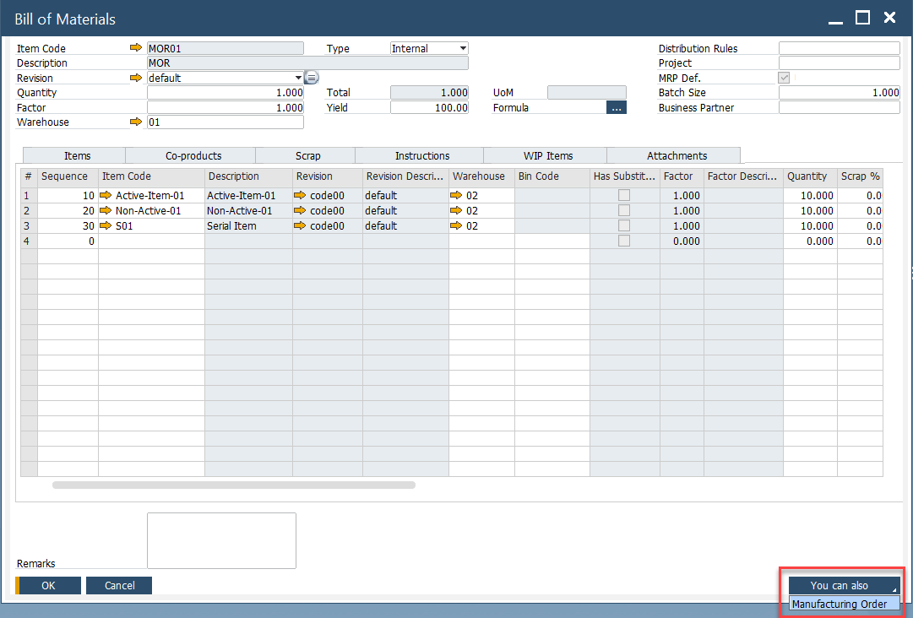
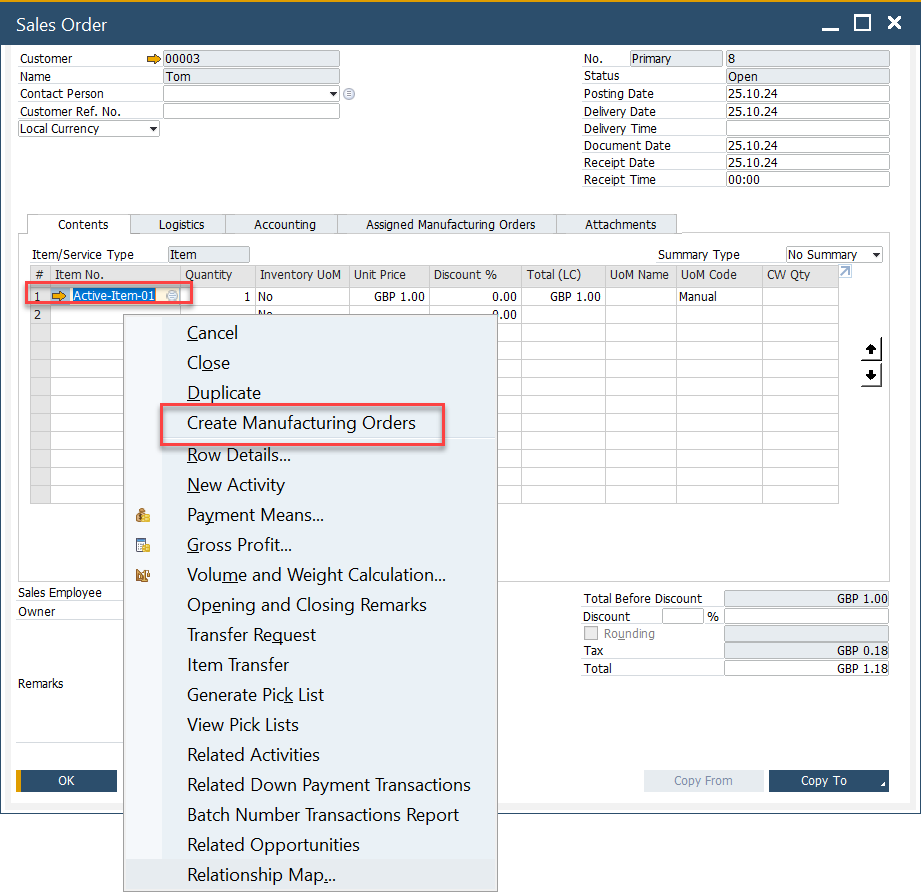
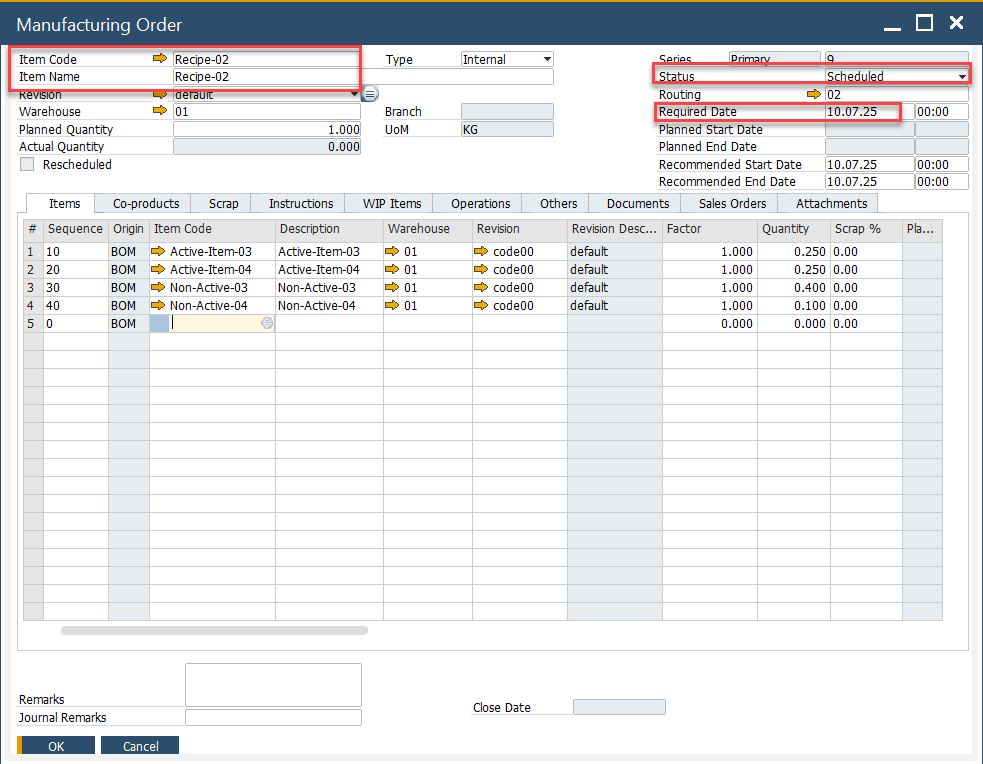
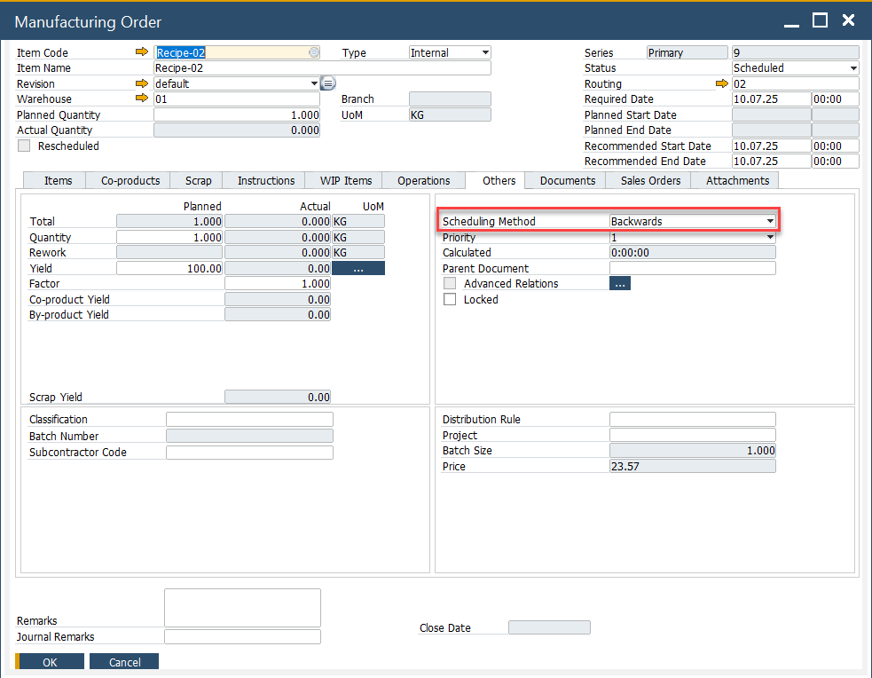
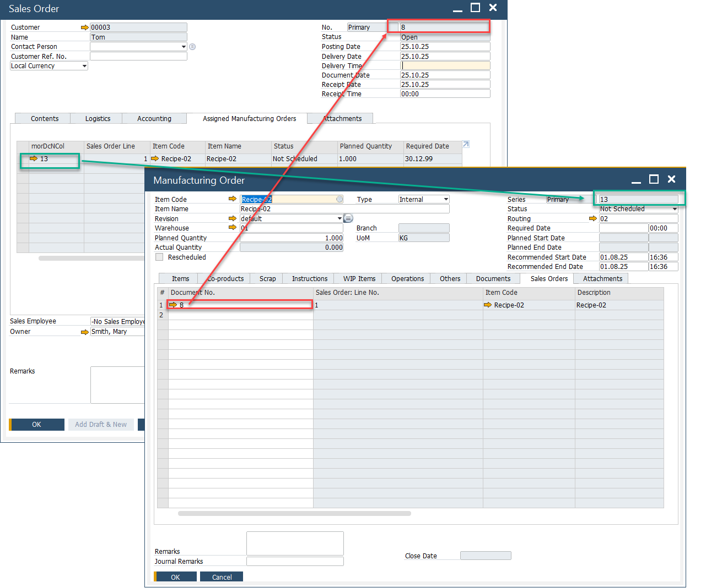
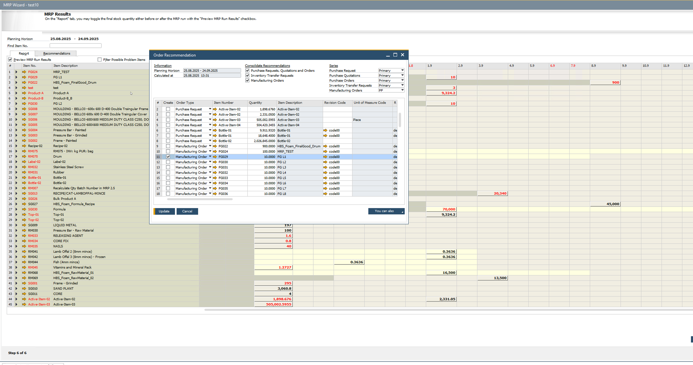

# Overview

Manufacturing Orders (MOs) are at the core of managing production in SAP Business One. There are several ways to create an MO depending on your business needs. This guide walks you through each method step by step.

Before creating a Manufacturing Order, ensure that:

- The relevant Bill of Materials (BOM) is already defined.
- Required authorizations are assigned to your user.
- Items and resources used in production are set up in the system.

---

## Creating a Manufacturing Order

### Method 1: From the Bill of Materials Form

    One of the easiest ways to create a Manufacturing Order is directly from the Bill of Materials (BOM) form:

    - Open the Bill of Materials form.
    - Click on the "You Can Also" option.
    - Select Manufacturing Order.

    

### Method 2: Manually from the Production Menu

    For a more hands-on approach, you can create an MO manually through the Production menu. To this, navigate to:

    :::info Path
        Production → Manufacturing Order → Manufacturing Order
    :::

    - Enter the necessary details (Item Code, Quantity, Required Date, etc.).
    - Save the order.

### Method 3: From a Sales Order

    Creating an MO from a Sales Order ensures seamless order processing and inventory planning.

    - Open the Sales Order.
    - Enter the Delivery Date.
    - Select the Item Code; the default revision will be automatically entered.
    - Enter the Quantity.
    - Add the Sales Document and refresh it.
    - From the Context Menu, select "Create Manufacturing Order".

        

    - The Manufacturing Order Form will open.
        - Sales Order Delivery Date is copied to the Required Date.
        - Sales Order Item Code, Revision Code, and Quantity from the Sales Order are copied also.
        - Manufacturing Order is automatically scheduled based on the Backwards scheduling method from the Required Date.

        

        

    - The Sales Order and Manufacturing Order documents are linked together for better tracking.

        

### Method 4: From MRP Wizard - Order Recommendation

    For automated order planning, you can use the MRP (Material Requirements Planning) Wizard to generate Manufacturing Orders:

    - Run the MRP Wizard.
    - Save the Recommendations.
    - Open Order Recommendations.
    - Select the Orders to create.
    - Press Update.

    

---
