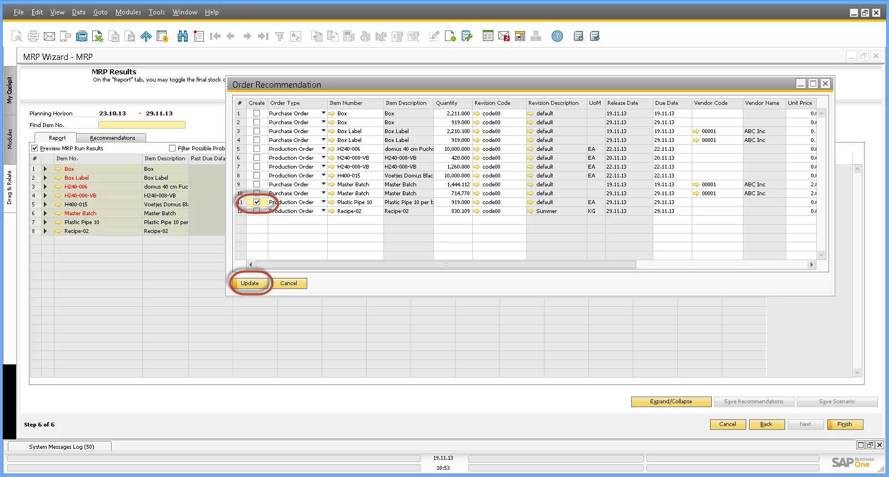

# Overview

Manufacturing Orders (MOs) are essential for managing production processes efficiently. In SAP Business One, there are multiple ways to create an MO, ensuring flexibility based on your business requirements. Below are the various methods to generate a Manufacturing Order.

---

## Creating a Manufacturing Order

1. **From the Bill of Materials Form**

    One of the easiest ways to create a Manufacturing Order is directly from the Bill of Materials (BOM) form:

    - Click on the "You Can Also" option.
    - Select Manufacturing Order.

    

2. **Manually from the Production Menu**

    For a more hands-on approach, you can create an MO manually through the Production menu.

    :::info Path
        Production → Manufacturing Order → Manufacturing Order
    :::

3. **From a Sales Order**

    Creating an MO from a Sales Order ensures seamless order processing and inventory planning.

    - Enter the Delivery Date.
    - Select the Item Code; the default revision will be automatically entered.
    - Enter the Quantity.
    - Add the Sales Document and refresh it.
    - From the Context Menu, select "Create Manufacturing Order".

        

    - The Manufacturing Order Form will open.
    - Sales Order Delivery Date is copied to the Required Date.
    - Sales Order Item Code, Revision Code, and Quantity from the Sales Order are copied also.
    - Manufacturing Order is automatically scheduled based on the Backwards scheduling method from the Required Date.

        

        

    - The Sales Order and Manufacturing Order documents are linked together for better tracking.

        

4. **From MRP Wizard - Order Recommendation**

    For automated order planning, you can use the MRP (Material Requirements Planning) Wizard to generate Manufacturing Orders:

    - Run the MRP Wizard.
    - Save the Recommendations.
    - Open Order Recommendations.
    - Select the Orders to create.
    - Press Update.

    

---
SAP Business One provides multiple methods for creating Manufacturing Orders, allowing businesses to choose the most efficient approach based on their operational needs. Whether you prefer manual creation, linking MOs to Sales Orders, or utilizing the MRP Wizard, each method ensures streamlined production planning and execution.
