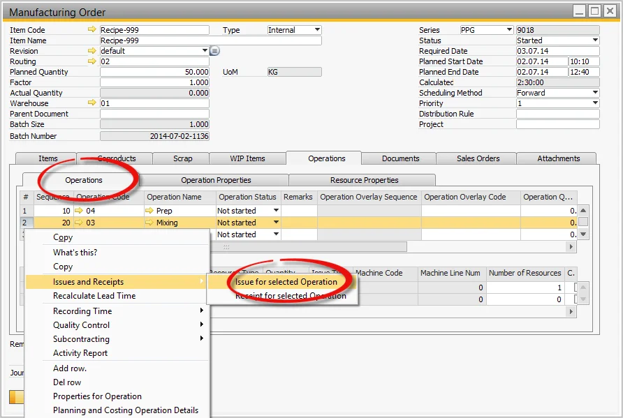
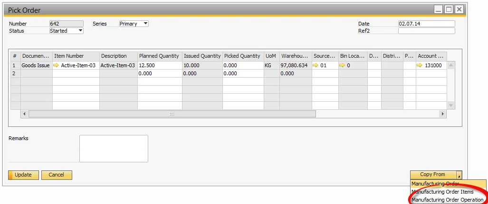
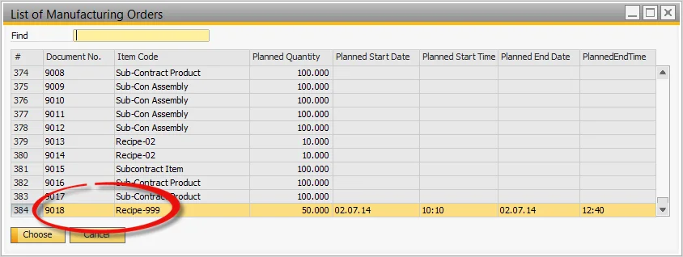
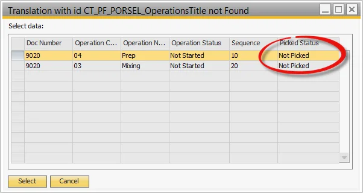
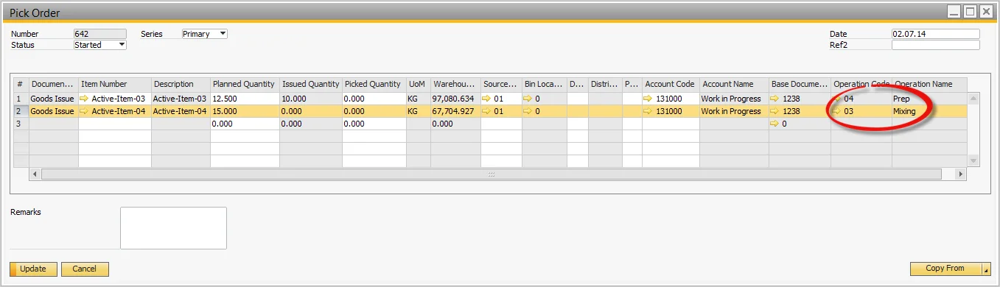

# Issue to Operation Alternative Processes

In manufacturing, handling material issues efficiently is crucial for maintaining smooth operations. This guide outlines two ways to issue materials to operations using alternative processes - directly from the Operations tab or through the Pick Order process.

---

## The Issue to Operation from the Operations tab

To issue materials directly from the Operations tab:

- Select the Operations tab.
- Select the relevant Operation.
- Select Issue for selected Operation.

## Copying Issue to Operation from the Pick Order Process

Another way to issue materials is through the Pick Order Process, which allows for bulk issuance:

- Open the Manufacturing Order from the Menu.
- Select the Pick Order linked to the order.
- Click Copy From and choose Manufacturing Order Operation.

    

- A list of Manufacturing Orders will be displayed. Select one or multiple orders.

    

- The corresponding Operations for the selected orders will be listed. Choose one or multiple rows.

    

- The items linked to the selected operations are copied into the Pick Order.

  

---
Both methods offer flexibility depending on the production scenario. The Operations tab provides a quick way to issue materials for a specific operation, while the Pick Order process streamlines bulk material issuance across multiple operations. Choosing the right approach ensures efficient material handling, minimizing production delays and optimizing workflow.
