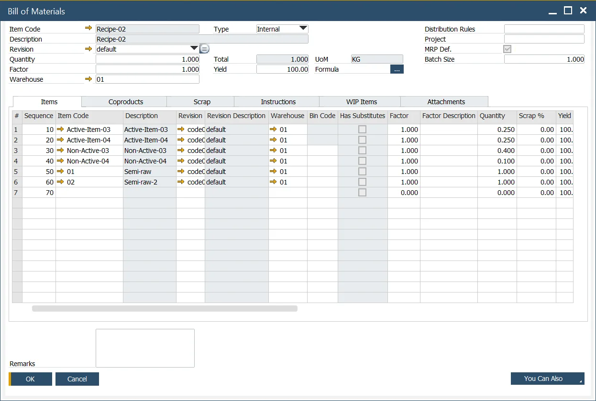
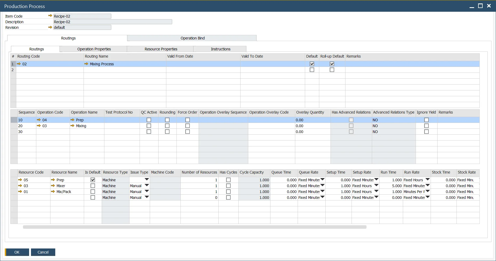
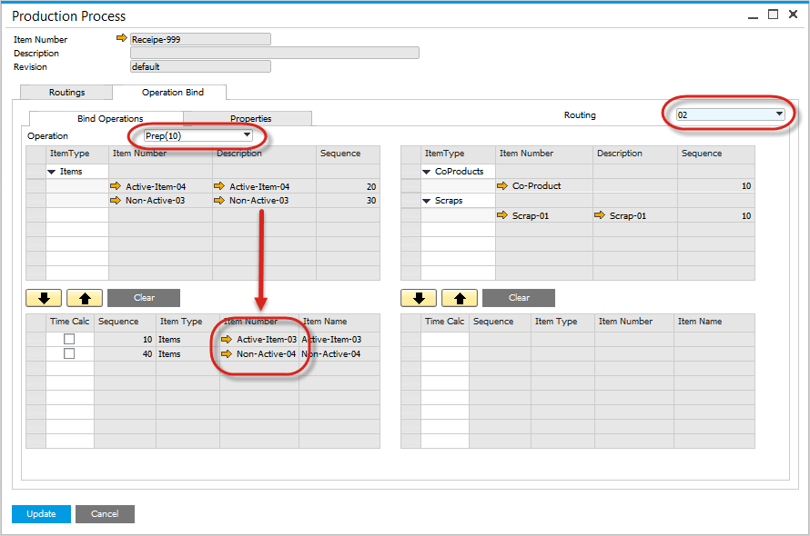
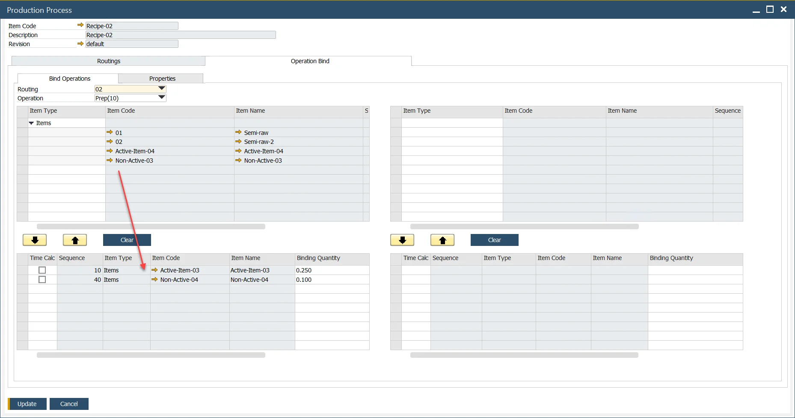
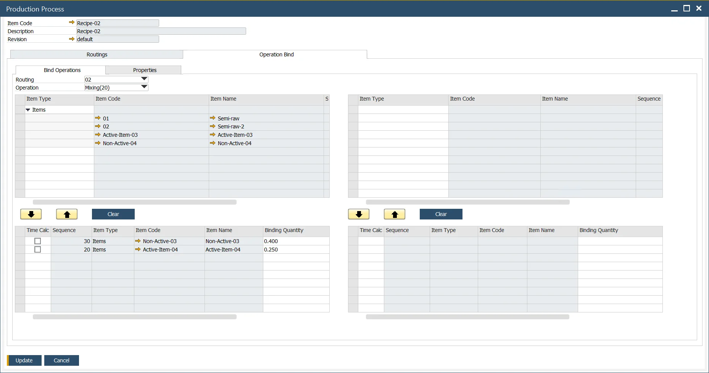

# Master Data

Accurate Master Data setup is essential for efficient material management in manufacturing. This section outlines how to configure master data for Pick Issue and Receipt by Operation, ensuring smooth integration between Bill of Materials (BOM), Production Process, and Operation Binding.

## Bill of Materials

- Define the Items, Coproducts, and Scrap within the bill of materials form as normal,
- The Item Number and Description appear in "Grey", indicating they have been linked to an operation.

    

## Production Process

Define the Production Process as usual. You can reach this form by Main Menu (Production → Bill of Materials → Production Process). Alternatively, access it via the context menu in the Bill of Materials form.

## Operation Binding

The Operation Binding Form ensures that materials are linked correctly to their respective production steps:

- The left side represents Inputs, while the right side represents Outputs.
- Select the Routing and Operation to define the production flow.
- Select the Items and link to Operation.
- In this example, Active-Item-03 and Non-Active-04 are linked as an Input to the Prep operation.

    

- In this example, Items Non-Active-03 and Active-Item-04 are linked as Input to the Mixing Operation

    

In this example, CoProduct Item Co-Product-01 and Scrap Item Scrap-01 are linked as an Output from the Mixing operation.

---
Proper configuration of Master Data ensures accurate tracking of materials throughout the production process. By linking BOM items to operations, businesses can improve production efficiency, enhance inventory accuracy, and streamline their Pick Issue and Receipt by Operation workflows.
