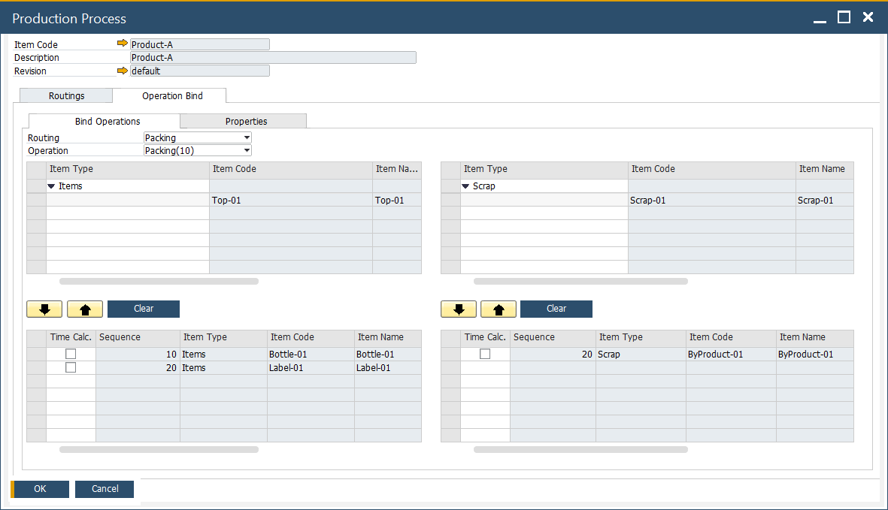

# Master Data

Accurate Master Data setup is essential for efficient material management in manufacturing. This section outlines how to configure master data for Pick Issue and Receipt by Operation, ensuring smooth integration between Bill of Materials (BOM), Production Process, and Operation Binding.

---

## How-to: Configure Master Data for Pick Issue and Receipt

1. Define the Bill of Materials

    - Set up **Items**, **Coproducts**, and **Scrap** within the BOM form as usual.
    - Once linked to operations, the **Item Number** and **Description** fields turn "Grey", indicating binding.

        

2. Define the Production Process

    - Navigate to:  
    `Production → Bill of Materials → Production Process`  
    or use the context menu from the BOM screen.
    - Define the process flow as per your production requirements.

    

3. Bind Operations to Materials

    - Open the **Operation Binding** form.
    - Select the **Routing** and relevant **Operation**.
    - On the left, assign **Input Items**; on the right, assign **Output Items**.

    - **Example 1**:  
    Inputs `Active-Item-03` and `Non-Active-04` are linked to the **Prep** operation.  
    

    - **Example 2**:  
    Inputs `Non-Active-03` and `Active-Item-04` are linked to the **Mixing** operation.  
    

    - **Example 3**:
    Output `Co-Product-01` and `Scrap-01` are also defined for the **Mixing** operation.  
    

    ---
