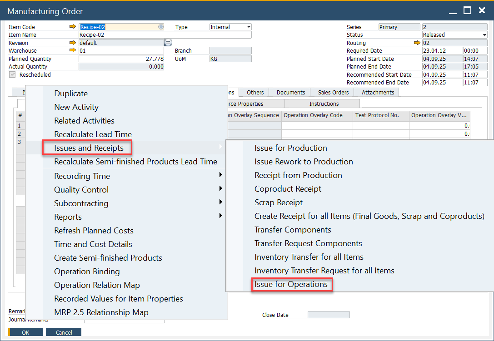
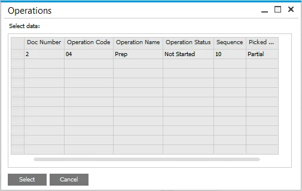
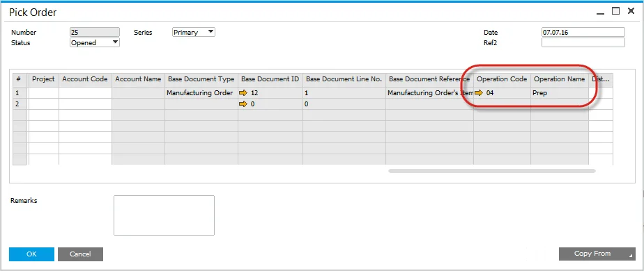
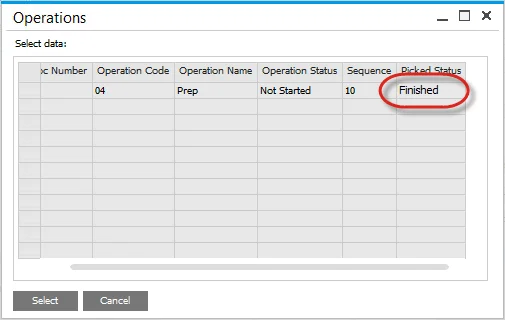
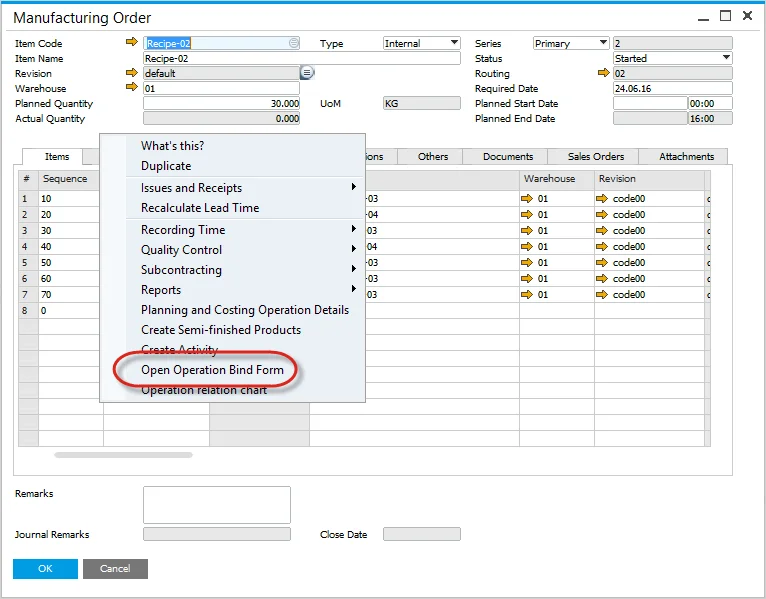
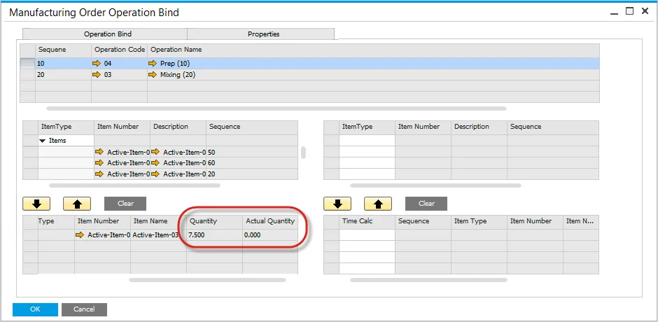

# Pick by Operation

Efficient inventory management is crucial in manufacturing, and the Pick by Operation function simplifies the process by ensuring materials are picked based on specific operations within a Manufacturing Order. This feature allows users to track picking status and optimize resource allocation.

---

## Issue to Operation

- Open the Manufacturing Order and select Issue to Operations from the context menu.
- This menu option will only be displayed if there is an Item linked to an Operation (you can check how to do this [here](../../formulations-and-bill-of-materials/production-process/overview.md#manufacturing-order-operation-bind)).
- If an Item is not linked to an Operation, this menu will not be displayed.

  

- A List of Operations with linked Items will be displayed.
- Select single or multiple rows
- Note that the Operation Status is based on the Operations Tab and Time Bookings.
- Pick Status displays the progress of Picking.
- Valid values are:
  - Not Picked
  - Partially Picked (status changes when a Pick Issue has been created),
  - Finished.

  

## Pick Order

- The Pick Order Form will open, displaying items linked to the selected operation.
- The Operation Code and Name are recorded for reference.
- Proceed with the picking process as per standard procedures.

## Pick Status

- When a Pick Order is created and Items have been partially picked, the Picked Status will change to Picked.

  

- Once all items are picked, the status changes to Finished.

  

## Operation Picking Status

- Open the Operation Bind Form to view a summary of the Operation Picking.

  

- Planned and Actual Quantities are displayed.

  

---
The Pick by Operation function enhances efficiency in Manufacturing Orders by enabling precise tracking of material allocation. By linking items to operations and monitoring pick statuses, businesses can streamline their workflows, reduce errors, and ensure timely production processes.
