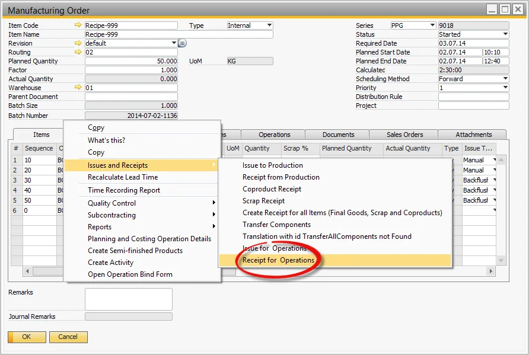
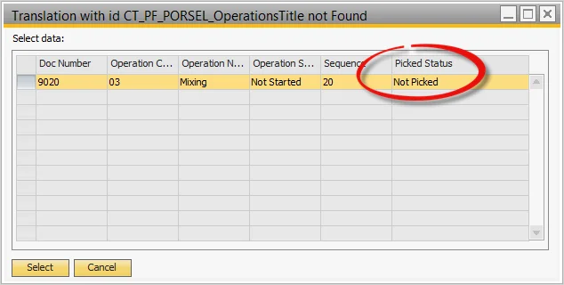
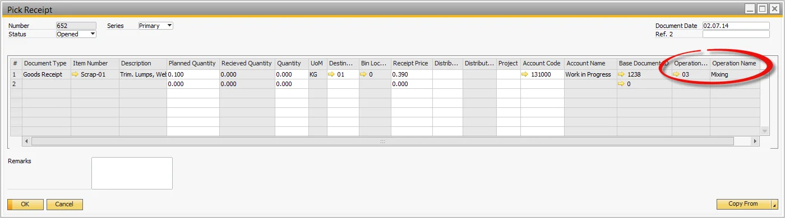

# Receipt by Operation

Efficiently tracking material receipts during production is essential for maintaining accuracy in manufacturing processes. The Receipt by Operation function allows users to record received materials at different operation stages, ensuring proper documentation of outputs, co-products, and scrap. This guide outlines the process of handling receipts by operation.

---

## Receipt for Operation

To create a receipt for an operation:

- Select the Receipt for Operation from the Manufacturing Order's context menu.

  

- A list of Operations will be displayed, along with linked Co-Product and Scrap Outputs.

  

## Pick Receipt

- The Pick Receipt form opens, displaying the output items.
- The corresponding Operation number and name are referenced for traceability.
- Complete the rest of the Pick Receipt process as per standard procedures.

  

---
The Receipt by Operation function streamlines material tracking and ensures all production outputs—including co-products and scrap—are properly recorded. This process enhances traceability, reduces discrepancies, and supports efficient manufacturing operations.
