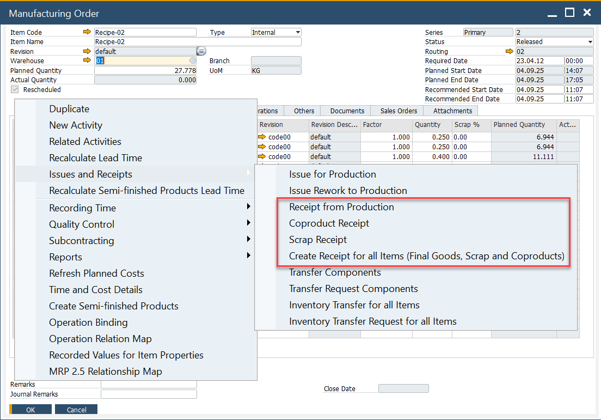

# Pick Receipt

Managing the receipt of produced items from manufacturing into stock is a critical process in Inventory Control. The Pick Receipt function streamlines this activity by offering multiple options for handling production receipts, ensuring accuracy and efficiency. This tutorial walks you through how to receive produced items from manufacturing into stock using the Pick Receipt function in CompuTec ProcessForce.

---

## Key Features

The Pick Receipt function is used to manage the activity of receiving produced items from manufacturing into stock and contains multiple options:

- Receipt from Production,
- CoProduct,
- Scrap,
- Create Receipt for all Items.

## Creation of Pick Receipt

Pick Receipts can be created in multiple ways, offering flexibility to accommodate different manufacturing workflows:

- **Automatic Creation**: Generated directly from a Manufacturing Order.
- **Manual Creation**: Copy one or more Manufacturing Orders into a new Pick Receipt.
- **Using an Existing Pick Receipt**: Multiple Manufacturing Orders can be included in a single Pick Receipt.

When creating a Pick Receipt, key details such as Items, Planned Quantity, Destination Warehouse, and Receipt Price (based on the costing method) are copied from the Manufacturing Order. If the Distribution Rule and Project are defined at the Manufacturing Order header level, they are also copied. Otherwise, they can be manually added.

---

## Additional Resources

➡️ For further details on completing the Pick Receipt to Production Goods Receipt cycle, refer to [Pick Receipt Bin Locations and Allocations](../inventory/pick-receipt-bin-locations-and-allocations.md).

➡️ You can check how to create Pick Receipt for and Production Goods Receipt for Items managed by Batches, [follow this guide](../inventory/pick-receipt-for-batch-managed-items.md).

➡️ Watch video tutorials on [Pick Receipt](https://www.youtube.com/playlist?list=PLtT6kgaz5Ync9BW5iceuweMlSu9E2D7Y2).

---

## Multiple Manufacturing Orders on Pick Receipt Warning

Currently, you can include up to five Manufacturing Orders in a single Pick Receipt. Although this number can be slightly extended by modifying CompuTec ProcessForce translations (e.g., changing Based on **Manufacturing Order** to **Based on MOR**), it is not recommended to include more than five Manufacturing Orders due to:

**Why the Limit?**

- **System Locking**: Large transactions may temporarily lock the production system, affecting other users.
- **Execution Time**: Processing a high volume of Manufacturing Order lines increases execution time significantly due to SAP DI API speed limitations.

### Best Practice

To optimize performance and prevent system delays, it is recommended to process Goods Receipts individually for each Manufacturing Order. This ensures efficient transaction handling and prevents system bottlenecks.

---
