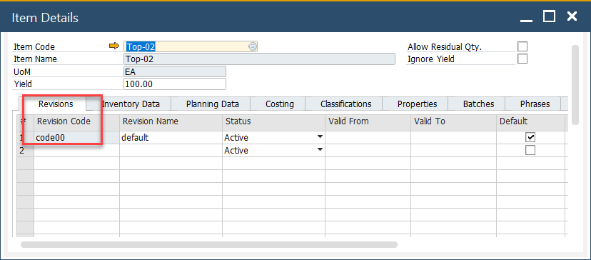
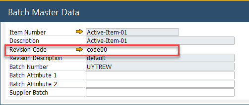
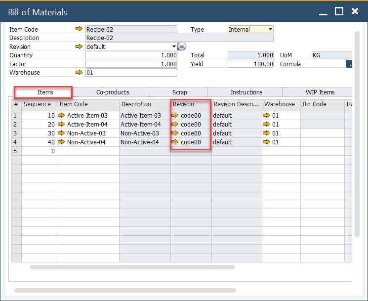

# Revision Based Picking and Backflushing

Managing inventory efficiently is critical in manufacturing, and Revision-Based Picking and Backflushing helps streamline material tracking and usage. This functionality ensures that the correct batch of materials is selected based on the Revision Code, improving accuracy in production and inventory transactions. This guide outlines how revision-based picking works and its integration into various processes.

---

## General Settings

To enable this functionality, navigate to:

:::info Path
    General Setting → ProcessForce → Inventory → Revision based picking (manual and backflushing)
:::

## Item Details

Each item and batch record includes a Revision Code, ensuring traceability:

    

## Batch Master Data

The Revision Code is recorded in the batch master data, allowing precise selection during transactions:

    

## Bill of Material

The Revision Code is displayed in the Bill of Materials form, ensuring consistency in production planning:

    

## Pick Issue

When the Revision-Based Picking (Manual) checkbox is selected while creating certain inventory documents, the system filters batch selection based on the Revision Code. This applies to the following document types:

- Inventory Transfer,
- Delivery,
- Return,
- Return PO,
- Pick Order,

Batches will be filtered based on Revision Code from the base document. The filtering rules are as follows:

- If the Revision Code is empty or set to default, the system displays batches with an empty or default revision code.
- If the Revision Code is unique (not default), the system displays only batches with that specific Revision Code.

---
By incorporating Revision-Based Picking and Backflushing, manufacturers can ensure materials are selected accurately, minimizing errors and maintaining consistency throughout production. This feature enhances inventory control, reduces waste, and improves traceability, leading to a more efficient manufacturing process.
