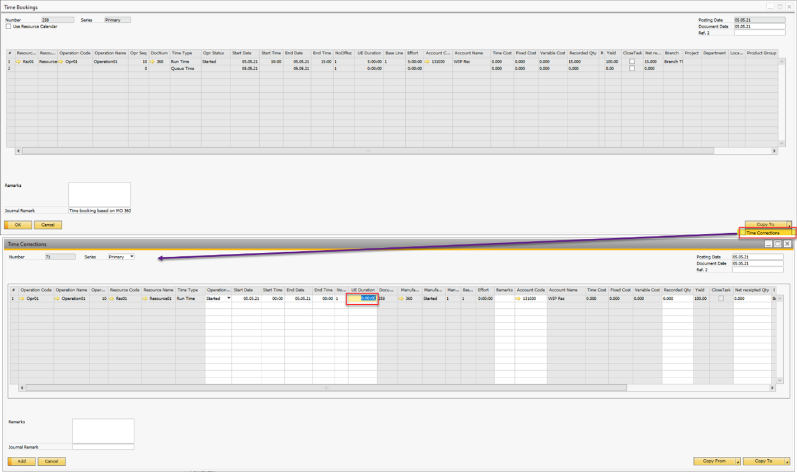

# CompuTec ProcessForce Costing for Time Entries

In CompuTec ProcessForce, resource costs for manufacturing are recorded in Time Booking (TB) and Time Correction (TC) documents. These costs are determined based on system settings and can be adjusted or reversed using Time Corrections. This guide explains:

- How resource costs are determined for Time Booking.
- How Time Corrections adjust postings.
- Where to find related reports and journal entries.

---

## How Costing Works

### Time Booking

When creating a Time Booking document, the resource cost per hour is retrieved either from:

- **Resource Costing 000**: If Receipt Evaluation Type in General Settings → ProcessForce → Costing is set to Item Costing. In this case, the hourly cost is always taken from Resource Costing 000 at the time the TB document is created.
- **Manufacturing Order Resource Lines**: If Receipt Evaluation Type is set to Costing or Dynamic.
Here, the hourly cost is taken directly from the specific Manufacturing Order.

### Time Correction

A Time Correction document adjusts the duration or cost recorded in a previous Time Booking.

- TC documents store the actual corrected duration and total cost for that duration.
- The linked Journal Entry (JE) only posts the difference compared to the original TB.
- For a full reversal, a TC with zero duration and zero costs is created — the JE will have opposite amounts so the combined total of TB and TC is zero.

---

## Journal Entry Field Details

In the linked JE:

- LineNum reference → JDT1."U_LineNum" points to the LineNum from the linked TC document.
- Cost Type → JDT1."U_CostType" values:

        - R = Time Cost
        - F = Fixed Cost
        - V = Variable Cost

## Viewing Time Bookings and Corrections

You can see all TB and TC documents in the Time Recording Report:

1. Open the Manufacturing Order.
2. Right-click → Recording Time → Time Recording Report.

To view all related transactions to the WIP account, use the SAP Query:

```sql
CT_PF_MOR_Transations_Report SAP Query - HANA - 20220805.sql
```

- Leave parameters blank for all results.
- For resources only, set Manufacturing Item Type to RS.
- For a single resource, enter the resource code in Item No..

## How to Reverse a Time Booking

1. Open the Time Booking document you want to reverse.
2. Click Copy To → Time Correction.
3. In the Time Correction document:

    - Review the copied lines from the original TB.
    - Correct details if needed.
    - To completely reverse, enter 0 in the UE Duration column.
4. If there are related documents for backflush items or resources, opposite documents will be created automatically.



---
