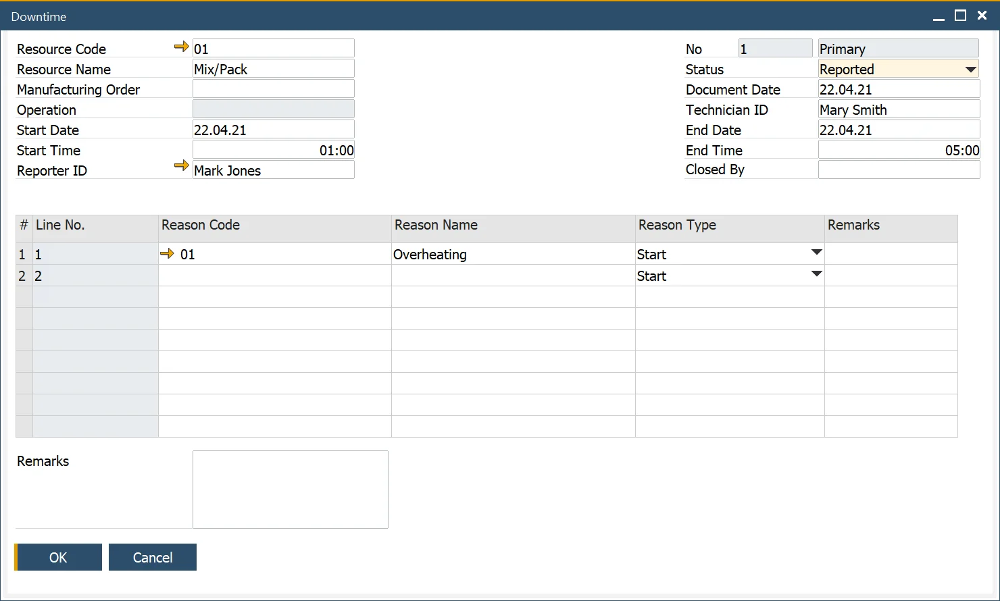
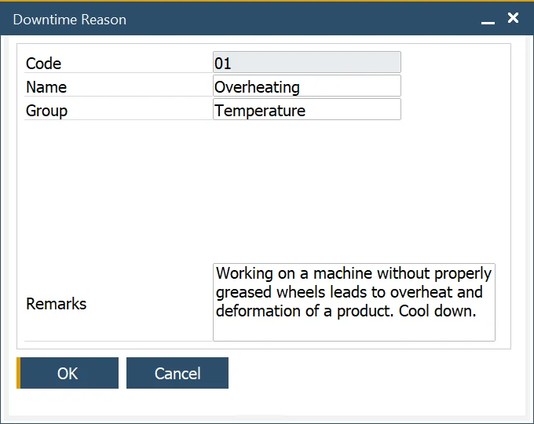
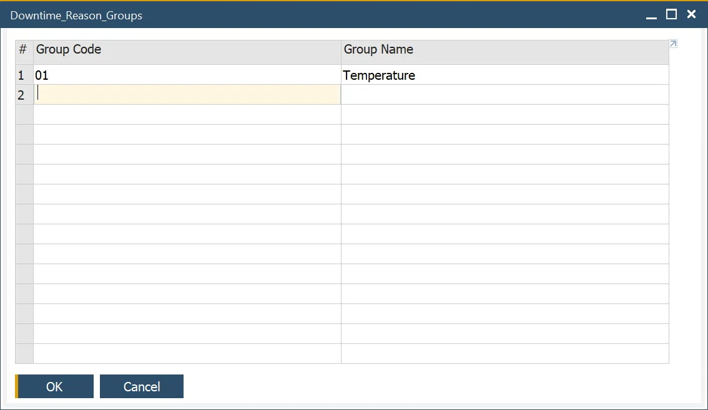

# Downtime

The downtime function allows recording downtime for a specific resource with additional data, e.g., time constraints, status, downtime reason, employees connected to the particular resource downtime: a reporter, a technician, or a person responsible for closing downtime.

:::info Path
    Production → Time Booking → Downtime
:::

---

## Downtime Creation

In the Downtime form header, you can define the following:

- Resource data: Code and Name
- Manufacturing Order and Operation: the specific order and task related to the downtime
- Start and end date and time: duration of the downtime
- Employees connected to the downtime:
  - Reporter: who logs the downtime.
  - Technician: the person responsible for the defect removal. Click [here](https://learn.computec.one/docs/pdc/administrators-guide/setting-up-the-application/overview#requirements) to find out more.
  - Employee who can check and end downtime
- Document Series
- Status:
  - Reported: downtime has been logged.
  - In Progress - issue resolution is underway.
  - Waiting - awaiting further action.
  - Fixed - downtime has been resolved.

Users must select a Downtime Reason from the predefined list.

## Downtime Reason

To configure downtime reasons, navigate to:

:::info Path
    Administration → Setup → Production → Downtime Reason
:::

You can define Code, Name, and Remarks for a Down Time Reason. A predefined group can be chosen from a list.

## Downtime Reason Group

To categorize downtime reasons, navigate to:

:::info Path
    Administration → Setup → Service → Down Time Groups
:::

Downtime Groups help in organizing and streamlining downtime tracking.

---
