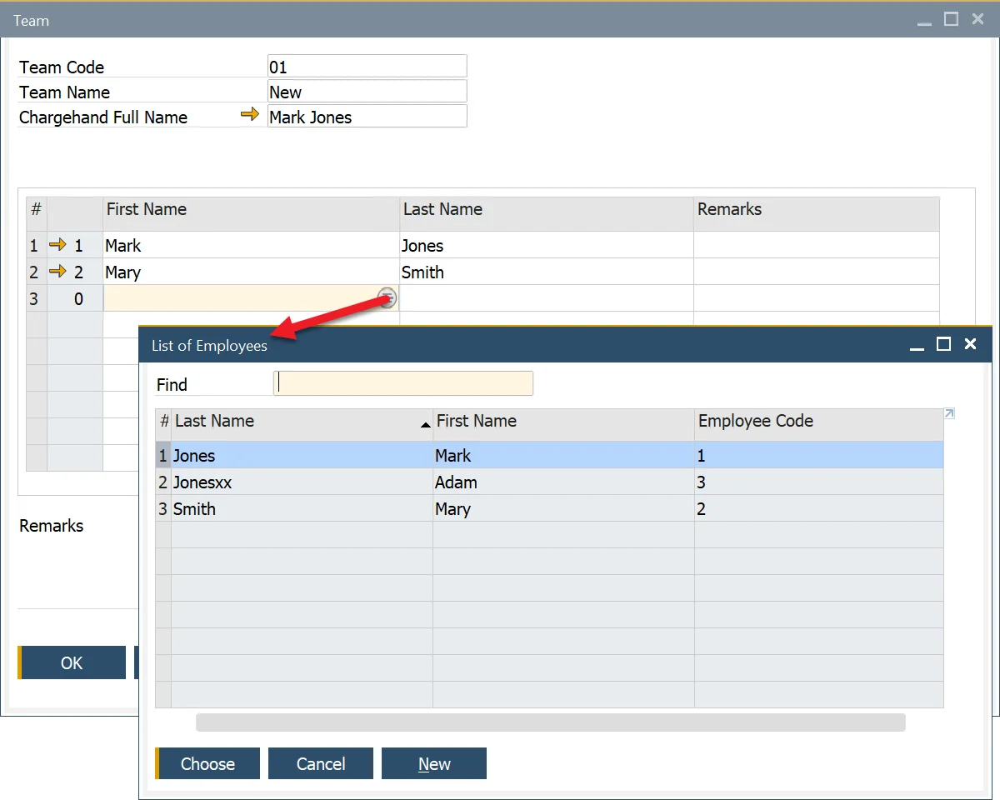

# Teams

The Teams feature in SAP Business One allows users to create and manage groups of employees working together on manufacturing tasks. By defining teams and assigning a Team Leader, businesses can enhance production efficiency, streamline time tracking, and improve workforce coordination.

---

To set up a team, navigate to:

:::info Path
    Production → Time Booking → Teams
:::

To create and manage teams:

1. Open the Teams function.
2. Select employees from the List of Employees to form a team.
3. Assign a Team Leader to oversee and manage the team.

    

New employees can be added using the SAP B1 Employee Master Data function:
Main Menu → Human Resources → Employee Master Data

---
