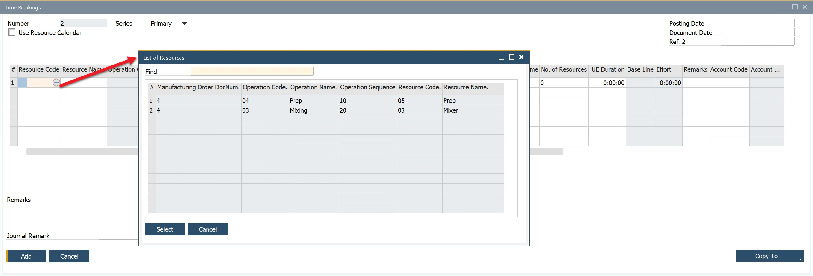

# Time Bookings

The Time Booking function in SAP Business One allows users to track and register the time and cost of specific resources working on a Manufacturing Order. This feature ensures accurate production monitoring, cost control, and efficiency tracking. It also offers functionalities such as defining work teams, handling multiple resources, and making time corrections.

To use the Time Booking function, navigate to:

:::info Path
    Production → Time Bookings → Time Bookings
:::

---

## Creating Time Booking

To create a new Time Booking, follow these steps:

1. Click on a circle in the Resource Code or Resource Name field within the Time Bookings form.
2. A Data Selection form will appear, listing resources linked to Manufacturing Orders in Scheduled, Released, or Finished status.
3. Select the records for which you want to create Time Bookings by clicking the first field in the corresponding row.

    

4. Set document dates in the form header and enter Time Booking details in the table.
5. The system automatically calculates time and cost values based on the provided inputs. You can manually adjust cost values without affecting time-related fields.
6. Click Add to finalize the Time Booking entry.

    

Additionally, Time Booking is accessible via the context menu on a Manufacturing Order under Recording Time → Time Bookings. If selected from the header, all related resources and times are copied to the open Time Booking document. If selected from a specific resource line, only that resource’s time is copied.

    

## Working with Multiple Resources

SAP Business One allows assigning multiple resources of the same type (e.g., two machines). This is configured in the No. of Resources column within the Time Bookings form.

- Increasing the Number of Resources affects run time.
- Example: If Run Time is 10 hours and 1 resource is assigned, the Planned Run Time remains 10 hours. If 2 resources are assigned, the Planned Run Time is adjusted to 5 hours.
- During cost calculation, the system sums up the total work time. For example, if 2 resources complete 10 hours of work in 5 hours, the cost is calculated based on 2 resources working for 5 hours each (total: 10 hours).

    

## The Use Resource Calendar Checkbox

By default, Time Booking calculates time based on Start Time / End Time and Start Date / End Date, while subtracting: non-working hours, Exceptions, and Holidays during the work period. When the Use Resource Calendar checkbox is enabled, the calculation aligns with the predefined [Resource Calendar](../../scheduling/resource-calendar.md), ensuring accurate time tracking based on actual working hours.period.

## Time Recording Report

All recorded time data, along with any modifications, can be reviewed in the  [Time Recording Report](time-corrections.md#time-recording-report). This report helps in auditing and validating production time entries.

---
The Time Booking feature in SAP Business One provides an efficient way to track, manage, and adjust resource time and costs associated with manufacturing processes. With options for handling multiple resources, aligning with resource calendars, and generating reports, this functionality ensures accurate production planning, cost control, and operational efficiency.
