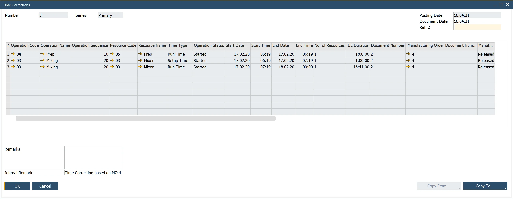

# Time Corrections

The Time Corrections document allows correcting already posted Time Bookings document (or a previous Time Corrections).

---

:::info Path
    Production → Time Bookings → Time Corrections
:::

## Usage

The Time Corrections table closely resembles the Time Bookings table, with additional columns identifying the base document.

To create a Time Corrections document:

- Click the ‘Copy From’ button in the Time Corrections form and select the base Time Bookings or Time Corrections document.
- Alternatively, use ‘Copy To’ from a Time Bookings document.
- Update values directly instead of adjusting by adding/reducing amounts. Example: If the base document has 9.000 in the Time Cost column and the correct value is 12.000, enter 12.000 instead of adding 3.000.
- Click the ‘Add’ button once all required modifications are made.
- If the correction involves a cost difference, a [related Journal Entry](time-booking-related-journal-entries.md) is created
- Click the orange arrow next to the Journal Remark field to access the linked Journal Entry.
- Once a Time Correction is added, it becomes the active document, and the base document becomes inactive.
- To access the original entry, use the ‘Base Document’ option from the context menu.
- Further corrections can be made by selecting the active document and repeating the process, creating a structured correction history.

## Time Recording Report

This report can be accessed directly from a Resource row in a Manufacturing Order:

It displays all records from Time Booking and Time Corrections documents, with Status columns indicating which document is the latest (Active). Earlier records remain available for reference but are considered previous versions.

---
