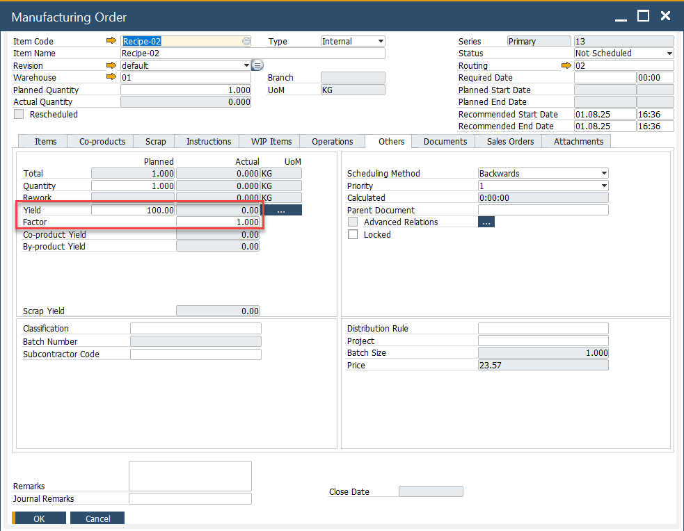

# Yield Based Production

Yield-Based Production enables manufacturers to accurately monitor and compare planned versus actual output. This helps in optimizing resource usage, reducing waste, and improving production efficiency.

---

## How-to: Use Yield-Based Production

To implement Yield-Based Production:

1. Define planned yield in the Bill of Materials (BOM).
2. Record actual yield during production.
3. Analyze discrepancies between planned and actual results.

:::info Related topics
    - [Define Planned Yield in BOM](../../user-guide/formulations-and-bill-of-materials/bill-of-materials/planned-yield-percentage.md)
    - [Analyze Yield Variance](../../user-guide/formulations-and-bill-of-materials/bill-of-materials/yield-analysis.md)
:::

---
