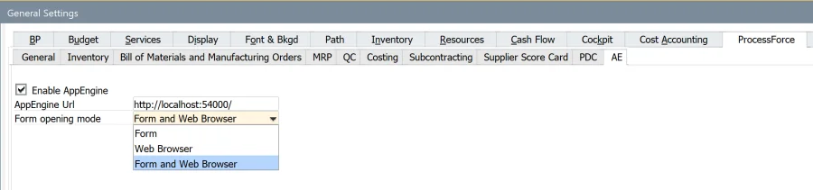
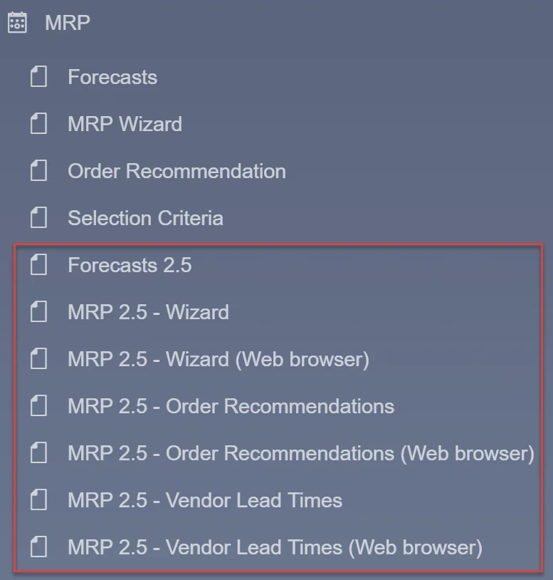
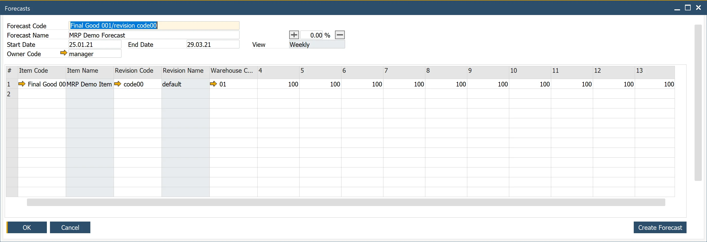
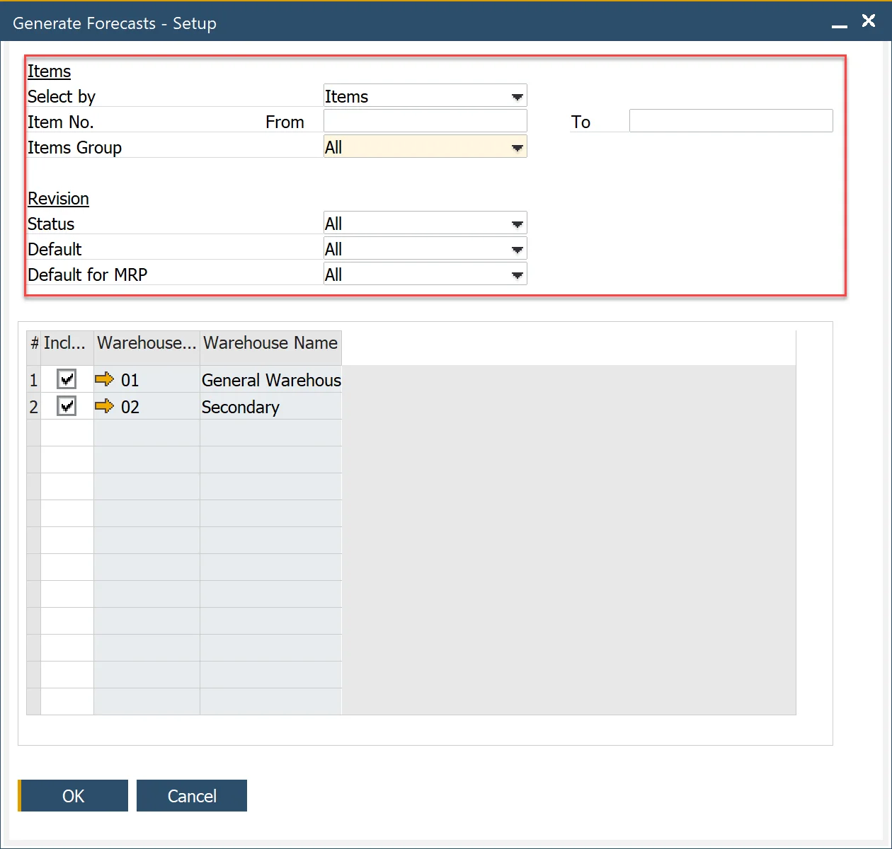
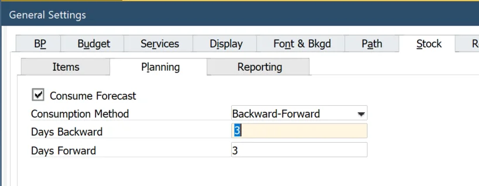
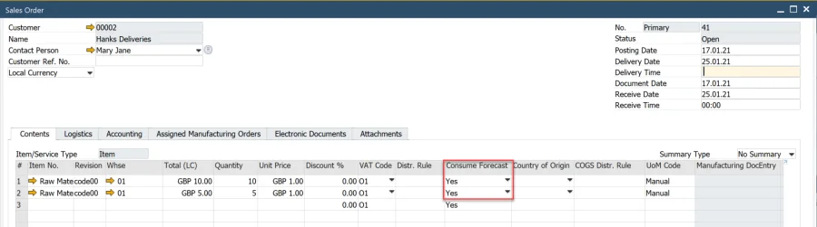
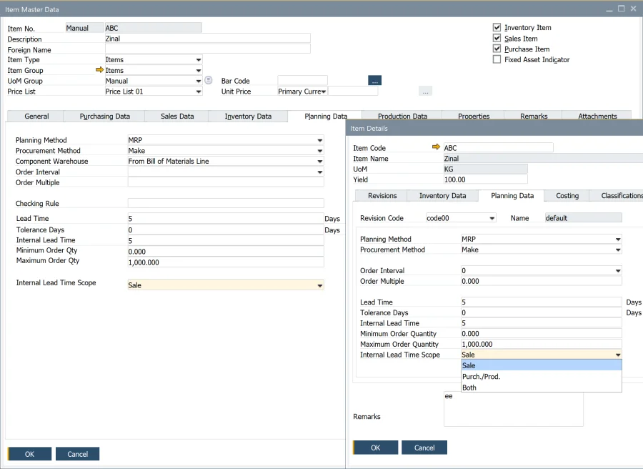
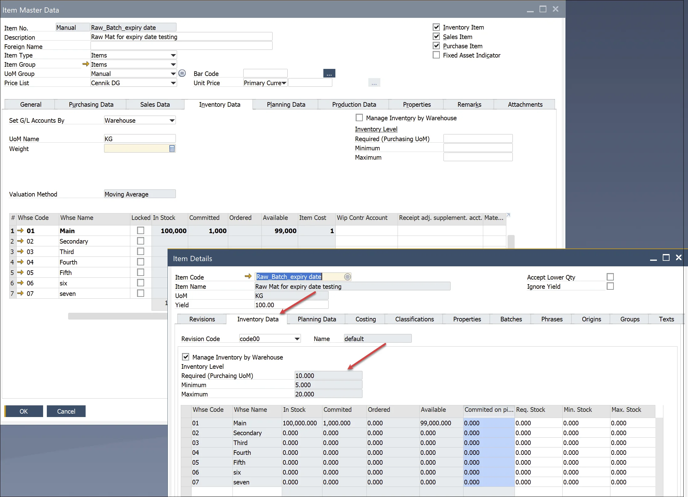

# Basic Settings

MRP 2.5 in SAP Business One brings enhanced Material Requirements Planning (MRP) capabilities, enabling businesses to optimize procurement, production, and inventory management. This upgraded version introduces advanced forecasting, improved stock visibility, and flexible procurement settings tailored for efficient resource planning.
This guide covers the essential basic settings required to activate and configure MRP 2.5, ensuring a streamlined approach to demand forecasting, procurement, and production planning.

---

To activate the MRP 2.5 function in the SAP Business One menu, you need to enable AppEngine. This integration allows SAP Business One to display AppEngine plugins within the application.

You can access MRP 2.5 in two modes:

- **Form Mode**: works directly inside SAP Business One.
- **Web Browser Mode**: opens the application in a separate browser window. (Note: Yellow arrows are not functional in this mode.)

  

Once enabled, the MRP menu will display additional options:

## Forecasts 2.5

To generate forecasts for MRP 2.5, use Forecast 2.5, which allows defining forecasts per Item/Revision.

Use the Create Forecast button to quickly add multiple forecast lines based on selection criteria.

## Forecast Consumption in General Settings

The General Settings define default parameters for MRP 2.5.

- **Consumption Method**: Days Backward/Forward: Can be adjusted per scenario.
- **Consume Forecast**: A global setting that determines forecast consumption in sales document lines under the Consume Forecast column.

  

## Item/Revision Planning Data

Planning data is defined in the Item Master Data and separately for each Item Revision under Item Details.

- **Planning Method**: functions similarly to standard SAP Business One MRP.
- **Procurement Method**: supports both Make and Buy, working as in standard SAP Business One.
- **Component Warehouse**: Can be determined from the Bill of Materials (BOM) Line or Parent Item Document Line, similar to the standard version.
- **Order Interval**: choose from predefined intervals or create a custom interval using the Order Interval - Setup window. The system groups recommended orders into defined periods, scheduling them on the first working day within that period.
- **Checking Rule**: not ready for tests.
- **Tolerance Days**: not ready for tests
- **Lead Time (LT)**: enter the number of days from when the item is ordered to when the item is received or produced.

### Example

If the lead time is for three days, the MRP will issue the purchase or production order for the child items with a due date three days before the parent item's due date. In other words, we need three days to produce (Procurement Method = Make) or send the item by the supplier (Procurement Method = Buy).

[**Example: Holidays, Lead Time, and Order Interval in MRP Calculations**](https://help.sap.com/docs/SAP_BUSINESS_ONE/68a2e87fb29941b5bf959a184d9c6727/6593f6fb14cb4f188859a2b0e6ba1e70.html?q=lead%20time)

**Internal Lead Time (ILT)** – additional time calculated for documents/recommendations. The calculation depends on the Procurement Method and ILT Scope. For example, internal testing time.

**Internal Lead Time Scope** – determine how ILT is added to documents/recommendations.

- For Item with Procurement Method = Buy, ILT can be calculated for Sale document, Purchase document/recommendation, Purchase document/recommendation & Sale documents
- For Item with Procurement Method = Make, ILT can be calculated for Sale document, Production document/recommendation, Production document/recommendation & Sale documents.

Procurement MethodILT ScopeOutcome1aMakeSaleILT added to Sales document1bMakePurch. / Prod.ILT added to MOR document/recommendation (Supply)1cMakeBothILT added to Sales document and MOR document/recommendation (Secondary Demand)2aBuySaleILT added to Sales document2bBuyPurch. / Prod.ILT added to Purchase document/recommendation2cBuyBothILT added to Sales document and Purchase document/recommendation.

|     | Procurement Method | ILT Scope      | Outcome                                                                        |
| --- | ------------------ | -------------- | ------------------------------------------------------------------------------ |
| 1a  | Make               | Sale           | ILT added to Sales document                                                    |
| 1b  | Make               | Purch. / Prod. | ILT added to MOR document/recommendation (Supply)                              |
| 1c  | Make               | Both           | ILT added to Sales document and MOR document/recommendation (Secondary Demand) |
| 2a  | Buy                | Sale           | ILT added to Sales document                                                    |
| 2b  | Buy                | Purch. / Prod. | ILT added to Purchase document/recommendation                                  |
| 2c  | Buy                | Both           | ILT added to Sales document and Purchase document/recommendation               |

### Example {#example-2}

1. Item with **Procurement Method = Make**, Lead Time = 3, Internal Lead Time = 1,
    1. **ILT Scope = Sale**
      If it is an Item ordered by the customer, ILT will be added to the Sales Order. After three days of MOR’s Release Date, the Item will be available in stock (Lead Time=3), and one day of Internal Lead Time will be added before the Item will be ready to send to the Customer (for example, packing time, quality control before packing, etc.). ILT will not be added to the finished MOR.
    2. **ILT Scope = Purch. / Prod**.
      ILT will be added only to the finished MOR. After three days of MOR’s Release Date, the Item will be available in stock (Lead Time=3), and one day of Internal Lead Time will be added after finishing MOR (for example, quality control activities).
      ILT will not be added to the Sales Order if it is an Item ordered by a customer.
    3. **ILT Scope = Both**
      After three days of MOR’s Release Date, the Item will be available in stock (Lead Time=3), and one day of Internal Lead Time will be added:
        - to Sales Order if it is an Item ordered by the customer, like in 1.1. In such a case, ILT will not be added to MOR.
        - to MOR if it is not an Item ordered by the Customer. For example, it is planned based on demand from the higher BOM level (secondary demand), Like in 1.2.
2. Item with **Procurement Method = Buy**, Lead Time = 10, Internal Lead Time = 1
    1. **ILT Scope = Sale**
      If it is an Item ordered by the customer, ILT will be added to the Sales Order. After ten days of the Purchase Order Release Date, the Item will be available in stock (Lead Time=10), and one day of Internal Lead Time will be added before the Item will be ready to send to the Customer (for example, packing time, final quality control, etc.). ILT will not be added to the PO.
    2. **ILT Scope = Purch. / Prod**.
      ILT will be added to the Purchase Order. After ten days from the Purchase Order’s Release Date, the item will be available in stock (Lead Time=10). One day of Internal Lead Time will be added before the item is available for production or sale (for example, quality control activities for the purchased item). ILT will not be added to the Sales Order if it is an Item ordered by a customer.
    3. **ILT Scope = Both**.
      After ten days of the Purchase Order’s Release Date, the Item will be available in stock (Lead Time=10), and one day of Internal Lead Time will be added:
        - only to Purchase Order If it is an Item not ordered by a customer.
        - Purchase Order and Sales Order If it is an Item ordered by a customer. Thus, Internal Lead Time will be doubled.

>**Note**: The sum of Lead Time and Internal Lead Time determines item availability for subsequent activities like production or sale.

**Order Quantity Considerations**:

- **Order Multiple**: order recommendations are rounded up to the nearest multiple of the defined value.
- **Minimum Order Qty**: if the recommended quantity is below this threshold, it is adjusted accordingly.
- **Maximum Order Qty**: When demand exceeds the defined maximum, the system creates multiple recommendations equal to the Maximum Order Quantity. The remainder is adjusted using the Minimum Order Quantity.

>**Note**: Maximum Order Should be used with Minimum Order Quantity.

<u>**Examples of order Qty calculations**</u>:

**Example 1**

<i>**Parameters**</i>:

- Order Quantity = 103
- Order Multiple = 3
- Minimum Order Qty = 5
- Maximum Order Qty = 10

<i>**Outcome**</i>:

- 10 recommendations with a quantity of 10 each.
- Rest of division = 3 (Order Quantity/Maximum Order Qty)

Last (11) recommendation with quantity 5 (effect of Minimum Oder Quantity, Rest of division < Minimum Order Qty)

**Example 2**

<i>**Parameters**</i>:

- Minimum Order Qty = 2 (other parameters unchanged)

<i>**Outcome**</i>:

- The first ten recommendations with quantity 10
- Rest of division = 3 (Order Quantity/Maximum Order Qty)

Last (11) recommendation with quantity 6 (effect of Order Multiply, Rest of division < Minimum Order Qty)

## Item/Revision Stock Data

For batch-managed and serial-numbered items, MRP 2.5 provides enhanced visibility into stock levels. Inventory level parameters can be managed per revision and per item, allowing businesses to maintain precise inventory control.

---
