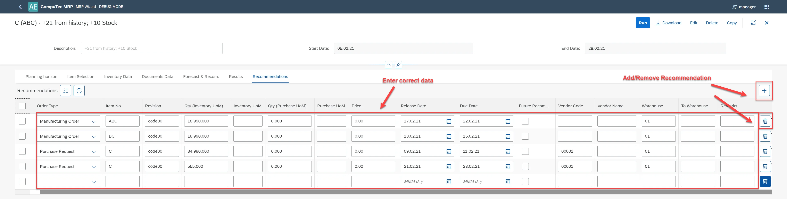

# Debug Mode

When encountering discrepancies in scenario results, it is essential to document and report the issue effectively. Debug mode provides a way to capture detailed information, making it easier for support teams to analyze and resolve problems. By enabling debug mode, users can extract relevant data and attach it to a support ticket for troubleshooting.

---

If you suspect that the scenario results are incorrect, please report the issue by submitting a ticket to Computer Support. When documenting tickets, be sure to use debug mode.

To turn on the debug mode, please add the address line:
`http://localhost:54000/webcontent/launchpad/webapp/Index.html?aedebug=true` and Enter.

Once debug mode is active, you can recognize it through:

- A Load icon over the list of scenarios (for CompuTec).
- A Download icon above the scenario (for user access).

## Steps to Use Debug Mode

1. Switch the debug mode on.
2. Run the scenario.
3. Open the Recommendation tab and enter the correct data in place of incorrect data:

    
  
4. Select the Download icon to save the JSON file.
5. Attach the JSON file to a support ticket on the CompuTec support website. Provide necessary details, including screenshots if applicable.
6. Exit debug mode once the issue is documented.

## Diasbling Debug Mode

To turn off debug mode, change "true" to "false" in the address line:

- **Before**: `http://localhost:54000/webcontent/launchpad/webapp/Index.html?aedebug=true#/plugin/computec.appengine.MRP&home`
- **After**: `http://localhost:54000/webcontent/launchpad/webapp/Index.html?aedebug=false#/plugin/computec.appengine.MRP&home`

and approve.

---
