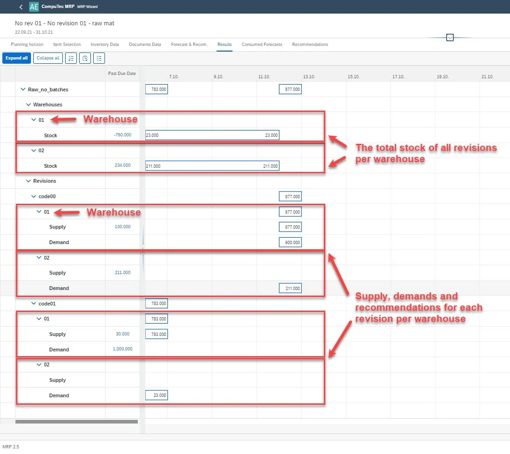
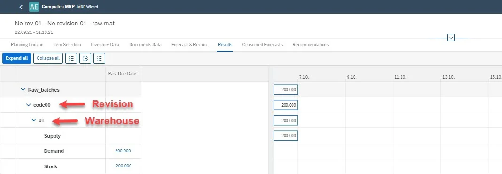

# Item not Managed by Batches versus Stock per Revision

Effective inventory management plays a crucial role in ensuring accurate stock tracking and operational efficiency. One key distinction in inventory control is between items managed by batches or serial numbers and those that are not. This difference directly impacts how stock levels are recorded and visualized, particularly in systems like MRP 2.5.

---

For items that are not managed by batches or serial numbers, tracking inventory per revision is not feasible. In such cases, the total inventory level is aggregated across all revisions without differentiation. As a result, MRP 2.5 does not distinguish inventory by revision, leading to variations in how these items are displayed in reports and system results.

    

Below is the representation of Items managed by batches and serial numbers on Results.

    

---
Understanding the impact of batch and serial number management on inventory tracking is essential for optimizing supply chain operations. While non-batch-managed items offer a simplified approach, they lack the precision needed for revision-level tracking. On the other hand, batch and serial number management provide greater control and accuracy, enhancing inventory visibility and decision-making. Businesses must choose the appropriate method based on their operational needs and inventory complexity.
