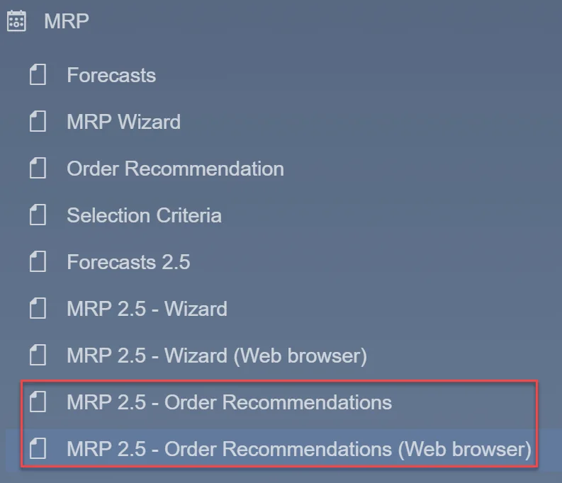

# Order Recommendation

Efficient procurement planning is essential for maintaining optimal inventory levels. Order Recommendation in MRP 2.5 helps streamline this process by generating purchase and production suggestions based on demand and supply analysis. Users can access this feature through SAP Business One or the  platform.

---

## Accessing Order Recommendation

You can open MRP 2.5 – Order Recommendation from the SAP Business One menu:

    

    Alternatively, after logging into CompuTec AppEngine, select the Order Recommendation tile:

Upon accessing the feature, a selection criteria screen is displayed for filtering recommendations:

    

To refine the recommendations, first select a scenario and apply additional parameters, such as Vendors and Items, to narrow the filtering. Once the criteria are set, click Apply Filter, and relevant recommendations will appear in the table.

In this view, users can:

- change editable parameters of recommendation in the table, for example, Item Code, Base Quantity, Selected Quantity (1),
- select recommendations to generate documents (2),
- save recommendations (3),
- view relationship map (4),
- hide created lines, with 0 in Open Quantity column (5),
- select series for documents (6).

Once all adjustments are made, clicking Save Recommendations (3) will finalize the recommendations. Selected recommendations (2) will be converted into documents with quantities taken from the Selected Quantity column.

To return to the filtering criteria view, select the Change Filter icon (7).

---
