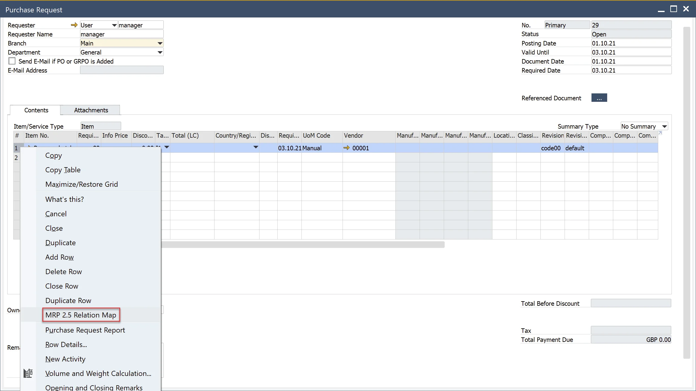
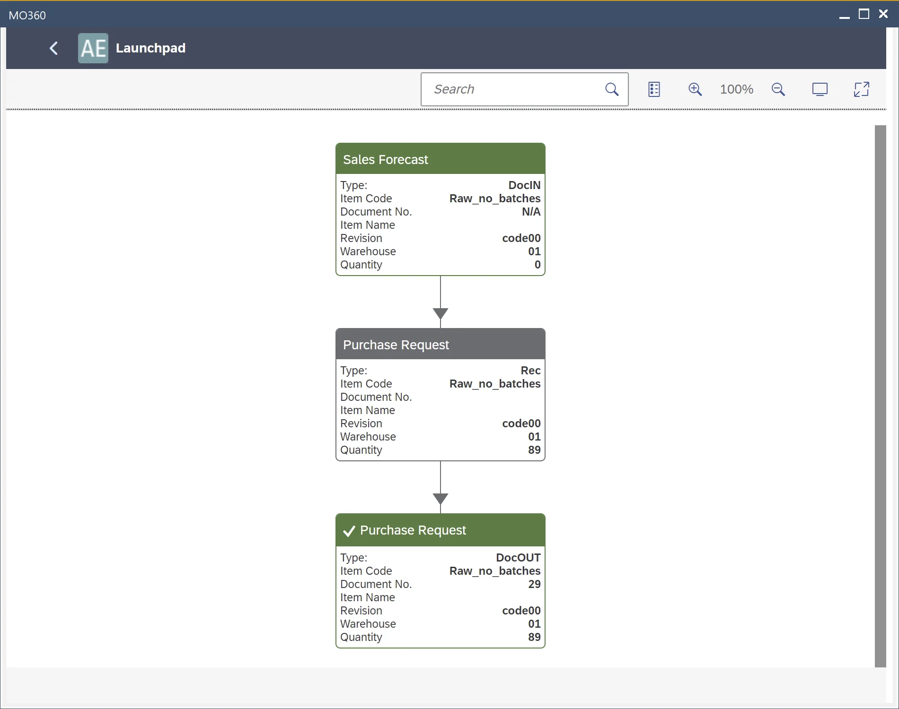

# Relationship Map from SAP documents

In SAP, tracking the connections between supply and demand documents is crucial for efficient inventory and procurement management. The Relationship Map provides a visual representation of these connections, helping users trace document linkages seamlessly.

---

## Viewing the Relationship Map

To access the Relationship Map for supply and demand documents in MRP 2.5, users can select the Relation Map option from RMBM for a specific document line. This feature allows for an intuitive way to navigate between related documents, ensuring a clear understanding of the procurement and supply chain flow.

    

Once selected, the system generates a map displaying the relationships between documents.

    

---
The Relationship Map in SAP is a valuable tool for visualizing the flow of documents within the procurement and supply process. By using this feature, businesses can streamline operations, improve traceability, and ensure better decision-making in managing supply and demand.
