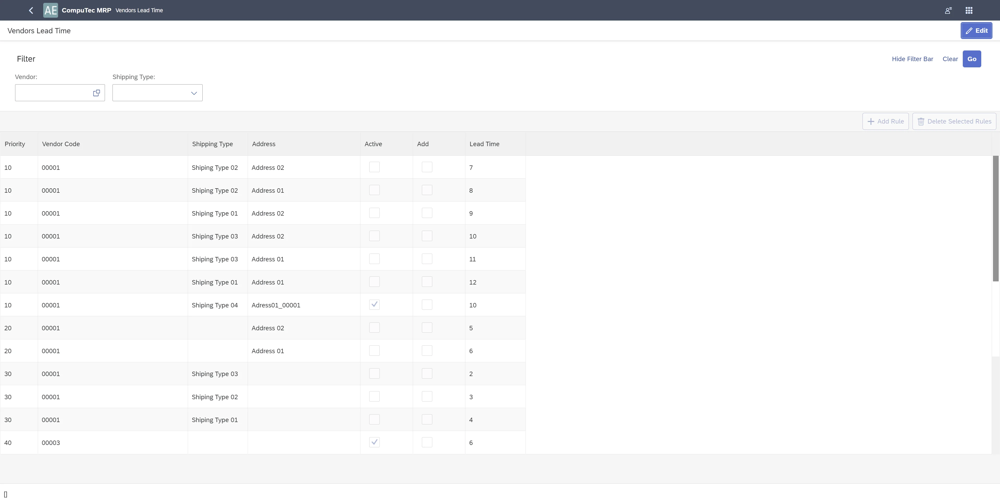

# Vendors Lead Times

Effective management of vendor lead times is crucial for optimizing procurement and ensuring smooth production planning. In MRP 2.5, vendor lead times can be defined with varying levels of accuracy, considering vendor defaults, shipping types, and shipping addresses. This article outlines how vendor lead times are determined, the hierarchy of rules applied, and the role of internal vendor lead times in material planning.

---

## Overview of Lead Time Precision Levels

Vendor lead times can be configured with the following levels of detail, prioritized in this order:

1. Vendor(default) & Shipping Type(default) & Shipping Address(default).
2. Vendor(default) & Shipping Type(default).
3. Vendor(default).

Each level contributes to more accurate delivery expectations in the MRP recommendation process.

---

## Default Vendor

A **default vendor** must be selected in the **Item Master Data** under the **Purchasing** tab to apply vendor-specific lead times.

>**Note**:  Only one vendor from the preferred vendor list can be assigned as the default.

**Key Considerations**

If the default Vendor is not defined in Item Master Data, then:

1. MRP will use the **first vendor in the database** for recommendations.
2. Lead time will be taken from **Item Master Data** (under *Item Details* for revisions), and vendor-specific lead time rules will not be considered. The rules for Vendor Lead Time are not considered in calculations.

    
3. To define a default vendor, enable the "Duplicate purchase documents for item vendors" option in:
    :::info Path
    Administration → System Initialization → General Settings → ProcessForce tab → MRP
    :::

    

## Shipping Type

Vendors can have multiple shipping types, but only one can be marked as default in the Business Partner Master Data.

  

## Shipping Address

Similarly, Vendors can have multiple addresses (Ship To locations), but only one can be marked as "default".

  

## Vendor Lead Time Rule Hierarchy

When generating MRP recommendations, the system applies lead time rules in the following order, using the first valid rule where Lead Time > 0:

1. At first, we will try to find a rule with a match of all three components of the rule to these defined as default: Vendor(default) & Shipping Type(default) & Shipping Address(default).
2. If MRP 2.5 did not find Lead Time > 0 for the combination of Vendor(default) & Shipping Type(default) & Shipping Address(default), then we will try to find a match to Vendor(default) & Shipping Type(default).
3. If he did not find will use Lead Time > 0 defined for Vendor (default).
4. If he does not find it, he will use Lead Time from Item Master Data (Item Details for revision).

You can deactivate the rule by unselecting the checkbox Active. You can add Vendor Lead Time to Lead Time from Item Master Data by selecting Add.

In the MRP scenario in the Item Selection tab, these rules can be edited per Item.

It is possible to add Custom Rules. You can do this by adding a new one or by copying from Default Rules. The rule can be edited there.

Custom Rules are overwritten Default Rules for the current scenario if they are identical. Edited rules/values are obligatory for the present scenario.

**Note**

1. If the default Vendor is not defined in Item Master Data, then:
    1. For recommendation, the first Vendor in the database is proposed.
    2. Lead Time is taken from Item Master Data (Item Details for revisions). The rules for Vendor Lead Time are not considered in calculations.
2. Hierarchy of applying rules:
    1. Custom Rules
    2. Default Rules

## Internal Vendor Lead Time

Based on the data defined in Business Partner Master Data, a set of rules is established for Internal Vendor Lead Time.

These rules can be accessed in the Item Selection tab under the Custom Vendor Internal Lead Time column. Here, you can modify Internal Lead Time values as needed. Any edited values are mandatory for the current scenario.

When preparing an MRP 2.5 recommendation, the system will identify the most appropriate rule where the Internal Lead Time is greater than zero. The selection process follows this priority:

1. The system first searches for a rule that matches both the Vendor (default) and Shipping Address (default) as defined in the master data.
2. If no valid Internal Lead Time > 0 is found for the Vendor (default) & Shipping Address (default) combination, the system will attempt to find a match based on the Vendor (default) alone.
3. If no valid rule is found, the system will use the Internal Lead Time from Item Master Data (located under Item Details for review).

---
