# MRP 2.5 Wizard

To access the MRP 2.5 Wizard, navigate from the SAP Business One menu or directly log in to CompuTec AppEngine.

If you log in directly to CompuTec AppEngine, the following tiles will be visible.

:::caution
    The yellow arrows do not function when logged in directly to CompuTec AppEngine.
:::

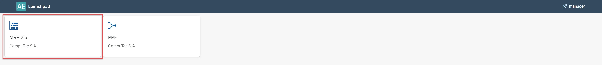

Once you select MRP 2.5, three options are available.

  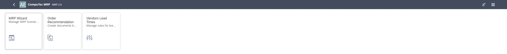

After selecting MRP 2.5 Wizard, the MRP Scenarios list will appear. From this list, you can:

- Filter scenarios by status: Not Ran, Processing, Completed, Failure.
- Sort Scenarios.
- Search scenarios (by Name and Description).
- Add scenario.
- Select a scenario to work with.

  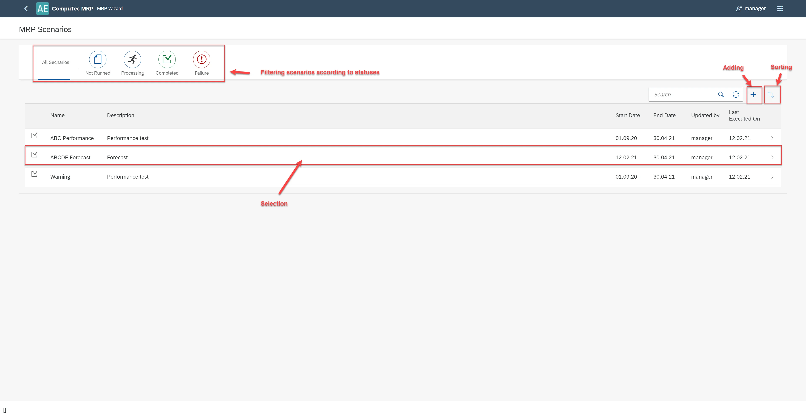

## Scenario's Data Settings

### Planning Horizon Tab

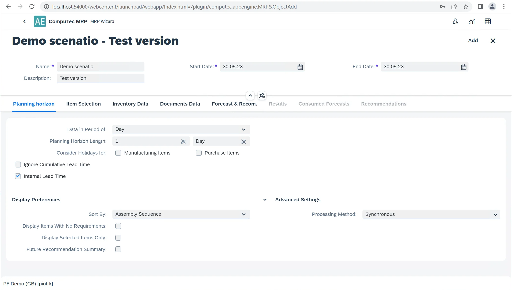

- **Scenario Name**: required.
- **Description**: provide a brief description of the scenario.
- **Start Date**: required, must be equal to or later than today.
- **End Date**: Required, must be equal to or later than the start date.
- **Data in Period of**: choose from Days, Weeks, Months, or Hours. Quantities are summarized according to the selected period in the Results tab.
- **Planning Horizon Length**: this is determined based on the selected period.
- **Consider Holidays**: Select this checkbox to have MRP account for holidays and weekends defined in the Holiday Dates Window. This automatically adjusts demand and supply based on these dates, extending the lead time where necessary.
- **Ignore Cumulative Lead Time**: if selected, Cumulative Lead Time (CLT) will not be considered in calculations.
- **Internal Lead Time**: adds Internal Lead Time (ILT) to documents or recommendations. For more details, refer to the Item’s Planning Data (Internal Lead Time and Scope).

**Display Properties**

- **Sort By**: Choose how to sort the MRP report. Options include:
  - Assembly Sequence: Sorts the results from the highest level to the lowest level of the production Bill of Materials.
  - Item Number: Sorts the results by the item number.
  - Item Description: Sorts the results by the item description.
  - Item Group: Sorts the results by the item group.

- **Display Items with No Requirements**:  items without actual requirements after the MRP run are displayed in the tab Results. If you do not select this checkbox, MRP items without requirements or with incoming orders balancing the requirements are not displayed.
- **Display Selected Items Only**: only the items selected in the Item Selection tab will be shown in the Results tab. This setting can be modified in the Results tab.
- **Future Recommendation Summary**: the Results tab will display a column summarizing future recommendations. This setting can also be changed in the Results tab.
**Advanced Settings, Processing Method**:
  - **Asynchronous**: processes multiple BOM trees simultaneously, making the process faster. This is the recommended option.
  - **Synchronous**: Bill of Materials trees are processed one after another.

## Item Selection Tab

The Item Selection tab allows you to add items to the scenario and edit their planning parameters. Any changes made to the parameters will not affect the master data; they are only applicable to the current scenario. To edit a parameter, select the checkbox next to its value.

  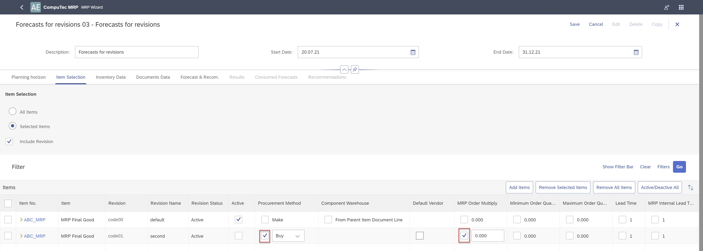

**Options**:

- **All Items**: includes all items that have the Planning Method set to MRP for the MRP run. When this option is selected, the application does not display items from the table below.
- **Selected Items**: choose this option to select specific items for the MRP run. Click Add Items to open the Items List – Selection Criteria window. You can filter items by item number, group, and properties. If necessary, select the Expanded Selection Criteria checkbox to filter items further by the Preferred Vendor and UDFs defined in the Item Master Data window.

  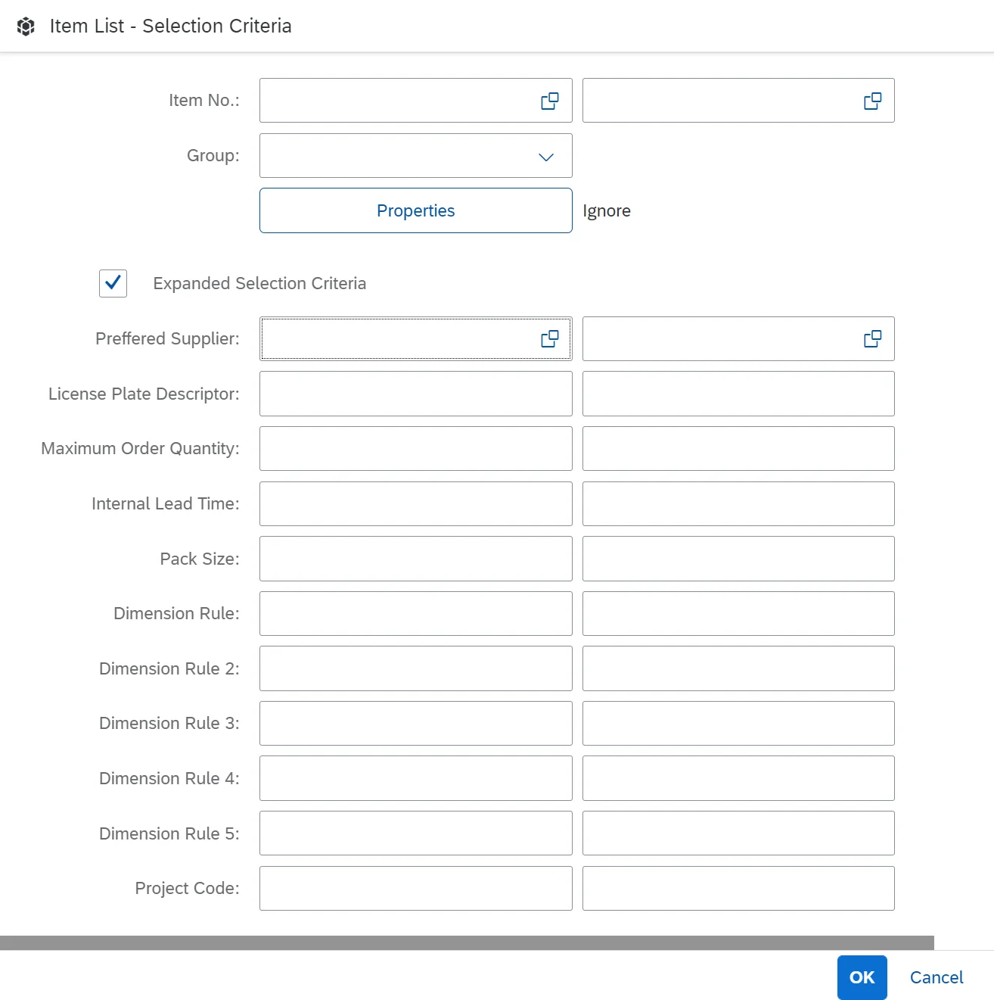

- **Include Revision**: if selected, MRP will consider the item's revisions. Planning data for revisions will be taken from the Item Details. If not selected, the planning data will be read from the Item Master Data.
- **Remove Selected Items**: removes all selected items from the scenario.
- **Remove All Items**: removes all items from the scenario.
- **Active/Deactivate All**: activates or deactivates all items displayed in the table.

  **Notes:**
    1. If you add an item and later deactivate it in an MRP run, it will still appear in the table the next time the scenario is run. To include the deactivated item in the next MRP run, simply activate it. However, if you remove the item from the MRP run, it will not appear in the list the next time the scenario is executed. You must add the item again to include it.
    2. Planning parameters for individual items can be edited by selecting the checkbox next to the respective parameter. The edited values are valid only for the current scenario.
    3. To plan primary demands for coproducts and scraps, the procurement method must be set to "Make" (without BOM), and the items must be listed and active in the item list. The system will propose MOR recommendations for the produced items to cover the demands for coproducts and scraps. If multiple BOMs exist for coproducts or scraps, the most efficient BOM will be selected.

- **Default Vendor** - click [here](/docs/processforce/user-guide/mrp/mrp-2-5/vendors-lead-times/) to find out more.
- **Custom Vendor Lead Time**: click [here](/docs/processforce/user-guide/mrp/mrp-2-5/vendors-lead-times/) to find out more.
- **Custom Vendor Internal Lead Time**: click [here](/docs/processforce/user-guide/mrp/mrp-2-5/vendors-lead-times/) to find out more.
- **Vendor Selection Strategy**: the Default Vendor strategy is currently implemented. When preparing a recommendation, all planned quantities are assigned to the default vendor. Additionally, lead time rules are applied based on the default vendor selected in the Preferred Vendors list (Item Master Data > Purchasing Data tab).

## Inventory Data tab

The Inventory Data tab allows you to add warehouses to your MRP scenario. For each added warehouse, you can define:

- Run By policies,
- Inventory level policies,
- using of batches and serial numbers parameters,
- Using of Inventory Transfer Request.

  

- **Run by Company**: this option consolidates inventory, demand, and supply across all selected warehouses into a default warehouse for MRP calculations. The system sums up initial inventory levels, demands, and supplies from all selected warehouses before calculating requirements.
- **Run by Warehouse**: this option runs MRP calculations individually for each warehouse, treating demand and supply separately. Your choice here impacts how MRP handles inventory levels and demand calculations.
- **Include Existing Inventory**: select this option to include the warehouse’s current inventory in the MRP calculation.
- **Include Demand**: enables MRP to factor in all demand sources from this warehouse, including inventory level requirements.
  >**Note**:
  - Supplies with negative quantities are treated as demands. For instance, while a purchase order is usually a source of supply, any line with a negative quantity will be considered a demand.
  - If this checkbox is unchecked, MRP will ignore inventory level requirements for this warehouse, regardless of the inventory level settings in the MRP Wizard.
- **Include Supply**: ensures that all supply sources from this warehouse are considered in MRP calculations.
  >**Note**: Demands with negative quantities are regarded as supplies. For example, a sales order is typically a source of demand. However, if the sales order has a line with a negative quantity, then this line is included as supply.
- **Location**: displays the warehouse location.
- **Recommendations**:
  - **Inventory Transfer Request**: functions like SAP Business One. If initial inventory levels allow, MRP will recommend a transfer request.
  - **Inventory Transfer Request from the planned stock**:  extends the standard transfer request to also consider planned stock (generated by planned supplies and recommendations).
  - **Inventory Level**: works similarly to SAP Business One. Recommended adjustments are based on levels defined in the Item Master Data > Inventory Tab.
  - **Recalculate Stock by Batch Expiry Date**: automatically reduces stock based on batch expiry dates.
  - **Expiration Date/From/To**: Limits initial stock to batches or serial numbers expiring within a specified date range.
  - **Statuses/Released/Not Accessible/Locked**: allows filtering of initial stock based on batch statuses (Released, Not Accessible, or Locked). If all statuses are selected or unselected, the system includes all batches in calculations.

## Document Data Tab

The Document Data tab allows you to define which supply and demand sources should be included in the MRP calculations.

- **Time Range**:
  - **Within Planning Horizon**: only supply and demand sources within the Start Date and End Date (as defined in the Planning Horizon tab of the MRP Wizard) are considered in the MRP calculations. Any supply or demand document dated before the current date is grouped and displayed in the Past Due Date column.
  - **Include Historical Data**: When selected, MRP includes all supply and demand data before the Start Date. These historical quantities are displayed in the History column in the MRP results. The History column is only visible if this option is enabled. Select corresponding checkboxes for the document type to include document sources in the MRP calculation.
- **Purchase Requests**: when checked, displays open purchase requests as supplies.
- **Purchase Quotations**: when checked, displays open purchase quotations as supplies.
- **Purchase Orders**: when checked, displays open purchase orders as supplies.
- **Blanket Purchase Agreements**: when checked, displays approved blanket purchase agreements as supplies.
    >Note: MRP considers only the blanket agreements of type Specific.
- **Sales Quotations**: when checked, displays open sales quotations as demands.
- **Sales Orders**: when checked, displays open sales orders as demands.
- **Blanket Sales Agreements**: when checked, displays approved blanket sales agreements as demands. Only Specific type agreements are considered. The blanket agreements with a customer code are considered blanket sales agreements.
  >Note: MRP considers only the blanket agreements of type Specific.
- **Manufacturing Orders**: in the MRP Results, the application displays the parent items as demands and the child items as supplies for production orders.
- **Inventory Transfer Requests**:
  - For the issuing warehouse, MRP displays the requested quantities as demands.
  - For the receiving warehouse, MRP displays the requested quantities as supplies.
  >Note: The MRP cannot recommend inventory transfer requests for scenarios where you choose to run by company. The MRP considers all the demands and supplies jointly for the whole company as one warehouse, and it does not make sense to transfer inventory within one warehouse.
- **Reserve Invoices**: when selected, the application considers open reserve invoices and open correction invoices for reserve invoices in the MRP calculation.
  - For A/R reserve invoices and correction invoices, the application displays them as demands.
  - For A/P reserve invoices and correction invoices, the application displays them as supplies.
- **Restrict Documents** - if specific documents are selected in the right panel and the Restrict Documents checkbox is enabled in the left panel, only these selected documents will be included in the MRP scenario.
- **Distribution Settings**:
  - Recommendations are generated per marker combination down the production tree, ensuring one offer per combination.
  - Project information from demand sources (e.g., Sales Orders, Manufacturing Orders) propagates throughout all recommendations according to the BOM structure.
  - Any project data defined in the BOM (header or lines) will be overwritten by the project associated with the demand document.

## Forecast & Recommendations Tab

The Forecast & Recommendations tab allows you to manage forecasts and define recommended document types based on MRP calculations.

- **Select Documents - Forecast**: choose which forecast documents to include in the MRP calculation.
- **Add Forecast**: adds forecasts to the scenario.
- **Remove Selected Forecasts**: removes the selected forecasts from the scenario.
- **Remove All Forecasts**: clears all forecasts from the scenario.
- **Activate/Deactivate Selected**:
  - If you do not want to include forecast data in the MRP calculation, leave all checkboxes unchecked.
  - If you want to consider forecast data in MRP calculations:
    - select the checkbox for a single forecast if only one should be considered.
    - select multiple checkboxes to include multiple forecasts in the calculation.
- **Sales Orders Options**: if sales orders are included in the MRP calculation, the forecasted amount, minus the quantity consumed by sales orders, is treated as demand.
- **Consume Forecast**:
  - Default forecast consumption settings for open sales orders can be configured under General Settings → Inventory → Planning.
  - The forecast quantity is reduced by the corresponding sales order quantity.
  - This setting applies by default to sales order lines and cannot be changed within the scenario.

  You can configure the default forecast consumption settings for open sales orders under General Settings → Inventory → Planning. This setting automatically subtracts the sales order quantity from the forecast. The checkbox determines the default value for sales order lines and cannot be modified within the scenario.

- **Consumption Method**: Choose how forecasts are consumed based on system settings from General Settings → Inventory → Planning:
  - Backward-Forward
  - Forward-Backward
- **Days Backward**: defines how many days to look back for an available forecast to consume.
- **Days Forward**: defines how many days to look forward for an available forecast to consume.

**Recommendations**

Defines the document types recommended after the MRP wizard calculates the results. Purchase documents and production orders are mandatory recommended document types.
You can define whether to recommend inventory transfer requests when you are running the MRP by warehouse (please see Tab Inventory Data).

**Purchase**

**Note**: This checkbox is read-only and, by default, selected.
Items with the Procurement Method of Buy are recommended with purchase documents. You can choose between Purchase Request and Purchase Order.

If **Run by Warehouse** is selected in the Inventory Data tab, you can choose:

- To generate purchase orders to the default warehouse of the item, select **Generate to Default Warehouse**.
- To generate purchase orders to the warehouse that demands inventory supplies, select **Generate to Warehouse with the Demand**.

**Production Orders**

**Note**: This checkbox is read-only and, by default, selected.

- Items with a Procurement Method of Make are recommended for production orders.
- The recommended warehouse is determined by the Component Warehouse settings:
  - From Bill of Materials Line
  - From Parent Item Document Line (Planning Data for Item/Revision)

>**Note**: After running the scenario, forecast consumption can be reviewed in the Consumed Forecast tab and Pegging Information within the Results tab.

## MRP's outcome – Tabs: Results, Consumed Forecasts and Recommendation

To receive the MRP scenario's outcome, select the button Run. The outcome is presented in tab Results and Recommendation. If there are messages regarding the outcome, you can see the icon with an exclamation mark on the right of the button Run.

### Results tab

The main elements of this Tab are described in the screenshot below.

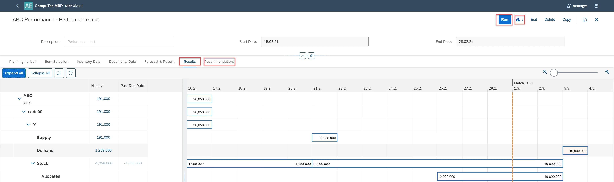

- **Column History**: Displays demand/supply before the scenario start date. Visible only if Include Historical Data is selected in the Documents Data tab.
- **Column Past Due Date**: shows demand/supply between the scenario Start Date and the Current Date. This is visible if the Start Date is earlier than the Current Date.
- **Expand all**: expand all rows for all Items.
- **Collapse all**: collapse all rows for all Items.
- **Warehouses without any recommendations** - if there are no planned actions for the warehouse, it is possible to hide him - the button has to be unchecked.
- **Future recommendations**: ecommendations beyond the current planning horizon but necessary for meeting future demand, considering factors like cumulative lead times.

**Note**:

1. To see the initial stock quantity, please place the cursor on the cell Stock in the column Past Due Date. The quantity will be displayed in the floating tooltip.
2. Future recommendations are represented on the Gantt chart with color-coded bars.
  
3. To view the initial stock details, select the cell in the Past Due Date column under Stock.
  

    - **Initial Quantity**:base quantity for MRP calculation.
    - **Excluded Quantity**: the quantity excluded based on batch parameters (such as expiration date and batch status) or serial number parameters (such as expiration date).
    - **Pegging information** is available when you select supply, demand, or recommendation bar on Gantt.

      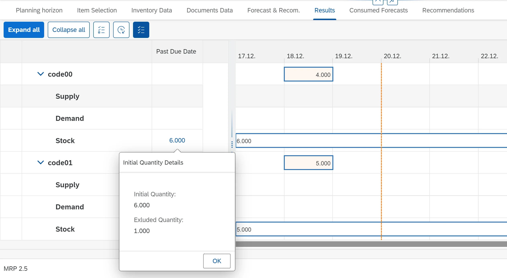

    - **Due Date**: the date for which the quantity is required.
    - **Document Date**: The posting date for supply/demand documents, or the creation date for manufacturing orders (MORs). For recommendations, it shows the date the document should be released.

### Consumed Forecasts tab

This tab displays forecast consumption data:

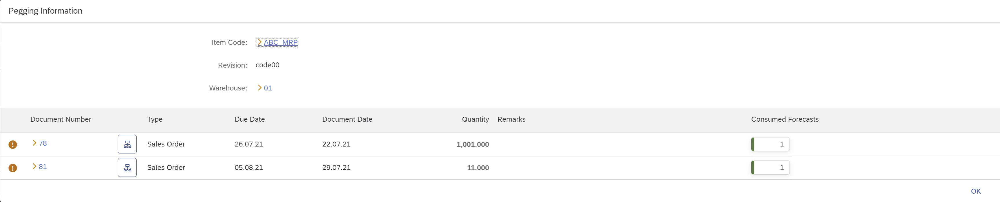

You can access the Consumed Forecast information from the Pegging Information section.

### Recommendations tab

The main elements of this Tab are described in the screenshot below.

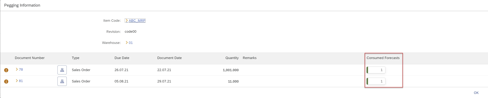

- **Display selected Items only**: if selected, only recommendations for items chosen in the Item Selection tab will be shown.
- **Display future recommendation**: If selected, recommendations beyond the planning horizon will be displayed. Future recommendations are marked with a checkbox in the Future Recommendation column.
- **Display Inventory Transfer Requests from Planned Stock**: if checked, Inventory Transfer Requests, which are based on planned supplies (documents and recommendations), will be displayed. This kind of Inventory Transfer Request is marked with the "info" icon in the column Order Type. Otherwise, only inventory transfer requests based on physical stock (initial stock) are displayed. This corresponds to the option Inventory Transfer Request from the planned stock in the tab Inventory Data.
- **Save Recommendation**: use this button to save recommendations for further work in the Order Recommendation module.
- **Display Relation Map**: if you select this icon, a new window, Document Details with relation map will be opened.
- **Document Details**: this window displays the relationships between source documents, recommendations, and outcome documents, starting from a given recommendation. Document types are color-coded, with their meanings explained in the legend.

  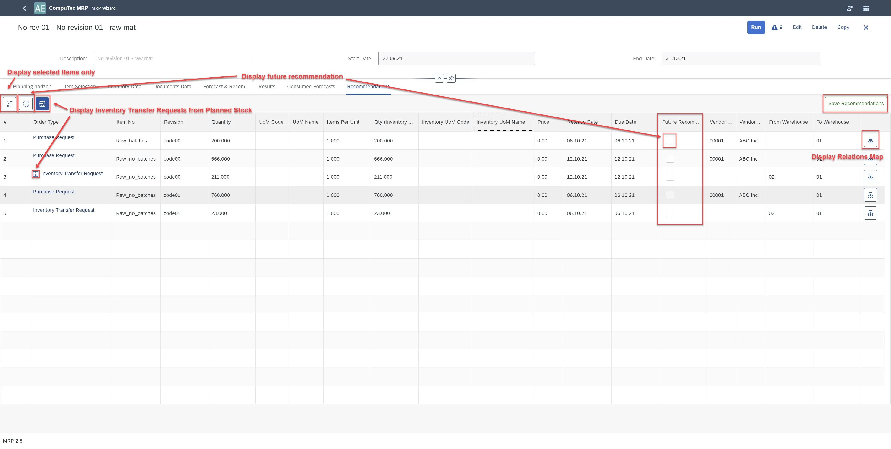

  

---
