# Overview

Plant Maintenance is essential for ensuring the efficiency, reliability, and longevity of assets. This document provides a detailed walkthrough of the key functionalities and usage examples within the Plant Maintenance module. These tools streamline maintenance operations, enhance data accuracy, and improve asset management processes.

---

## Maintainable Item definition schema

The definition schema for Maintainable Items can be accessed [here](../field-description/maintainable-item.md).

## Assigning an existing object to MI

When defining a new Maintainable Item (MI), ensure that the Assigned Object checkbox is selected.

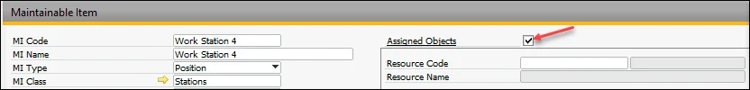

### Assigning Resource

Please select a Resource code from the list:

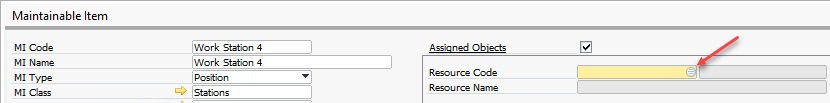

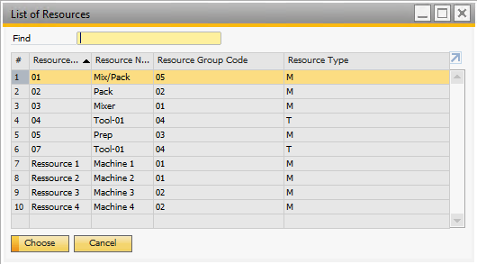

:::note
    It is impossible to assign the same Resource more than once.
:::

### Assigning Apparatus (Meter, Tool, Part)

It is possible to assign an Item to Maintenable Item with one of the Apparatus Types: Tool, Part, or Meter. Only this kind of Item is selectable in the List of Items. The assigned Item has to be managed by Serial Numbers.

First, select an Item from the list:

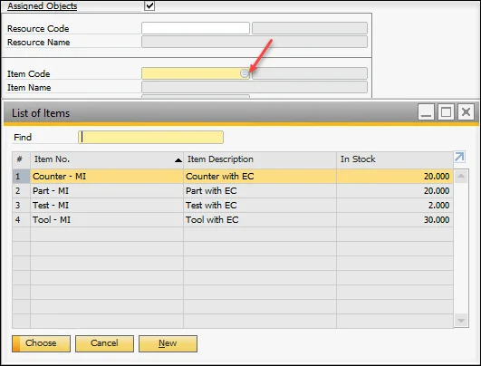

Select Apparatus Type:

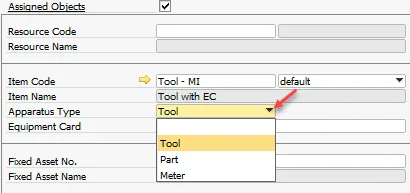

Select Equipment Card (first, you must define EC for SN) – not obligatory.

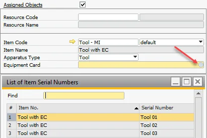

:::note
    The application of Equipment Card allows using standard EC functionality for MI.
:::

#### Assigning Physical Meter

If you set Apparatus Type to Meter, additional fields in the Details tab are active. To make them accessible, uncheck the Parameters Frozen checkbox.

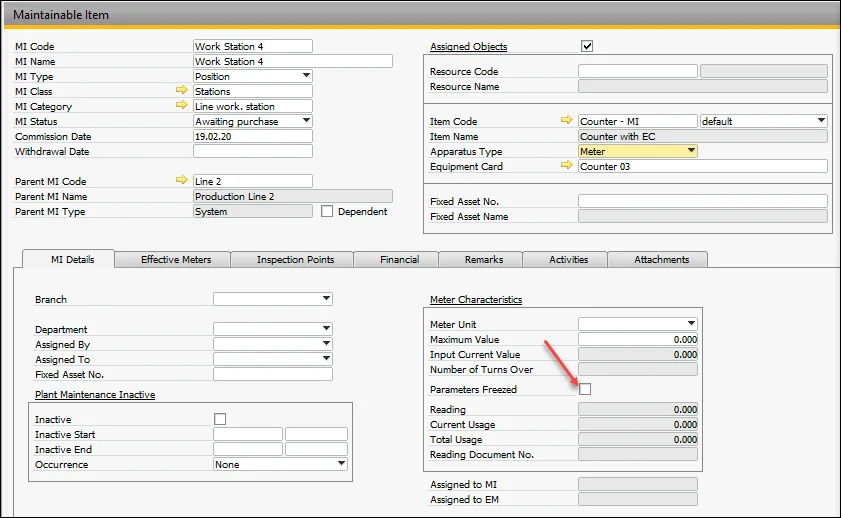

Next, you should select Meter Unit and set up the limit value for the meter (Maximum Value).

:::note
    If Maximum Value is set to 0, the meter's limit value equals infinity.
:::

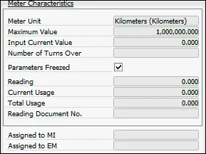

Next, check the Frozen Parameters checkbox to save values from unauthorized modification and the OK button to save the record.

Now you have to set up the Input Value (the value you can see on the meter before assigning) and Numbers of Turn Overs (if you know this value, for example, from meter documentation). If the Counter is new, these values are probably equal to zero. Please select Physical Meter Value Setting/Correction from RMBM (on a saved record) to do this.

A meter Reading window appears. Please enter the Reading and Number of Turn Overs.

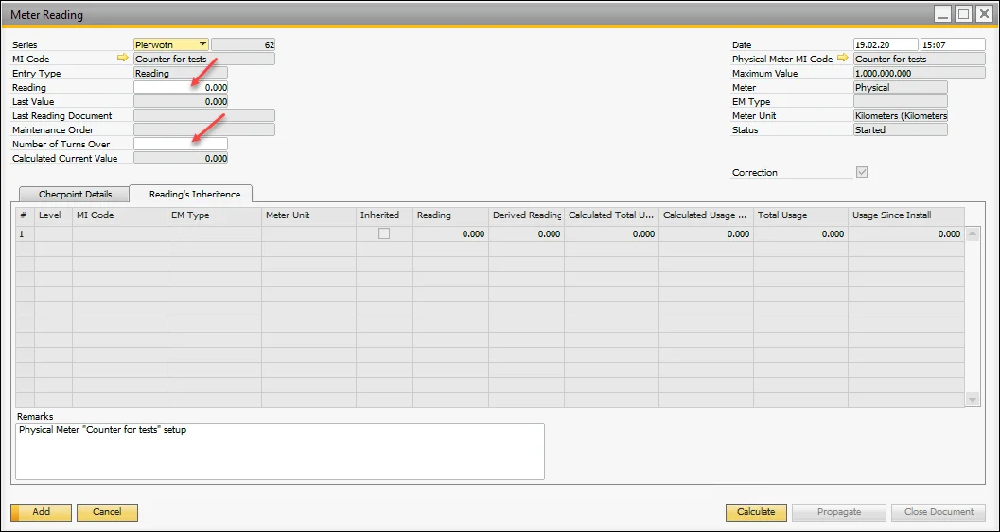

:::info To save values, select buttons:
Calculate → Add → Propagate → Close Document.
:::

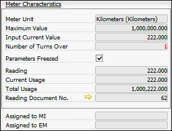

As you can see:

Input Value = Reading

Total Usage = Input Value + Number of Turns Over \* Maximum Value

In the same way, you can correct entered values if Physical Meter is not currently linked to any MI/EM. If the Meter is connected as Physical Meter to Effective Meter, you can correct these values in MI from the Effective Meter line.

## Definition of MI hierarchy with Effective Meters and linked Physical Meters

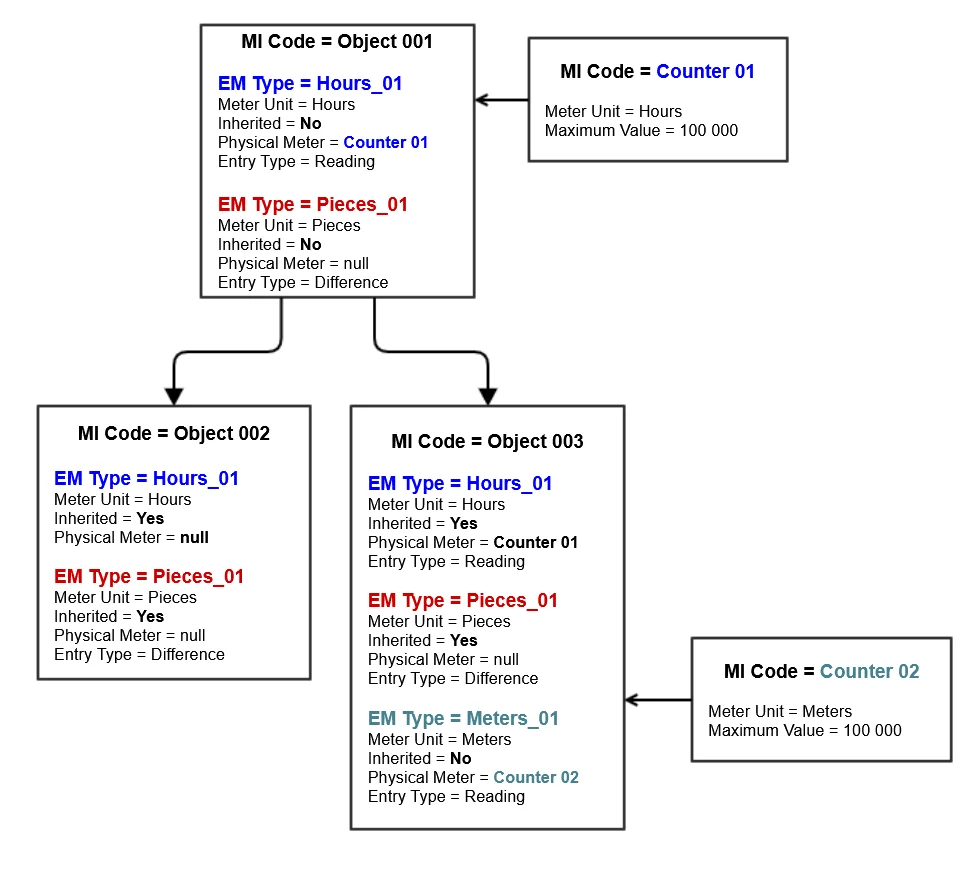

Follow these steps to define the Maintenance Item (MI) hierarchy with Effective Meters and linked Physical Meters:

1. MI hierarchy:

    - Define MI Object 001.
    - Define MI Object 002 and indicate Object 001 as a Parent MI.
    - Define MI Object 003 and indicate Object 001 as a Parent MI.

    - **Note**: You can check the MI hierarchy [here](/docs/processforce/user-guide/plant-maintenance/field-description/reports#mis-structure-report).

2. Define Meter Units *(Main Menu  → Administration  → Setup  → Stock Management   →Units of Measure*):

    - Hours.
    - Pieces.
    - Meters.

3. Define EM Types. Please check [here](/docs/processforce/user-guide/plant-maintenance/field-description/maintainable-item#definition-of-em-type-and-physical-meter):

    - Hours_01 (UoM=Hours, Entry Type=Reading)
    - Pieces_01 (UoM=Pieces, Entry Type=Difference)
    - Meters_01 (UoM=Meters, Entry Type=Reading)

4. Define MIs (Physical Meters), Apparatus Type=Meter. Please see [here](../examples/overview.md):

    - Counter 01 (UoM=Hours)
    - Counter 02 (UoM=Meters).

5. Define Effective Meters (here) and link Physical Meter for Object 001:

    - Add in tab Effective Meters:

      - EM Type=Hours_01, Inherited=No, Entry Type=Difference
      - EM Type=Pieces_01, Inherited=No, Entry Type=Difference
      - Save data.
    - To EM Type Hours_01 link Physical Meter: Counter 01:

      - Select the EM Type line and use the RMBM option Physical Meter Connection; a window with Physical Meters appears.
      - Select Physical Meter Counter 01 from the list (only not linked Physical Meters are visible with the same UoM like EM type).
      - Meter Reading window is opened. Please select the button Add.
      - Linking of Physical Meter is documented by Meter Reading document (accurate description is visible in Remarks, and a checkbox Correction is checked by default). You can check that in Physical Meter Reading History (here) or Physical Meter's MI record in the Details tab, fields: Assigned to MI, Assigned to EM.
      - For EM Type Hours_01, change Entry Type to Reading.
      - Save data.

6. Define Effective Meters for Object 002:

    - Add it in the Effective tab Meters:

      - EM Type=Hours_01, Inherited=Yes, Entry Type = Difference
      - EM Type=Pieces_01, Inherited=Yes, Entry Type = Difference
      - Save data.
7. Define Effective Meters and Physical Meters for Object 003.

    - Add it in the Effective tab Meters:

      - EM Type=Hours_01, Inherited=Yes, Entry Type = Difference
      - EM Type=Pieces_01, Inherited=Yes, Entry Type = Difference
      - EM Type=Meters_02, Inherited=No, Entry Type = Difference
      - Save data
    - To EM Type Meters link Physical Meter: Counter 02:

      - Select the EM Type line and use the RMBM option Physical Meter Connection; a window with Physical Meters appears.
      - Select Physical Meter Counter 02 from the list (only not linked Physical meters are visible with the same UoM, like EM type).
      - Meter Reading window is opened. Please select the button Add.
      - Linking of Physical Meter is documented by Meter Reading document (accurate description is visible in Remarks, and a checkbox Correction is checked by default). You can check that in Physical Meter Reading History (here) or Physical Meter's MI record in tab Details, fields: Assigned to MI, Assigned to EM.
      - For EM Type, change Entry Type to Reading.
      - Save data.

:::note
    If in the child MI (Object 002) you use the identical EM Type as in parent MI (Hourse_01, Pieces_01), in the child MI for these Effective Meters, you have to set Inherited=Yes. You can enter reading only for Effective Meters/Physical Meters from parent MI. Readings for Effective Meters in child MI will be calculated and propagated across MI's hierarchy by the system (please see here).
:::

## Definition of Inspection Points for MI

Let's assume you want to record tire pressure (in bars) for your car's front right and left tires, and if the pressure is too low, automatically generate a Maintenance Order (MO). Follow these steps:

1. Define MI: My Car.
2. Define UoM: *(Main Menu/Administration/Setup/Stock Management/Units of Measure*): Bar.
3. Define Point Type (check here): Tire.
4. Define Aspect Type (see here): Pressure with UoM=Bar.
5. For object My Car:
    - In the tab Inspection Points/Points (here), define Points with Point Type=Tire:

      - Front Right,
      - Front Left,
    - In tab Inspection Points/Aspects (here), define with Aspect Type=Pressure:

      - Pressure in Tire (UoM = Bar)
      - Nominal Value = 2,5
      - Min. Critical = 2,3
      - Min. Std. MO = Pump air (Maintenance Order Template).
    - In the tab Inspection Points/Aspect Points (here), define Aspect Point using Points and Aspect:

      - Pressure in Tire - Front Right
      - Pressure in Tire - Front Left
    - Save data.

## Findings Usage

Findings are utilized during Maintenance Order (MO) recording in Task → Checkpoint, where a result can be selected from a predefined list.

To share the finding in the list, follow the below steps:

1. Define the finding (check [here](#findings-usage)). You can define the finding as General or share it for MI Class/MI Category.

    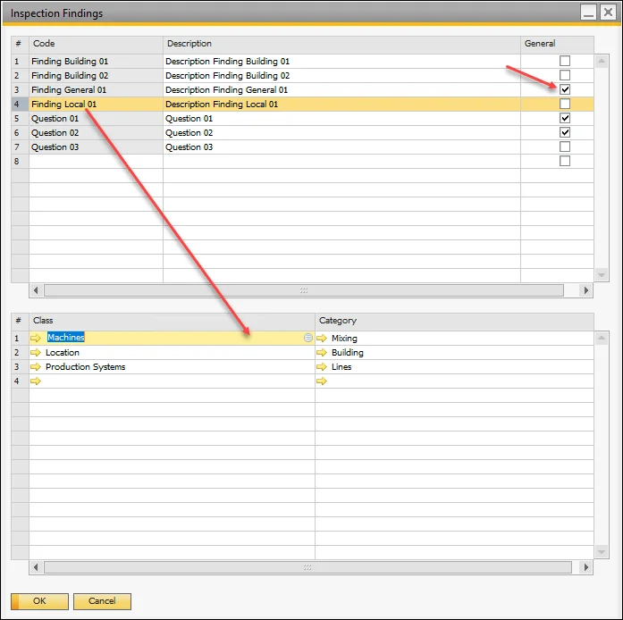
2. In the Checkpoint Template, click the Import Findings button to populate the findings list in the Findings tab. The list is updated based on the MI Class/MI Category specified in the checkpoint header.

    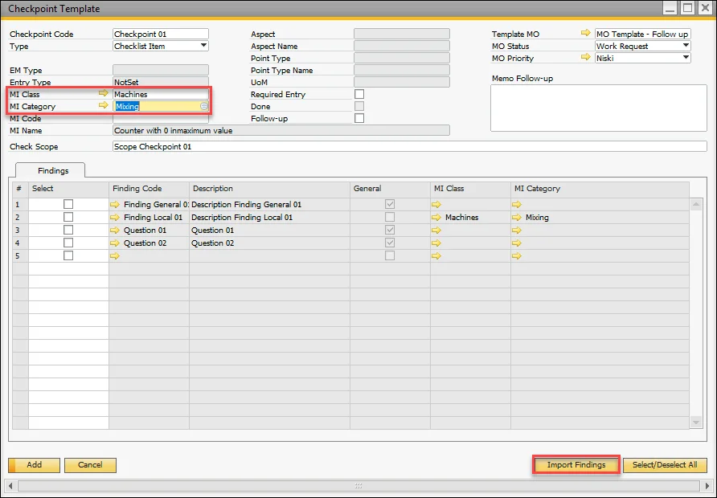
3. Use the checkboxes to select the findings that should be available in the findings list during checkpoint recording.

    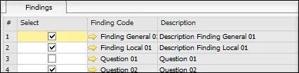
4. The selected findings will now appear in the findings list during checkpoint recording.

    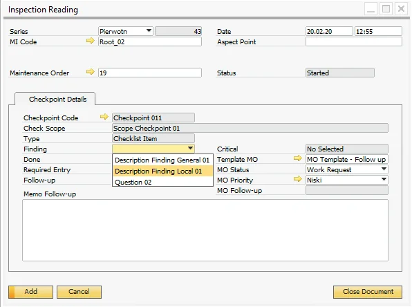

## Maintenance Order Template Definition Schema

For details on Maintenance Order Template Definition Schema, click [here](../field-description/maintenance-order-template.md).

## Maintenance Order Creation Schema

For additional information on Maintenance Order Creation Schema, click [here](../field-description/maintenance-order-template.md).

## MO Recording

Recording activities within a Maintenance Order (MO) are possible when the MO status is set to "Started".

**Recording Checkpoints**:

1. The first user has to record checkpoints (check [here](#maintenance-order-template-definition-schema) and for definition [here](../field-description/maintenance-order-template.md#checkpoint-template)).
2. If all checkpoints with Required Entry = Yes have Done = Yes (automatically checked when the document is closed), the Task is marked as completed.
3. If a task does not include checkpoints, it can be marked as completed directly on its line by selecting "Done".
4. If a task includes checkpoints, every checkpoint must be reported individually.
5. Once all jobs are completed, the MO status can be updated to Finished.

**Recording Readings**:

Select a checkpoint from the checklist and choose one of the following RMBM options:

- Inspection Reading: For checkpoints associated with inspections (Type: Inspection, Checklist Item, Quantitative, Qualitative, or Question).

    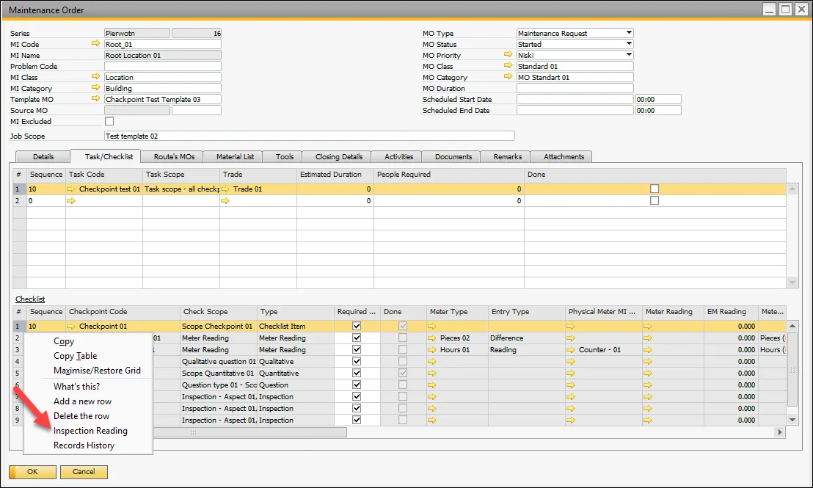

- Meter Reading: For checkpoints with Type = Meter Reading.

    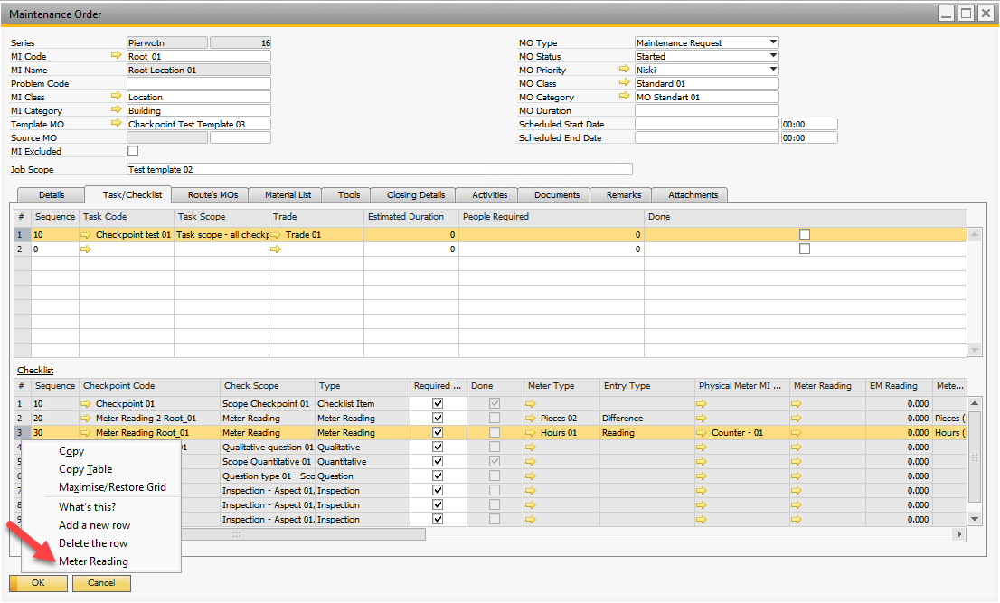

Multiple Inspection Reading or Meter Reading documents can be created for each checkpoint line. The latest document is displayed in the checkpoint line (column: Meter Reading or Inspection Reading). New documents can only be created after the previous document is closed. Use the Records History option in the RMBM to review past documents.

:::note
    Recording of different Types of Checkpoints is explained in detail [here](../field-description/maintainable-item.md#meter-reading)
:::
