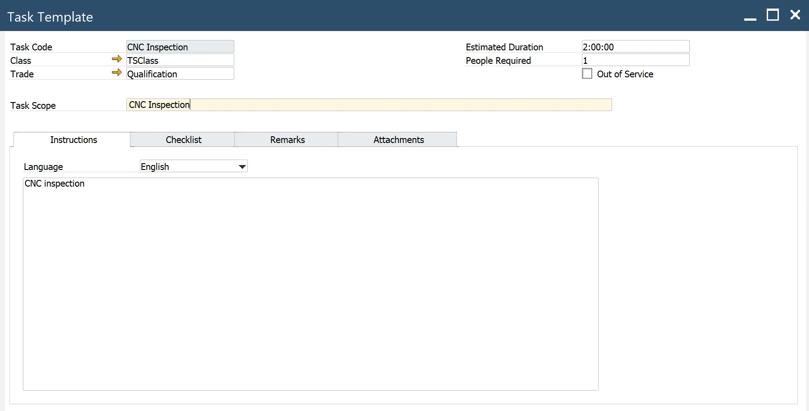

# Maintenance Order Template

Maintenance Order Templates are essential tools in Plant Maintenance, enabling systematic and efficient handling of maintenance activities. This guide provides a detailed overview of the elements within Maintenance Order Templates, including their purpose, structure, and related configurations. By understanding and implementing these templates effectively, organizations can streamline their maintenance operations and enhance equipment reliability.

---

:::note Path
        Main Menu → Plant Maintenance → Work Setup → Maintenance Order Template
:::

## Header

The header section defines key attributes of the Maintenance Order Template:

- **Template Code**: a unique code identifying the Maintenance Order Template.
- **Job scope**: a brief description of the job’s purpose.
- **Problem Code**: a code identifying a problem from a pre-defined list.
- **MI Class**: a class of equipment for performing the work.
- **MI Category**: equipment category to which the standard work order applies, a category inside Class.
- **MI Code**: the Maintenable Item for which the MO is defined.
- **MI Name**: the name of the Maintenable Item.
- **MI's Defaults MO**: indicates if the Maintenance Order template is set as the default for the MI.
- **MI Excluded** - if selected, the MI is excluded from scheduling during the planned Maintenance Order period.

The Maintenance Order (MO) can be in one of the following statuses: scheduled, started, or released. If MI Exclude is selected, the header MI of the MO becomes unavailable for production. Additionally, the time allocated for the MO is excluded from scheduling and displayed as a grey bar on the Gantt Chart in the resource view.

If the MI acts as a parent to another MI and the child MI is marked as Dependent = Yes, the excluded time will also appear on the Gantt Chart for the child MI (resource). This exclusion propagates throughout the MI hierarchy.

- **MO Class**: defines the Maintenance Order class of the template(check [here](../field-description/maintainable-item.md#classes)).
- **MO Category**: specifies the Maintenance Order category within a class.
- **MO Dependent**: ensures the Maintenance Order remains open until all child work orders are completed.
- **MO Type**: specifies the type of Maintenance Order for the template.
- **Maintenance Request**: request related to Manufacturing Order
- **Setup Request**: request related to a Manufacturing Order
- **Change Over Request**: indicates a changeover request related to a Manufacturing Order
- **Manual Request**: maintenance request initiated by the end user
- **Breakdown**: select to create a maintenance order in response to an equipment breakdown or failure
- **PM request**: select to create a preventive maintenance work order.
- **MO Duration**: specifies the duration of the template Maintenance Order, including the Route’s Maintenance Order.
- **MO Priority**: defines the priority level of the Maintenance Order, such as Low, Medium, or High.

## Closing Codes

:::info Path
Main Menu → Administration → Setup → Plant Maintenance → Closing Codes
:::

The PM system includes four types of closing codes:

1. **Action codes**: describe the actions taken to resolve a problem (e.g., adding lubricant to a pump).
2. **Cause codes**: identify the root cause of the issue (e.g., inadequate lubrication).
3. **Failure codes**: explain why the equipment failed (e.g., blocked lubrication pipe).
4. **Problem codes**: highlight the observed problem (e.g., pump overheating).

### Priority

:::info Path
Main Menu → Administration → Setup → Plant → Maintenance → Priority
:::

- **Code**: a unique priority code
- **Name**: a priority name

## Tab Task/Checklist

Based on Task Template.

- **Sequence**: order of tasks execution.
- **Task Code**: Task's code from Task Template. The system automatically populates the task definition from the Task Template.

### Task Template

:::info Path
Main Menu → Administration → Plant Maintenance → Work Setup → Task Template
:::

Header

- **Task Code**: a unique code identifying the task. Enter a description of the task in the Task Scope field.
- **Task Scope**: descriptive information of the Task Scope (brief explanation of the problem)
- **Class**: categorize the task based on its class/type.
- **Trade**: specify the trade associated with the task.
- **Estimated Duration**: the number of hours estimated to complete the task.
- **People Required**: indicate the number of people necessary to execute the task.
- **Out of Service**: select this option if the task is inactive and should not appear in lookups,, e.g., on Template MO.

#### Trade

:::info Path
Main Menu: Administration → Setup → Plant Maintenance → Trade
:::

Trades are unique codes that define the types of employees performing maintenance tasks. A single trade may have multiple rates depending on the cost trade type or the department associated with the trade for a specific Maintenance Order. The system, based on an hourly rate, charges the trade costs to the corresponding maintenance order, MI, or project for accurate cost tracking (this feature is not implemented in phase I). On the Qualifications tab, qualifications can be associated with trades to set the minimum qualifications required for an employee in a specific trade to perform tasks related to that trade.

- **Trade**: a unique code identifying the trade.
- **Description**: descriptive information about the trade.
- **Class**: enter the class to further subdivide the trade as necessary, e.g., specify apprentice, journeyman, or master.

##### Rates tab

The Rates tab defines the hourly rates for trades. When booking hours, the system checks if an hourly rate is assigned to the employee. If so, the employee's rate is applied. If not, the system defaults to the hourly rate defined for the trade on the Rates tab.

- **Type of Hours**: specifies the type of hours worked (e.g., regular or overtime).
- **Department**: the department associated with this rate. If the rate applies to all departments, leave empty (Main Menu/Administration/Setup/Stock Management/Departments)
- **Hourly Rate** – the hourly rate for this trade.
- **Start Date and End Date** – beginning and ending dates to which the rate applies.
- **Note**: Dates for the same hours and department combination cannot overlap.

#### Qualification tab

- **Qualification Code**: a unique qualification code associated with the trade, based on the qualification template.

#### Qualification Template

:::info Path
Main Menu: Administration → Setup → Plant Maintenance → Qualification
:::

- **Qualification Code**: a unique code identifying the qualification. Enter a description in the adjacent field.
- **Class**: enter the class of the qualification here.
- **Active**: select this option to mark the qualification as active. You can also select and unselect Active to temporarily activate and deactivate a qualification.
- **Training Record**: mark the qualification as a training record if it does not need to be enforced for qualification tracking. In this case, the qualification cannot be associated with tasks, trades, or work order activities.

### Instruction tab

- **Language**: select the language for the instructions.
- **Instructions** – enter the comments on the screen.

### Checklist tab

- **Sequence**: defines the order in which the checkpoint steps should be executed.
- **Checkpoint Code**: select the specific step in the task, defined in the Checkpoint Template.

## Checkpoint Template

:::info Path
Main Menu → Administration → Plant Maintenance → Work Setup → Checkpoint Template
:::

- **Checkpoint Code**: a unique code for a checkpoint.
- **Check Scope**: descriptive information about checkpoint scope.
- **Type**: specifies the type of checklist item,: Checklist Item, Question, Quantitative, Qualitative, Inspection, or Meter Reading.

>Note: Checkpoint Type determines how the checkpoint will be reported in Maintenance Order

- **MI Class**: the MI Class for which the checkpoint is designated.
- **MI Category**: the MI Category applicable to the checkpoint.

>Note: MI Class/MI Category determines what findings will be visible in the tab Findings (check here)

- **MI Code**: the MI Code for which the checkpoint is designated.
- **EM Type**: MI's Effective Meter Type associated with UoM for the meter reading. (Check [here](maintainable-item.md#effective-meters-tab)).
- **Entry Type**: specifies the meter reading input mode: Reading or Difference.
- **Aspect**: determines for which Inspection Points from MI inspection results will be recorded, based on Aspect/Point Type. (Check [here](maintainable-item.md#aspect-points)).
- **Aspect Name**: an aspect defined for MI, please check [here](maintainable-item.md#aspect)
- **Point Type**: the point related to the aspect in the Maintainable Item definition. (Check [here](maintainable-item.md#point-type)).
- **Point Type Name**: name of the point.
- **UoM**: a unit of measure for Aspect Point.
- **Required Entry**: select this if completing the checkpoint is mandatory to close the associated task in the Maintenance Order.
- **Follow-up**: enable this to generate a follow-up Maintenance Order (MO) from the template.

A follow-up MO is created when the Follow-up checkbox is selected. The source for the follow-up MO template can be defined in the From field, with the following options:

- **Header**: applies to all checkpoint types.
- **Findings**: applies to all checkpoint types. Uses the MO Template and parameters (Status, Priority, and Memo Follow-up) from the Findings tab.
- **Values**: are available for Meter Reading, Inspection, and Quantitative checkpoint types. MO Template and parameters (Status, Priority, and Memo Follow-up) are determined from predefined value intervals in the Values tab.
- **Aspect Point**: is available for Inspection-type checkpoints. MO Template and parameters (Status, Priority) are based on Aspect Points defined in the Maintainable Item. Memo Follow-up is derived from the checkpoint header.

If Follow-up is not selected, no follow-up MO is created, and Memo Follow-up is taken from the header.

- **Memo Follow-up**: additional remarks to follow up on MO.
- **Template MO**: a follow-up Maintenance Order the system will create when checklist Items are selected for follow-up.
- **MO Status**: the status of the follow-up MO.
- **MO Priority**: the priority of the follow-up MO.

### Findings tab

The Findings Tab allows the selection and management of findings relevant to the Maintenance Order's Maintainable Item (MI) Class and Category.

Findings are automatically imported and associated with the specified MI Class and MI Category in the header.

- **Select**: if the checkbox is selected, the finding will be available for reporting when the checkpoint is executed in the Maintenance Order.

#### Findings

:::info Path
Main Menu → Plant Maintenance → Inspection Setup → Findings
:::

The Findings section defines predefined descriptive findings used during checkpoint recording in maintenance processes.

- **Finding**: A predefined description of observations or results recorded during inspections.
- **Code**: A unique code assigned to each finding.
- **Description**: detailed information describing the finding.
- **General**: if selected, the finding can be applied across all checkpoint template definitions.
- **Where Used**: lists the applicable MI Classes and MI Categories where the finding can be utilized.
        - **MI Class**: Represents the Maintainable Class where the finding is applicable.
        - **MI Category**: Maintainable Category.

## Material List tab

The Material List Tab enables users to define the materials required for executing a Maintenance Order (MO).

- **Material List Code**: select a predefined Material List or manually compose it by adding items individually.
- **Item Code**: specifies the code for the item. The system automatically populates associated parameters.
- **Revision Code**: revision code of the item.
- **Item Name**: retrieved from the Item Master Data.
- **MI Code**: select if any Maintainable Item (MI) is defined as a Part (Apparatus Type = Part).
- **MI Name**: fetched from the MI Master Data.
- **Equipment Card**: Equipment Card (EC) number assigned to the item managed by serial numbers.
- **Quantity**:  specifies the required quantity of the item.
- **UoM**: retrieved from the Item Master Data.
- **Warehouse Code**: specifies the default Warehouse.
- **Issue Type**: default is set to "Manual".
- **Hours**: Estimated time required to use the item for completing the MO.
- **Total Hours**: equal to Quantity \* Hours
- **Safety**: indicates if special safety conditions are required. If checked, ensure adherence to relevant safety protocols.

### Material List Template

:::info Path
Main Menu → Administration  →Plant Maintenance → Work Setup → Material List
:::

The Material List Template allows users to define and manage materials required for Maintenance Orders.

- **Item Code**: automatically populates the item's parameters based on the selected code.
- **Revision Code**: specifies the revision associated with the item.
- **Item Name**: indicates the number of items required.
- **Quantity**: how many Items are needed
- **UoM**: UOM derived from the Item Master Data
- **Warehouse Code**: specifies the default warehouse.
- **Issue Type**: default is set to "Manual".

## Tab MO Tools

The MO Tools Tab specifies the tools and equipment required for executing the Maintenance Order.

- **Item Code**: enter the Item Code to add to the Material List. The system automatically populates Item parameters.
- **Revision Code**: revision associated with the item.
- **Item Name**: description retrieved from Item Master Data.
- **MI Code**: you can select MI with assigned EC No. as a tool.
- **MI Name**: name retrieved from the MI Master Data.
- **Equipment Card**: Equipment Card (EC) number assigned to the item, typically managed by serial numbers.
- **Quantity**: specify the number of items required.
- **UoM**: UOM retrieved from the Item Master Data
- **Warehouse Code**: specifies the default warehouse.
- **Issue Type**: default is set to "Manual".
- **Hours**: estimated time needed to use the tool for completing the Maintenance Order.
- **Total Hours**: equal to Quantity \* Hours
- **Safety**: indicates whether special safety conditions are required. If checked, ensure compliance with the necessary safety protocols.

## Route’s MO tab

### MO Templates tab

The MO Templates Tab allows the assignment of child Maintenance Orders (MOs) to the main Maintenance Order template.

- **Sequence**: the order in which the route Maintenance Orders should be performed.
- **Template Code**: select the route Maintenance Order template to associate with the primary Maintenance Order template. Check [here](#maintenance-order-template). The system automatically populates the parameters for the selected MO Template.

For details on the Task Checklist, click [here](#tab-taskchecklist)

#### Materials tab

The Materials Tab defines the materials required for the Maintenance Order, allowing users to either use a predefined list or add materials manually.

- **Material List Code**: select a predefined Material List or compose one manually by adding items individually.
- **Item Code**: enter the Item Code. Item parameters are automatically populated by the system.
- **Revision Code**: revision associated with the item.
- **Item Name**: description retrieved from Item Master Data.
- **MI Code**: optionally select a Maintainable Item (MI) defined as a Part (Item with Apparatus Type = Part).
- **MI Name**: name retrieved from the MI Master Data.
- **Equipment Card**: Equipment Card (EC) number assigned to the Item, typically managed by serial numbers.
- **Quantity**: specify the quantity of items required.
- **UoM**: UoM retrieved from the Item Master Data.
- **Warehouse Code**: Specifies the default warehouse.
- **Issue Type**: default is set to "Manual".
- **Hours**: estimated number of hours required to use the material for completing the Maintenance Order.
- **Total Hours**: equal to Quantity \* Hours
- **Safety**:  indicates whether special safety conditions are required. If checked, ensure compliance with safety protocols.

#### Tools tab

The Tools Tab is used to define the materials and tools required for the Maintenance Order.

- **Item Code**: enter the Item Code to add to the Material List. The system automatically populates Item parameters.
- **Revision Code**: revision associated with the Item.
- **Item Name**: description from Item Master Data
- **MI Code**: select the Maintainable Item (MI) with an assigned Equipment Card (EC) number as a tool.
- **MI Name**: name retrieved from the MI Master Data.
- **Equipment Card**: Equipment Card (EC) number assigned to the Item, typically managed by serial numbers.
- **Quantity**: specify the number of items required.
- **UoM**: UoM retrieved from the Item Master Data.
- **Warehouse Code**: Specifies the default warehouse.
- **Issue Type**: default is set to "Manual".
- **Hours**: enter the estimated number of hours needed to use the tool for completing the Maintenance Order.
- **Total Hours**: equal to Quantity \* Hours
- **Safety**: indicates whether special safety conditions are required. If checked, ensure compliance with safety protocols.
