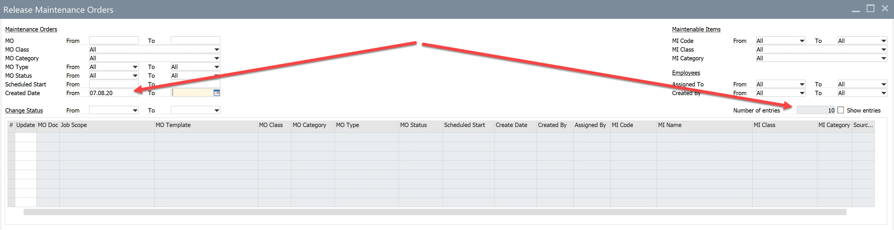
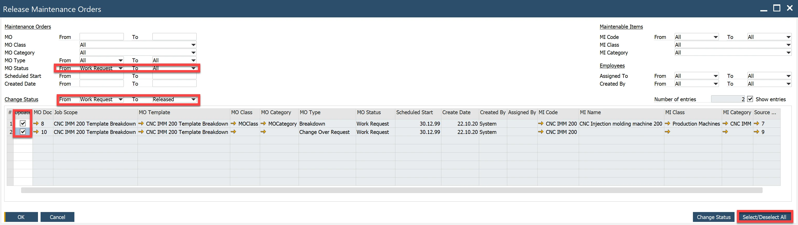
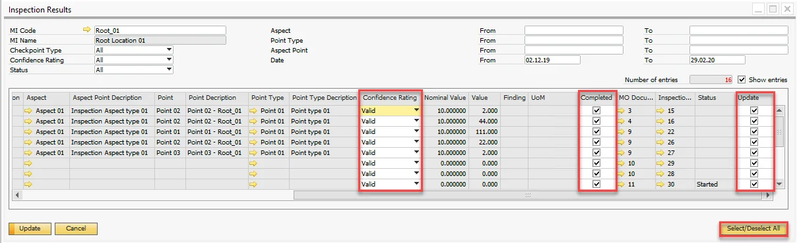

# Release Maintenance Orders, Inspection Results Verification

Efficient plant maintenance requires seamless management of maintenance orders and inspection results. This document provides guidance on releasing maintenance orders and verifying inspection results, ensuring that all processes are streamlined and accurately recorded. Below are the detailed steps and functionalities available in these features:

---

## Release Maintenance Orders

:::info Path
Main Menu → Plant Maintenance → Work Management → Release Maintenance Orders
:::

This feature enables users to modify the status of multiple Maintenance Orders simultaneously, such as changing their status from **Work Request** to **Released**. Header fields function as filters, helping users narrow down the orders they wish to manage. The **Number of entries** field displays how many orders match the selected filter criteria.

To view Maintenance Orders in the grid, check the **Show entries** checkbox.

Example: Change Maintenance Orders with the status "Work Request" to "Released":

- Apply filters as shown below.
- Click the **Select/Deselect** All button.

    
- Select the **Change Status** button.

## Inspection Results

:::info Path
Main Menu/Plant Maintenance/Work Management/Inspection Results
:::

The Inspection Results window is designed to manage and verify inspection outcomes. Users can set or modify:

- Confidence Rating (Valid, Invalid, Discontinuity)
- Completed

Filters in the header work similarly to those in the Release Maintenance Orders window. By default, the date range is set to the current month.

Example: Complete the selected inspection results as valid:

- Apply filter values to identify the desired inspection results.
- Check the **Show entries** checkbox to display the relevant records in the grid.
- Select the **Select/Deselect All** button to select all displayed lines. Ensure the following values are set:
        - Confidence Rating=Valid,
        - Completed=Yes,
        - Update=Ye

    
- Click the **Update** button to apply changes.

---
