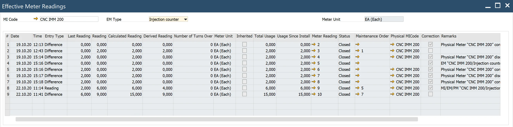
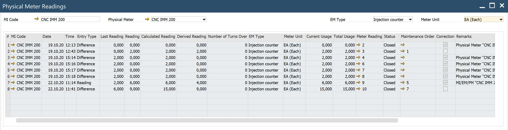
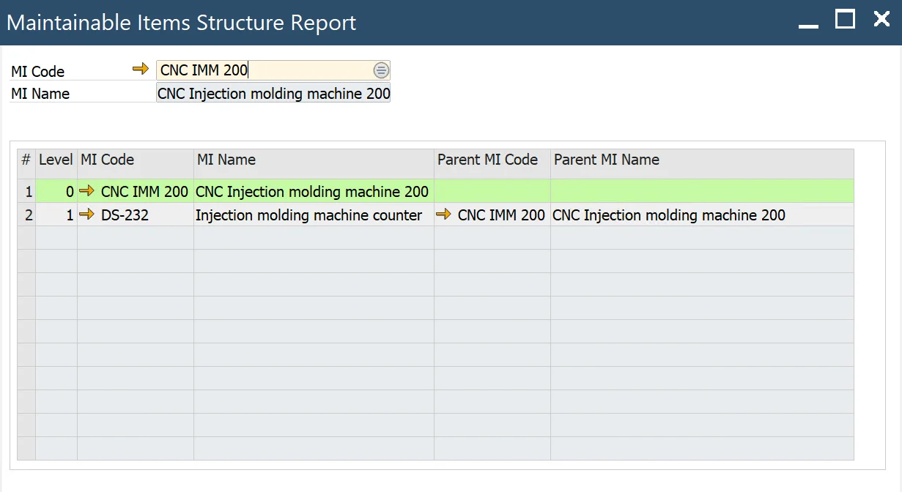

# Reports

Plant Maintenance reports provide valuable insights into various aspects of meter readings and MI (Maintenance Item) structures. These reports help streamline maintenance operations by offering detailed historical data, document links, and hierarchical structures for efficient analysis. Below are the key reports available within the Plant Maintenance module:

---

## Effective Meter Reading History

:::info Path
Main Menu → Plant Maintenance → Reports → Effective Meter Reading History
:::

This report enables users to view historical effective meter readings. By selecting values in the header, such as MI Code or EM Type, users can access a grid displaying the corresponding readings. Each reading includes a link to its source Meter Reading document, offering quick access to detailed information.

## Physical Meter Readings History

:::info Path
Main Menu → Plant Maintenance → Reports → Physical Meter Reading History
:::

The Physical Meter Readings History report allows users to review past physical meter readings. Users can filter the data by selecting MI Code or Physical Meter in the header. The grid displays readings along with links to the respective source Meter Reading documents for deeper insights.

## MIs Structure Report

:::info Path
Main Menu → Plant Maintenance → Reports → MIs Structure Report
:::

This report provides a hierarchical view of Maintenance Items (MIs). Users can select an MI Code in the header to display a grid with all related MIs from the hierarchy. The selected MI is highlighted, making it easier to analyze its relationship within the structure.

---
These reports are powerful tools for effective maintenance management, offering visibility into historical readings, structured data, and quick access to relevant documents. By leveraging these insights, organizations can enhance operational efficiency, ensure data accuracy, and maintain a robust maintenance process.
