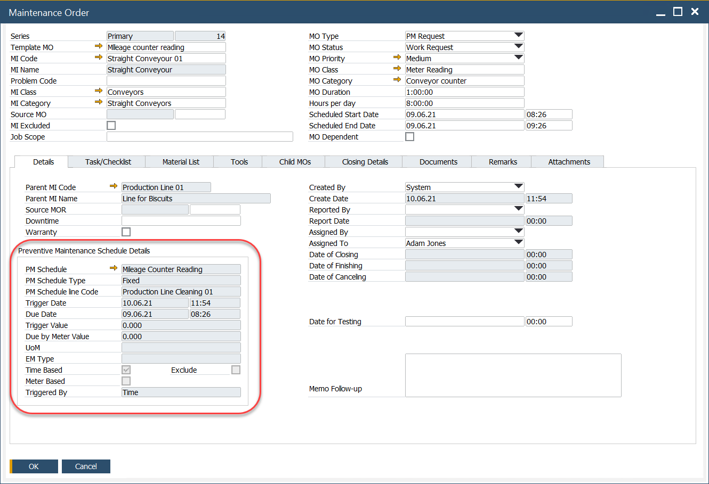

# Generated Maintenance Order

In every Maintenance Order (MO) generated from a PM Schedule, the Details tab serves as the central repository for critical information regarding the MO's conditions.

This tab provides a comprehensive view of essential data, including the schedule parameters, triggers, and any specific details that influence the maintenance task. It ensures that all necessary context and instructions are readily accessible, enabling effective planning and execution of the maintenance activities.

