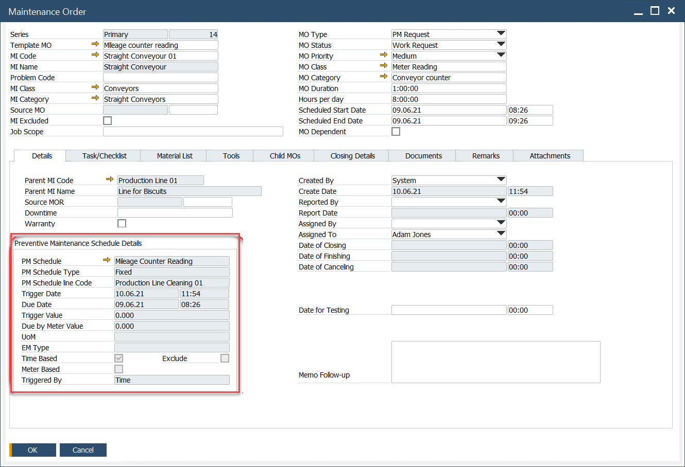

# Generated Maintenance Order

In every Maintenance Order (MO) generated from a PM Schedule, the Details tab serves as the central repository for critical information regarding the MO's conditions.

This tab provides a comprehensive view of essential data, including the schedule parameters, triggers, and any specific details that influence the maintenance task. It ensures that all necessary context and instructions are readily accessible, enabling effective planning and execution of the maintenance activities.

---

## Preventive Maintenance Schedule Details

The Preventive Maintenance Schedule Details section provides key information about how the Maintenance Order was generated - including schedule type, trigger parameters, meter readings, and timing details.

- **PM Schedule**: Identifies the Preventive Maintenance schedule associated with the Maintenance Order.
- **PM Schedule Type**: Specifies how the schedule operates (e.g., Fixed, Variable, or Fixed Duplicate).
- **PM Schedule line Code**: Refers to the specific line or task defined under the PM Schedule.
- **Trigger Date**: The date when the Maintenance Order was triggered.
- **Due Date**: The expected date by which the Maintenance Order should be completed.
- **Trigger Value**: The meter or counter reading recorded when the Maintenance Order was triggered.
- **Due by Meter Value**: The meter or counter value at which the next Maintenance Order is due.
- **UOM**: The unit of measurement used for the Effective Meter (e.g., hours, kilometers).
- **EM Type**: The Effective Meter type used for scheduling (e.g., runtime, distance).
- **Time Based**: Indicates if the Maintenance Order is triggered based on time intervals.
- **Meter Based**: Indicates if the Maintenance Order is triggered based on meter readings.
- **Triggered By**: Displays the parameter (Time or Meter) that initiated the Maintenance Order.

---
