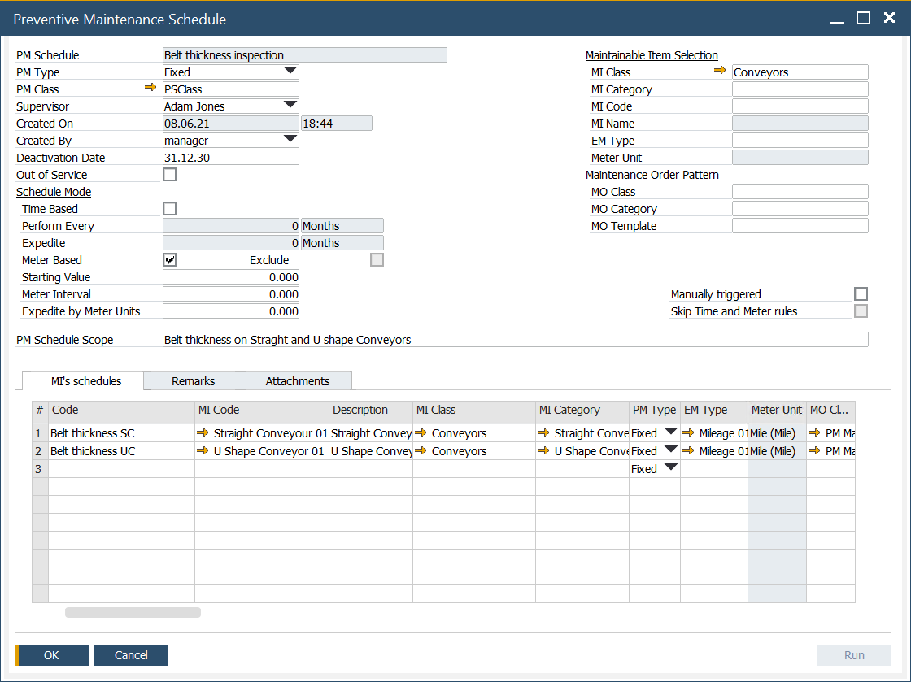
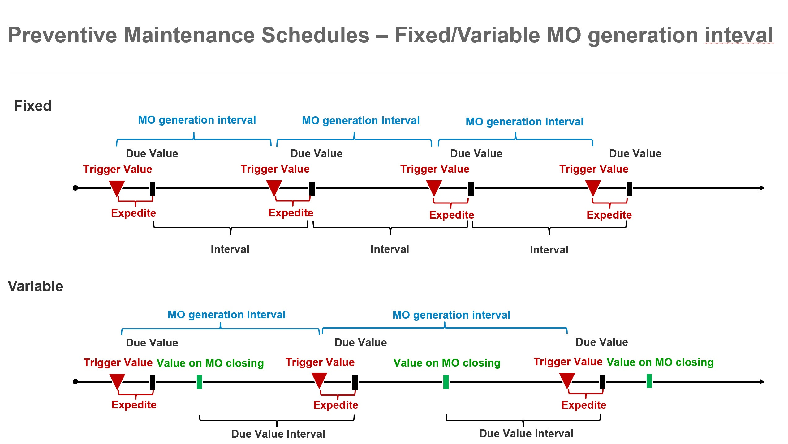

# Overview

Preventive Maintenance Schedules are created and managed using the PM Schedule form, which serves as a structured grouping of schedules defined for Maintainable Items (MI) in the grid lines.

The form header is divided into two key sections:

1. **Schedule Parameters** (left side): Used to define global scheduling settings.
2. **Selection Filters** (right side): Used to specify filters for selecting the serviced MI and the corresponding Maintenance Order (MO) templates.

Parameters defined in the header are automatically applied to new grid lines but can be customized at the grid line level as needed. The filters for MI and MO templates in the header influence the available options in the grid lines.

For clarity of the schedules you define, it is recommended to group schedules based on shared characteristics defined in the header. This approach ensures consistency and simplifies the management of schedules.

    

---

## Header

The header section provides an overview of key parameters and settings for PM Schedules.

- **PM Schedule**: A unique global code used to group PM Schedules within the form.
- **PM Type**: Defines how the PM Schedule operates. Options include:
        - **Fixed**: The next trigger is calculated by incrementing a fixed interval iteratively.
        - **Variable**: The next trigger is based on the value recorded at the time of the last MO closure.
        - **Fixed (Duplicate)**: Operates like Fixed but allows overlapping MOs. For the first iteration, the starting value is used as the base for trigger calculation. A new MO is generated only if the previous MO is finished (except for Fixed (Duplicate)).
            
- **PM Class**: Defines the classification or category of the PM Schedule.
- **Supervisor**: The user responsible for the PM Schedule. The value is defined in the header and can be adjusted in grid lines.
- **Created On**: The date when the PM Schedule was created.
- **Created By**: The user who created the PM Schedule.
- **Deactivation Date**: Specifies the date from which the PM Schedule becomes inactive. The header value applies to all grid lines but can be modified per line. The grid line value takes priority.
- **Out of Service**: When checked at the header level, all PM Schedules in the form are inactive. When checked at the grid line level, only that specific schedule becomes inactive. The value defined in the header is then available in grid lines where it can be changed.
- **Time Based**: Enables scheduling based on time intervals. The value is adjustable in grid lines.
- **Perform Every**: Defines the time interval between successive MOs. Adjustable in grid lines.
- **Expedite**: Reduces the Due Date by a specified interval to expedite MO generation. Adjustable in grid lines.
- **Meter Based**: Enables scheduling based on meter readings for the Effective Meter assigned to the Maintainable Item (MI). Adjustable in grid lines.
- **Exclude**: Relevant when both Time-Based and Meter-Based modes are active:
        - When one condition (time or meter) is met, the other is skipped, and both are recalculated.
        - When one condition is met, the other remains active, and only the fulfilled condition is recalculated.
- **Starting Value**: Activates the schedule when the Effective Meter value is greater than or equal to this value. Adjustable in grid lines.
- **Meter Interval**: Defines the meter reading interval between successive MOs. Adjustable in grid lines.
- **Expedite by Meters Unit**: Expedites MO generation by subtracting a specified meter unit value from the Due by Meter Value. Adjustable in grid lines.
- **PM Schedule Scope**: A descriptive field outlining the scope of PM Schedules.
- **MI Class**: Maintainable Item class. The value defined in the header is then available in grid lines where it can be changed. Limits the choice in grid lines.
- **MI Category**: Maintainable Item category. The value defined in the header is then available in grid lines where it can be changed. Limits the choice in grid lines.
- **MI Code**: Maintainable Item code. The value defined in the header is then available in grid lines where it can be changed. Limits the choice in grid lines.
- **MI Name**: The name of the Maintainable Item.
- **EM Type**: Effective Meter Type. The value defined in the header is then available in grid lines where it can be changed. Limits the choice in grid lines.
- **Meter Unit**: A unit of measure related to the selected EM Type.
- **MO Class**: Maintenance Order class. The value defined in the header is then available in grid lines where it can be changed. Limits the choice in grid lines.
- **MO Category**: Maintenance Order category. The value defined in the header is then available in grid lines where it can be changed. Limits the choice in grid lines.
- **MO Template**: Maintenance Order template. The value defined in the header is then available in grid lines where it can be changed. Limits the choice in grid lines.
- **Manually triggered**: Selecting the checkbox "Manually triggered" means that schedules in this group are not automatically generated via JOB but must be triggered manually using the "Run" button.
- **Skip Time and Meter rules**: If you select the "Skip Time and Meter rules" checkbox with "Manually triggered" selected, the Time-Based and Meter-Based conditions are ignored when the Run button is used. Other conditions, such as Starting Date, Out of Service, Deactivation Date, and MO-related restrictions, still apply.

## Grid Column (not described in the header)

The grid section provides additional details and controls for defining and managing PM Schedules.

- **Code**: A unique identifier for the PM Schedule in the form.
- **MO Type**: The type of Maintenance Order, based on the selected MO Template. This determines the type of MO that will be generated.
- **MO Status**: The status of the Maintenance Order, as defined by the MO Template. This status governs the generation of the corresponding MO.
- **Priority**: The priority assigned to the Maintenance Order, taken from the MO Template. This defines the urgency of the generated MO.
- **MO Duration**: The duration for which the Maintenance Order is expected to last, based on the MO Template.
- **Hours Per Day**: The number of operational hours per day for the Maintenance Order, as specified in the MO Template.
- **Starting Date**: The date when the PM Schedule is activated and starts its execution.
- **Due Date/Time**: The date and time when the next maintenance task is due.
- **Current Trigger Date/Time**: The calculated date and time when the next Maintenance Order (MO) will be triggered.
- **Expedite in**: A unit of measure for the expedition.
- **Last Trigger Date/Time**: The date and time when the last Maintenance Order was triggered.
- **Last Service End Date/Time**: The date and time when the last Maintenance Order was completed or closed.
- **Due by Meter Value**: The total effective meter reading or usage value that indicates when the next maintenance is due.
- **Current Trigger Value**: The current meter reading or usage value that will trigger the next Maintenance Order.
- **Last Trigger Value**: The meter reading or usage value at the time the last Maintenance Order was triggered.
- **Meter Reading**: The document number for the most recent meter reading.
- **Last Service End Value**: The meter reading value at the closure, finish, or cancellation of the last Maintenance Order.
- **Last Service End Meter Reading**: The document number for the latest meter reading at the time of MO closure or cancellation.
- **Triggered By**: Specifies the cause for the generation of the Maintenance Order from the PM Schedule: it could be based on time, meter, a combination of both, or a manual trigger.
- **Assigned To**: The supervisor or user who is responsible for the management and oversight of the PM Schedule.
- **Last MO No.**:The document number of the most recent Maintenance Order generated.
- **Last MO Status**: The status of the last Maintenance Order.
- **Last MO status Date/Time**: The date and time when the status of the last Maintenance Order was updated.

---
