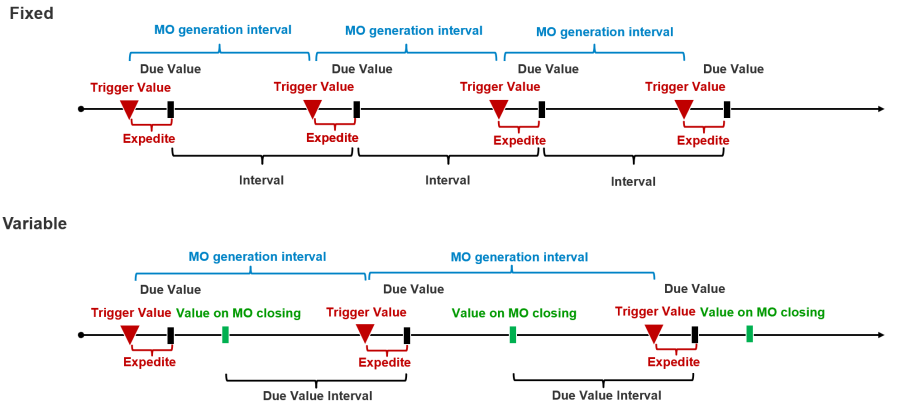

# PM Schedule Activation-Deactivation: General Conditions

Efficient maintenance planning ensures seamless operations in any asset-intensive organization. This guide explores the conditions for enabling or disabling Preventive Maintenance (PM) schedules and the generation of Maintenance Orders (MOs) based on time or meter readings.

---

## Activating and Disabling PM Schedules

1. **Disabling All Schedules**: The "Out of Service" checkbox in the form's header disables all PM schedules associated with that form.
2. **Disabling Individual Schedules**: The "Out of Service" checkbox in a specific line disables the corresponding PM schedule.
3. **Active Status**: A PM schedule is considered active when the following condition is met:
Starting Date ≤ Current Date ≤ Deactivated Date

**Conditions for Order Generation**

Order generation relies on either the passage of time or meter readings linked to a Maintenance Item (MI) using its Equipment Management (EM) Type. Two modes and two types define this process:

1. **Modes**
    - **Time-based**: Orders are generated based on elapsed time intervals.
    - **Meter-based**: Orders are triggered by predefined meter readings.

2. **Types**
    - **Fixed**: Orders are generated based on elapsed time intervals.
    - **Meter-based**: Orders are triggered by predefined meter readings.

**Fixed vs. Variable Intervals**

- In the Fixed type, intervals between Maintenance Orders remain constant, ensuring regular maintenance.
- In the Variable type, intervals are flexible, adapting to changing operational needs or asset conditions.

---
