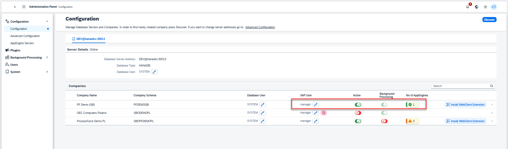
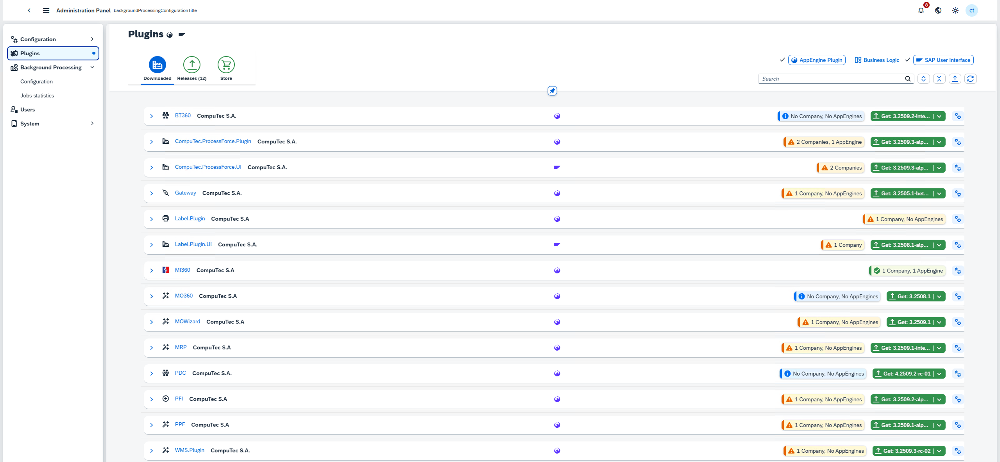
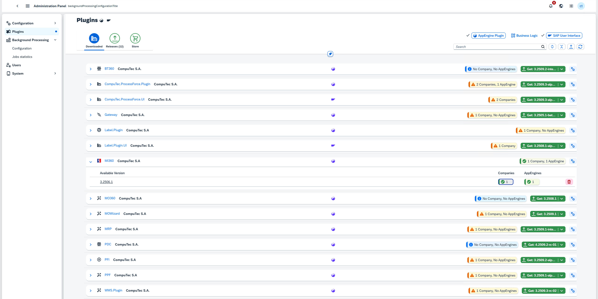
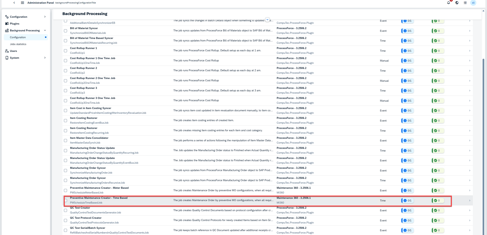
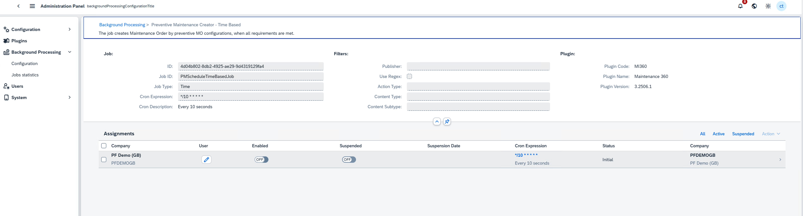

# Setting up CompuTec AppEngine for Preventive Maintenance Schedule

This guide explains how to configure CompuTec AppEngine to enable Preventive Maintenance Scheduling within CompuTec ProcessForce.  
You will learn how to activate the required settings in the SLD Server, install and enable the necessary plugins, and configure background processing jobs for time-based and meter-based maintenance.

## Prerequisites

Before you begin:

- Ensure you have administrator access to the CompuTec AppEngine Administration Panel.
- Confirm that CompuTec ProcessForce and Maintenance 360 (MI360) plugins are available.
- Verify that your System Landscape Directory (SLD) is connected and configured properly.

## SLD Servers Configuration

## Procedure

### Step 1: Configure SLD Servers

1. Open your SLD Server configuration and enable the Background Processing Date option by switching it to **ON**.

   

2. If this is your first setup, you might encounter an error prompting you to add a specific statement in the **Post-transaction procedure**.  
   Add the required code snippet as instructed in the message, then re-enable the Background Processing Date.

   

### Step 2: Install and Activate Plugins

1. Navigate to Plugins → Store and ensure both of the following are installed: CompuTec ProcessForce and MI360

        

2. Once installed, go to Plugins → Downloaded and activate these plugins for your company.

   

### Step 3: Configure Background Processing

**Time-Based Preventive Maintenance**

1. Navigate to Background Processing → Configuration.
2. Locate the job **PMScheduleTimeBasedJob** under the Maintenance 360 plugin.
3. Enable this job for your company to allow time-based preventive maintenance scheduling.

   

   

---
