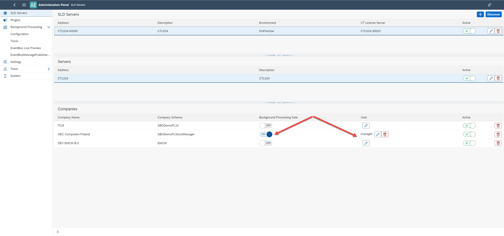
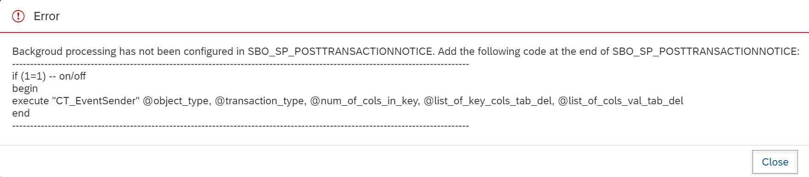
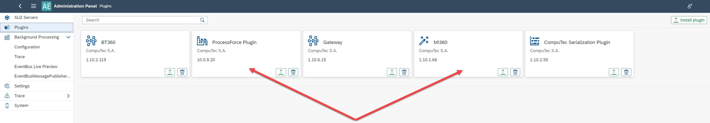
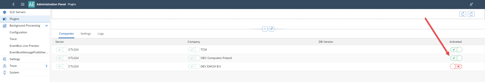
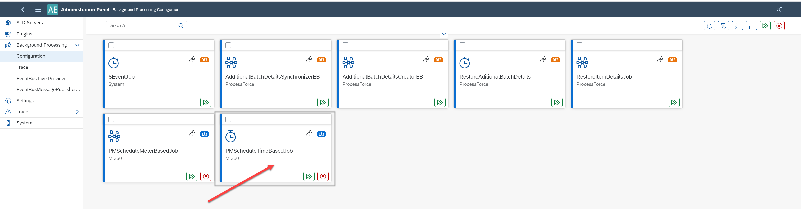
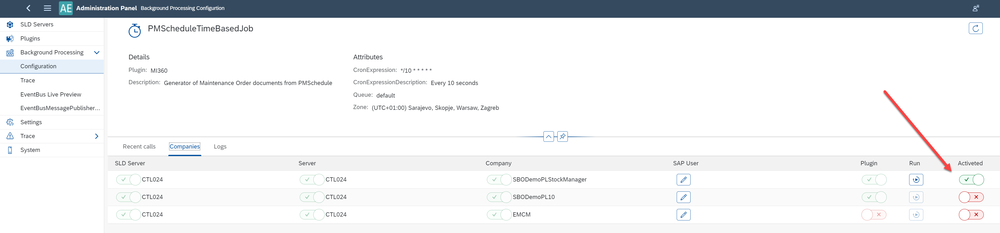
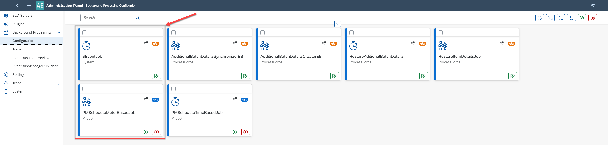
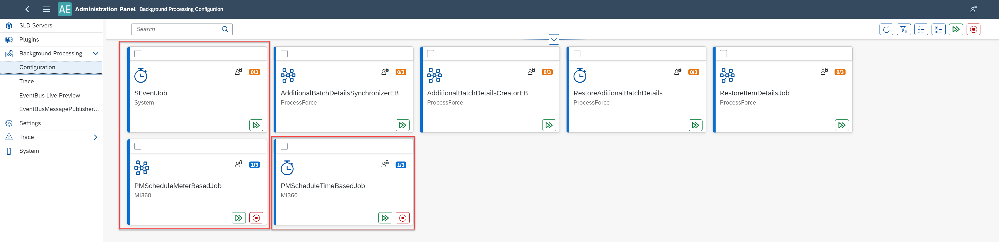

# Setting up CompuTec AppEngine for Preventive Maintenance Schedule

## SLD Servers Configuration

1. Enable the 'Background Processing Date' on your company's SLD Servers by switching it to **ON**.

    

2. If this is your first time setting it up, you may encounter an error requesting that you add a specific statement in the Post-transaction procedure. Once the required code is added, you can proceed to turn the "Background Processing Date" to **ON**.

    

## Plugins Configuration

1. Install **CompuTec ProcessForce** and the [MI360 plugin](/docs/appengine/2.0/releases/plugins/mi360/download).

    

2. Activate both **CompuTec ProcessForce** and **MI360** for your company.

    

## Background Processing Configuration

Preventive Maintenance Schedule based on **Time** set up:

    1. Go to the **PMScheduleTimeBasedJob** background processing and activate it for your company.

    

    

Preventive Maintenance Schedule based on **Meter** values set up.

    1. Go to the **PMScheduleMeterBasedJob**, **PMScheduleTimeBasedJob**, and **SEventJob** background processing and activate them for your company.

        

Preventive Maintenance Schedule based on **Time** and **Meter** values set up:

    1. Go to the **PMScheduleMeterBasedJob**, **PMScheduleTimeBasedJob**, and **SEventJob** background processing and activate them for your company.

    

---
