# Configure CompuTec AppEngine for Preventive Maintenance Scheduling

To use **Preventive Maintenance Scheduling** in **CompuTec ProcessForce**, you must configure **CompuTec AppEngine**, install the required plugins, and enable the appropriate background processing jobs.

This guide explains how to:

- Configure the **SLD Server**.
- Install and activate the required plugins.
- Enable **Background Processing** for time-based and meter-based preventive maintenance schedules.

## Before you start

Before you begin, make sure that:

- You have ``administrator`` access to the **CompuTec AppEngine Administration Panel**.
- **CompuTec AppEngine** is installed and configured.
- **CompuTec ProcessForce** and **Plant Maintenance Mobile** (**MI 360**) plugins are available.
- The **System Landscape Directory** (**SLD**) is configured and connected.

## Configure CompuTec AppEngine for Preventive Maintenance Scheduling

### Step 1: Configure the SLD Server

1. Open the **CompuTec AppEngine Administration Panel**.
2. Go to **Configuration**.
3. Enable **Background Processing Data** for the required company.

   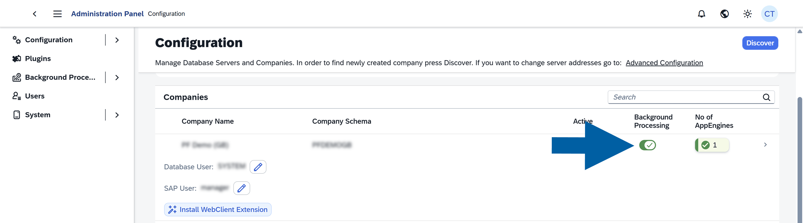

   :::info[note]
   During the initial configuration, you may receive a message indicating that the **Post Transaction Notification Procedure** must be updated.

   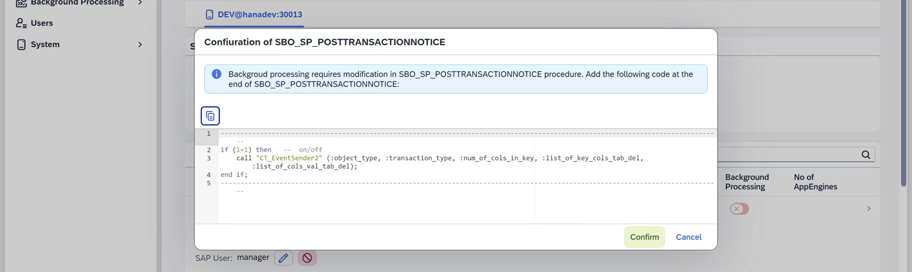

   If this happens:

   - Update the **Post Transaction Notification Procedure** as described in [our configuration guide](https://learn.computec.one/docs/appengine/administrators-guide/configuration-and-administration/installation#step-6-configure-background-processing-within-the-sap-environment).
   - Return to the **CompuTec AppEngine Administration Panel**.
   - Click **Confirm**.
   - Enable **Background Processing Data** again.

   :::

### Step 2: Install and activate the required plugins

1. In the **CompuTec AppEngine Administration Panel**, go to **Plugins** > **Store**.

   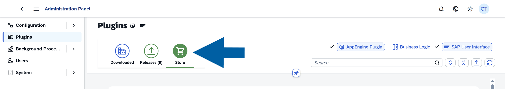

2. Install the following plugins:

   - **CompuTec ProcessForce**
   - **Plant Maintenance Mobile** (**MI 360**)

3. Go to **Plugins** > **Downloaded**.

   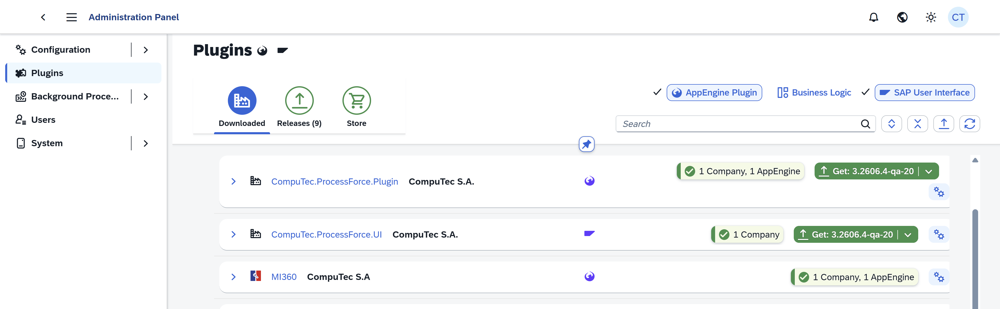

4. Activate both plugins for the company where **Preventive Maintenance Scheduling** will be used.

### Step 3: Configure Background Processing

Depending on the type of preventive maintenance you use, enable the appropriate background jobs.

You can do it in **CompuTec AppEngine Administration Panel** > **Background Processing** > **Cofiguration**.

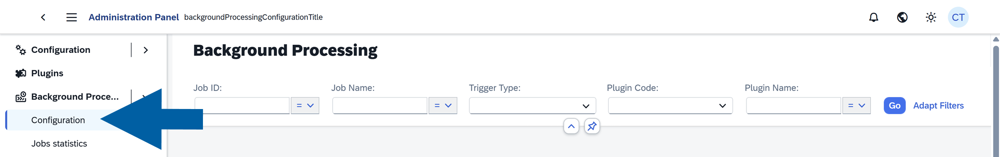

#### Time-Based Preventive Maintenance

To enable time-based preventive maintenance schedules, follow these steps:

1. Find **PMScheduleTimeBasedJob** background processing job on the list and click it.

   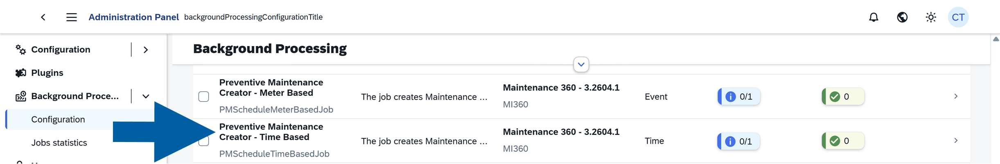

2. Click **the toggle** to enable the job.

   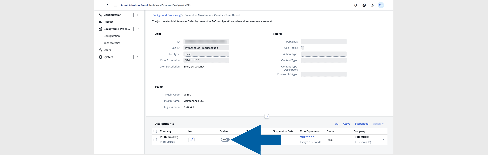

3. Click **Yes** to activate the job.

   
  
#### Meter-Based Preventive Maintenance

To enable meter-based preventive maintenance schedules, , follow these steps:

1. Find **PMScheduleMeterBasedJob** background processing job on the list and click it.

   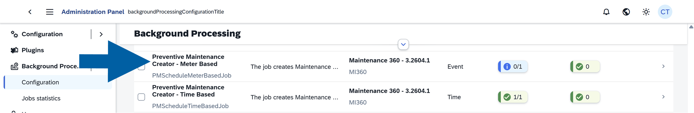

2. Click **the toggle** to enable the job.

   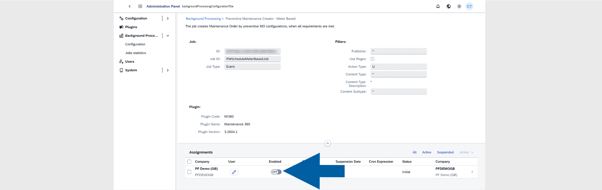

3. Click **Yes** to activate the job.

   

## Combined Time-Based and Meter-Based Preventive Maintenance

If your company uses both scheduling methods, activate:

- **PMScheduleTimeBasedJob**
- **PMScheduleMeterBasedJob**

   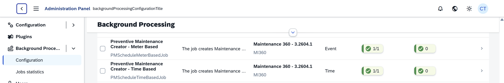

:::info[note]

Make sure the **Cron Expression** for each job is configured according to how often you want preventive maintenance schedules to be processed.

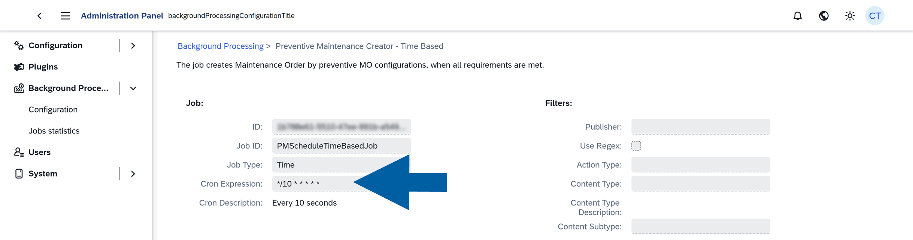

:::
