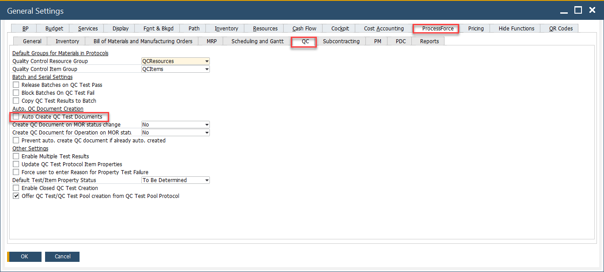
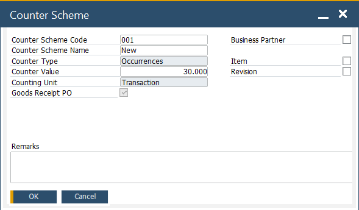
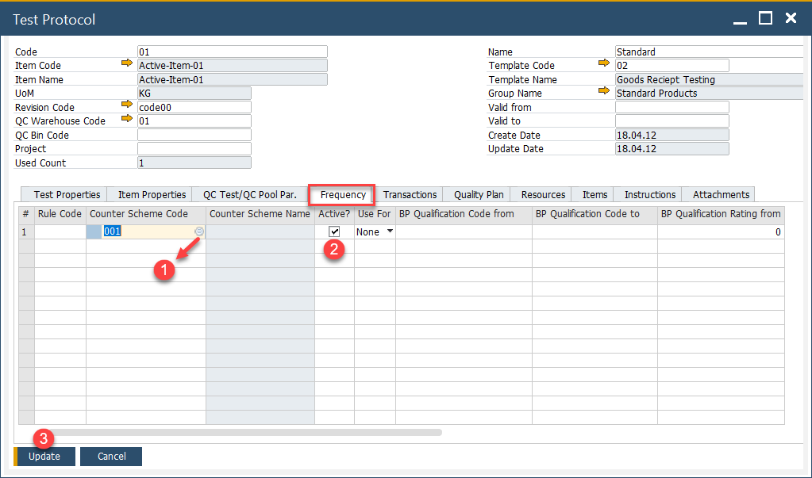
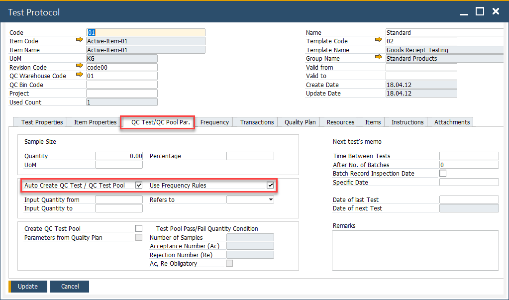
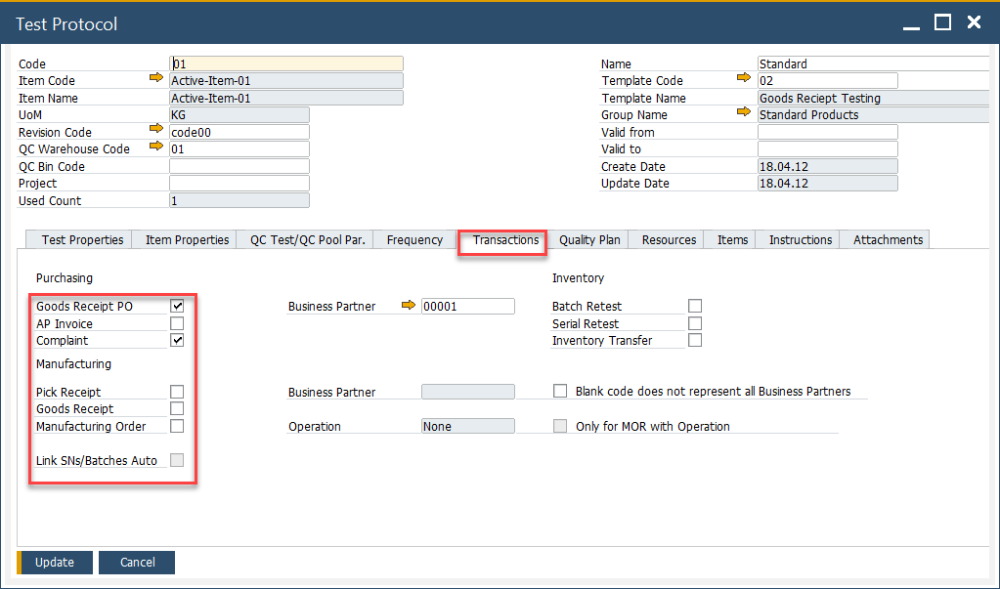
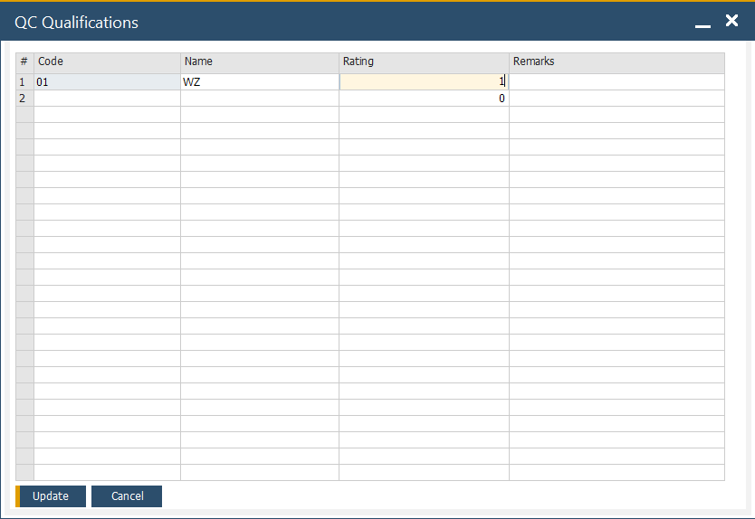
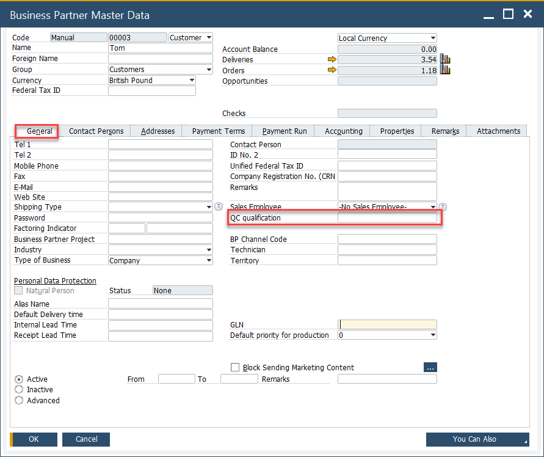
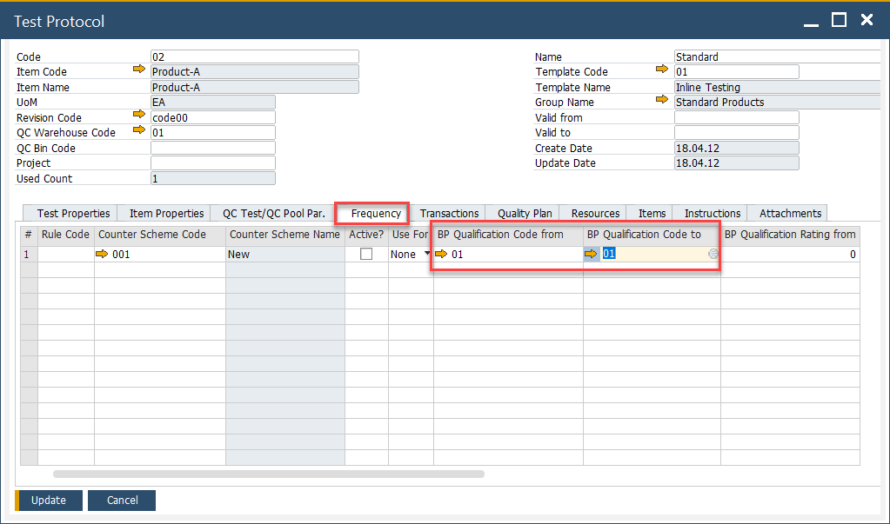

# Automatic Creation of Quality Control Documents

Efficient Quality Control (QC) processes are essential for maintaining product standards and ensuring compliance. To simplify this, you can automate the creation of Quality Control documents based on predefined conditions. This guide outlines the prerequisites, setup, and usage of the automatic QC document creation feature.

---

## Prerequisites

To enable automatic Quality Control (QC) document creation, follow these steps:

1. **Check the related checkbox in General Settings**: Navigate to the General Settings and check the option for automatic Quality Control (QC) test document creation.

        :::info Path
                Administration → System Initialization → General Settings → ProcessForce tab → QC tab
        :::

        

2. **Create a Counter Scheme**: Define a Counter Scheme to determine the frequency of QC document creation.

        :::info Path
                Administration → Setup → Quality Control → Counter Schemes
        :::

## Usage Example

**Setting the Counter Scheme**:

Create a Counter Scheme with a specific name and code. For instance, you can configure the scheme to generate a QC document every 30 batches.

    

**Configuring the Test Protocol**:

1. Open the Test Protocol section and navigate to the Frequency tab.

2. Select the previously created Counter Scheme (1), activate it (2), and save your changes (3).

        :::info Path
                Quality Control → Test Protocol
        :::

        

3. In the QC Test/QC Pool Pr. tab, configure the system to automatically create tests based on the defined frequency:

        

4. Specify the transaction types that trigger the creation of QC Test documents:

        

**Creating QC Tests for Business Partners**

To tailor QC tests for specific business partners:

1. Create **Qualifications** in the Test Protocol section.

        :::info Path
                Quality Control → Test Protocol
        :::

        

2. Assign the defined qualifications to specific **Business Partners**.

        :::info Path
                Administration → Setup → Quality Control → BP QC Qualifications
        :::

        

3. Connect the business partner qualifications to the relevant **Test Protocols**.

        

---
