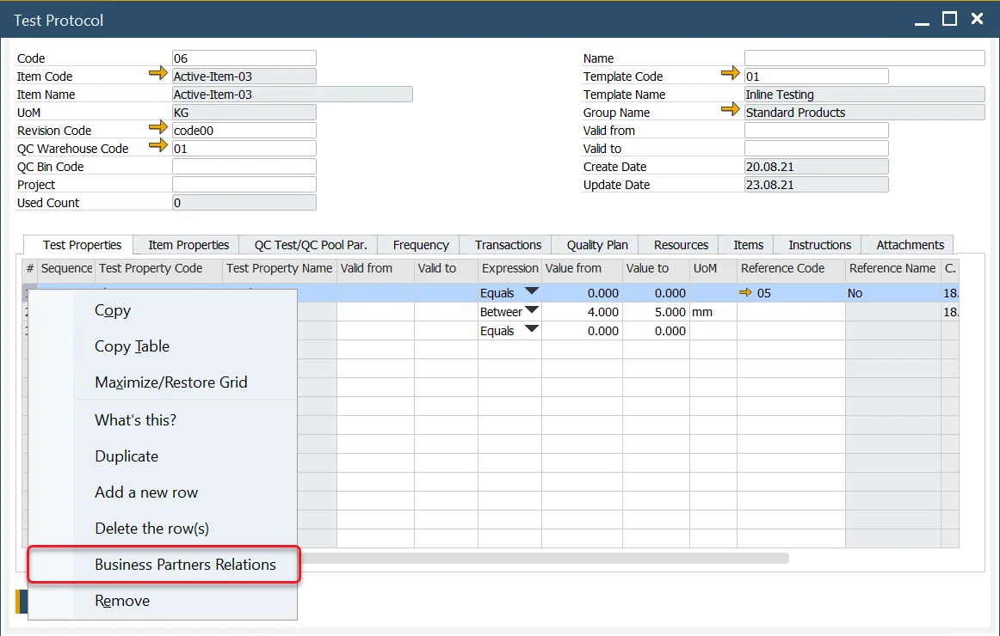
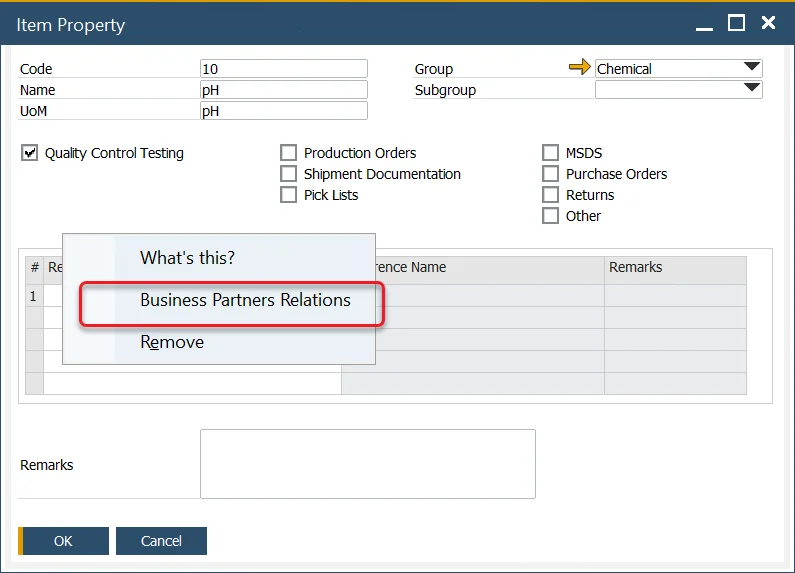
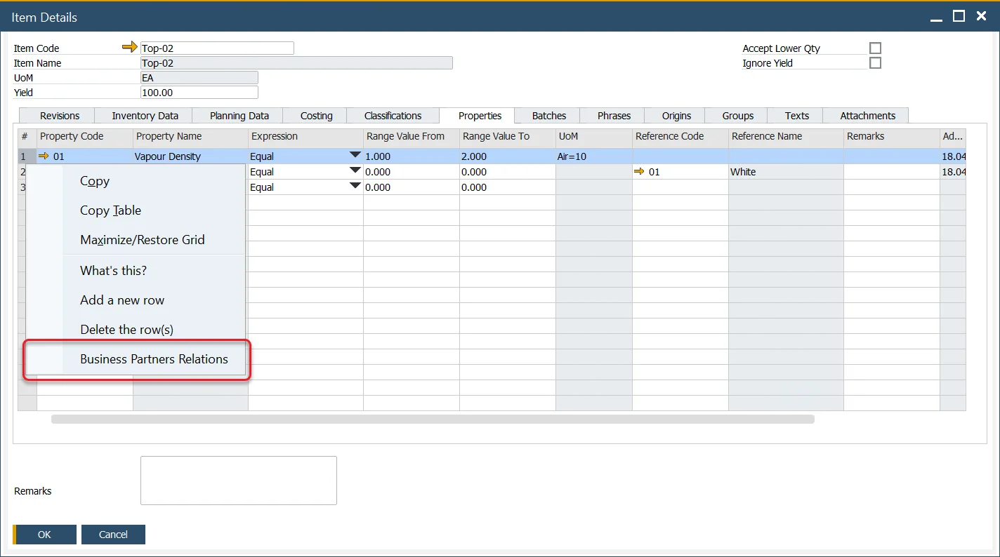
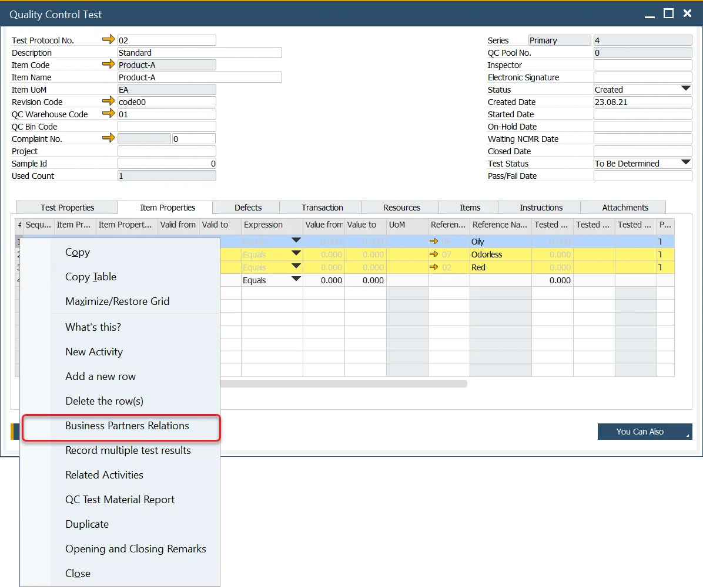

# Certificate of Analysis

A Certificate of Analysis (CoA) is a formal document that verifies that a product conforms to its specified standards. It typically includes the results of tests conducted during the quality control process for a particular batch of the product. CoAs are commonly requested by customers in industries such as food and chemicals, although any sector that requires product testing may request them. Different customers may request different information for the same product, depending on their individual requirements. ProcessForce offers a function to associate specific Test Properties and Item Properties with individual Business Partners, enabling the creation of customized CoAs that meet varying customer needs.

:::info
    Currently, ProcessForce allows assigning Business Partners to specific Test Properties or Item Properties. The functionality for generating Crystal Reports based on this data is expected to be released in upcoming versions of ProcessForce.
:::

## Test Property Assigning

To assign a Business Partner to a Test Property, you can use the Business Partners Relations option in the context menu on the Test Property form. This will associate the selected Business Partner with the property shown on the form:

This assignment can also be done on the Test Protocol form, within the Test Properties tab, by selecting a Test Property row:

Additionally, it can be set on the Test Protocol Template form:

You can also assign Business Partners on the Quality Control Test form:

## Item Property Assigning

Similarly, to assign a Business Partner to an Item Property, choose the Business Partners Relations option from the context menu on the Item Property form. This will assign the Business Partner to the selected property:

You can also do this on the Item Details form, within the Properties tab, by selecting the Item Property row:

Alternatively, this can be done from the Quality Control Test form:

## Certificate of Analysis Business Partners

After selecting the Business Partners Relations option, the Certificate of Analysis Business Partners form will appear:

In this form, you can choose a Business Partner and specify the period during which the Business Partner is assigned to a particular Property.

You can also set constraints for the Property, including:

- **Expression**: interval expression of interval in which tested value has to pass the test, e.g. Greater than, Equals.
- **Value From, Value To**: defines the numeric values of constraints.

---
