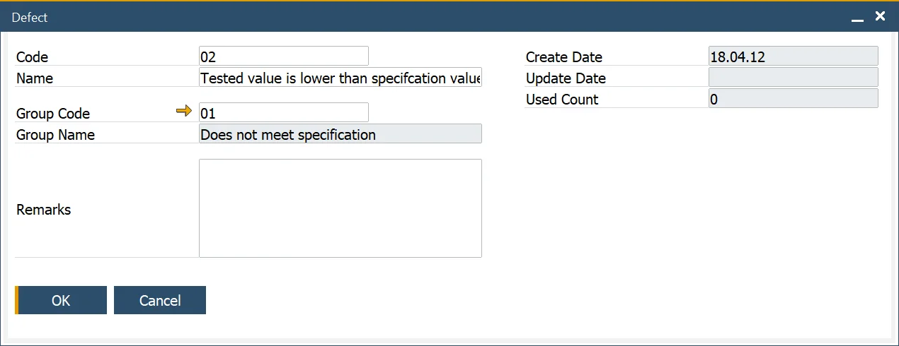

# Defects

In quality control, identifying and managing defects is essential for maintaining high standards and ensuring product reliability. The Defects and Defect Groups setup allows users to efficiently record, categorize, and analyze defects that arise during quality testing. This setup not only enhances reporting accuracy but also streamlines quality assurance processes.

---

## Defect

:::info Path
    Administration → Setup → Quality Control → Defects
:::

The Defects form enables users to define specific Defect Codes and associate them with a Group Code for streamlined reporting and detailed analysis. These codes are essential for documenting defects when an item fails quality tests.

Key features include:

- **Defect Codes**: Unique identifiers for recording specific defects.
- **Group Code**: Used to categorize defects for better organization.
- **Used Count**: Tracks the frequency of each Defect Code's usage, providing insights for quality improvement.

These Defect Codes are utilized within the Quality Control Test Form to log and monitor defective items effectively.

## Defect Groups

:::info Path
    Administration → Setup → Quality Control → Defect Groups
:::

The Defect Groups form allows users to organize individual Defect Codes into broader categories. This grouping facilitates detailed reporting and analysis, enabling better insights into recurring quality issues and trends.

---
