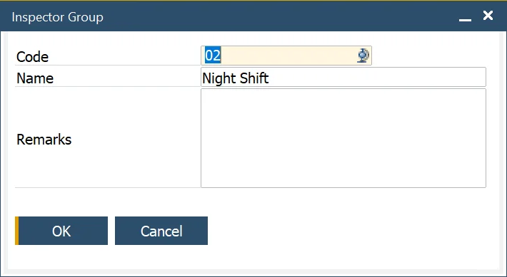

# Inspectors

Inspectors are integral to maintaining quality standards, ensuring thorough and accurate testing processes. The Inspectors, Inspector Groups, and NCMR Inspectors setups allow organizations to define, organize, and manage inspectors efficiently. These tools support streamlined task allocation, enhanced reporting, and better overall quality control.

---

:::info Path
    Administration → Setup → Quality Control → Inspectors
:::

## Inspectors

This form allows the user to define the Inspectors, used to conduct the Quality Control Tests and the Warehouse they are allocated to.

This data is utilized in the Quality Control Test Form to facilitate task assignment and tracking.

## Inspector Groups

:::info Path
    Administration → Setup → Quality Control → Inspector Groups
:::

This form allows the user to define Inspector Group codes, to categorize Inspectors, and is used within the Inspector and NCMR Inspector definition forms.

For example, Inspectors could be grouped by warehouse or specialization.

## NCMR Inspector

:::info Path
    Administration → Setup → Quality Control → Inspectors → NCMR Inspectors
:::

The NCMR Inspectors form is specifically designed for defining inspectors who handle the Non-Conformance Material Report (NCMR) process.

Key functionalities:

- **Inspector Allocation**: Assign inspectors for NCMR-related tasks.
- **Warehouse Allocation**: Designate a warehouse for each NCMR inspector.
- **NCMR Inspector Groups**: Similar to standard Inspector Groups, these can categorize inspectors for NCMR activities.

---
