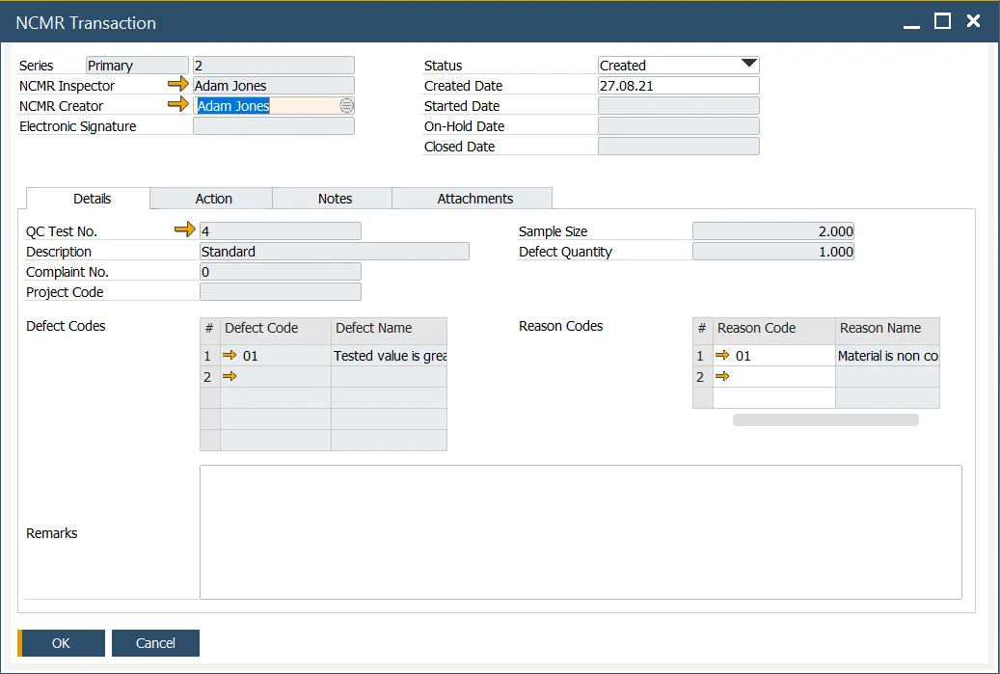
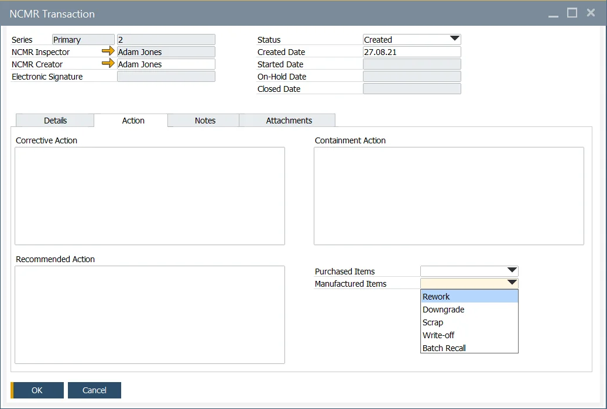
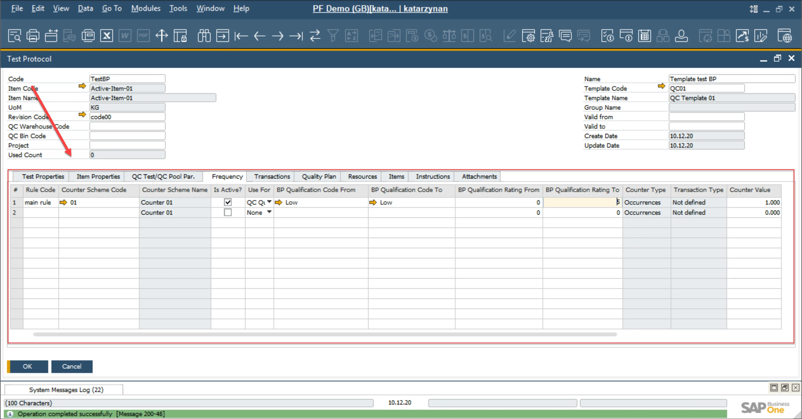

# NCMR - Non-Conforming Materials Report

Managing quality control effectively is critical for any organization to ensure that only conforming materials are processed further. The Non-Conforming Materials Report (NCMR) serves as a crucial tool to document and address materials or items that fail Quality Control Tests. By enabling users to record additional Reason Codes, specify Action Plans, and manage the associated workflow, NCMR ensures a systematic approach to resolving non-conformance issues while maintaining operational efficiency.

The NCMR transaction is created from a [Quality Control Test](../quality-control/quality-control-test/overview.md), ensuring seamless integration between quality control processes and corrective actions.

:::note Path
    Quality Control → NCMR Transaction
:::

---

## Header

Key details, such as the Series Number, NCMR Inspector, and Creator, are automatically copied into the NCMR form from the originating Quality Control Test.

The user is required to specify the Status and Date to track the lifecycle of the NCMR through the following stages: Created, Started, On-Hold, and Closed.

## Details

Information from the originating Quality Control Test, such as the QC Test Number, Description, Complaint Number, Project Code, Sample Size, Defect Quantity, and Defect Codes, is automatically populated in the NCMR.

The user reviews this information, along with the Quality Control Test results and complaint details, and then adds additional Reason Codes to document the cause of the failure.

## Action

The Action section allows users to define corrective measures for addressing non-conforming materials. This includes specifying:

- Corrective Actions
- Containment Actions
- Recommended Actions

The user can also select the appropriate inventory action and movement.

Based on the selected action from the drop-down fields, an Alert is sent to the appropriate user to perform the inventory action and movement.

## Notes

The Notes Tab provides a text field for entering any additional comments or context relevant to the NCMR document.

## Attachments

The Attachments Tab enables users to upload supporting files related to the document

## Creation

There are two ways to create an NCMR transaction:

- **From the Main Menu**: Users can create a new NCMR transaction directly from the main menu. In this scenario, only the Reason Code can be defined on the Details tab.
- **From the Quality Control Test Form**: Users can create an NCMR transaction by selecting the Create NCMR Transaction option from the You Can Also menu in the Quality Control Test form. The following conditions must be met:

  - The Quality Control Test form must be in Browse mode (not Add mode).
  - The NCMR checkbox on the Defects Tab must be checked.
  - The NCMR Inspector must be assigned on the Defects form.

Once these prerequisites are fulfilled, users can configure the Frequency Tab to define rules for non-conforming materials.

---
The Non-Conforming Materials Report (NCMR) provides a structured framework for identifying and addressing quality issues in materials. By integrating seamlessly with the Quality Control Test process, it allows users to efficiently track non-conformance, define corrective actions, and ensure accountability through alerts and documentation. Leveraging NCMR can help organizations reduce defects, improve product quality, and streamline their quality management processes.
