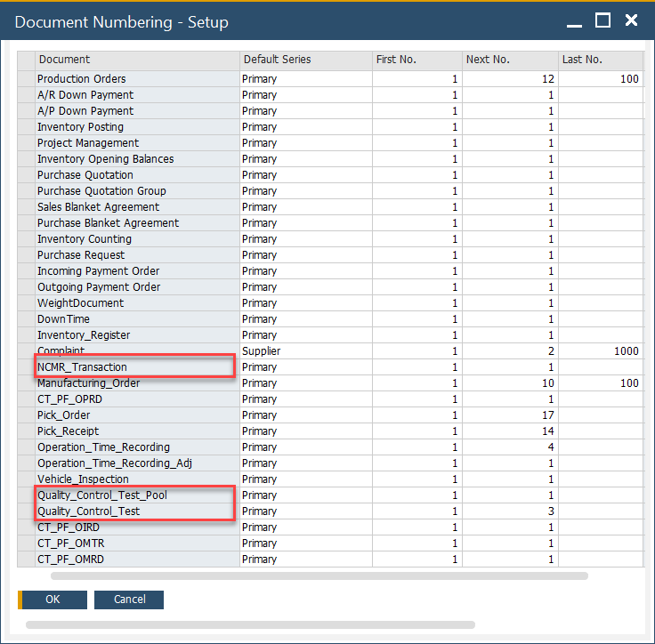
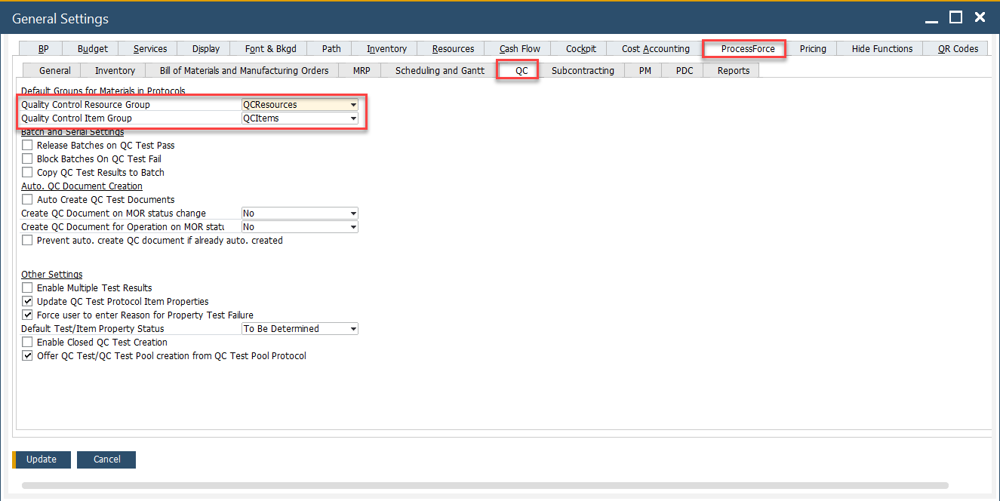
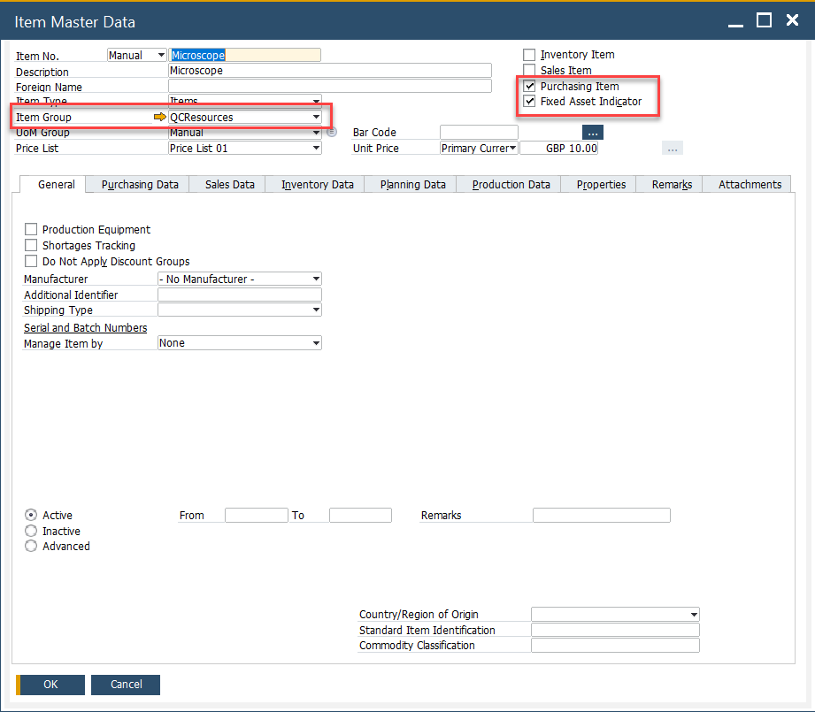
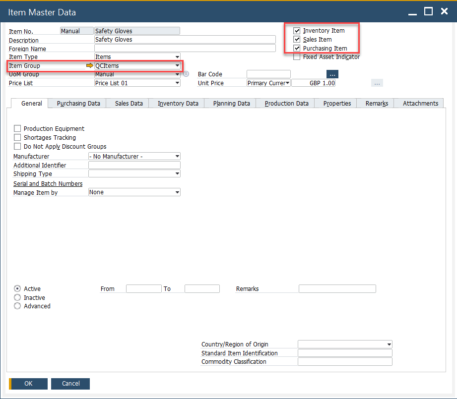

# Quality Control Configuration

The Quality Control Configuration section allows users to define the essential settings for conducting quality tests. This includes configuring Document Series Numbers, defining resources, and managing item information for the testing process. Proper configuration ensures seamless and accurate quality control processes across various testing activities.

This section provides a structured guide to setting up quality control settings in CompuTec ProcessForce. Use this page to understand, configure, and manage resources and items used in quality testing within SAP Business One.

---

## General Settings

Before setting up QC components, ensure that the Quality Control feature is activated and properly defined under system settings.

➡️ Learn more about [Quality Control](../../user-guide/system-initialization/general-settings/qc-tab.md).

## Document Series Number

The following Quality Control forms use **SAP Business One Document Numbering**:

- [Quality Control Test](./quality-control-test/overview.md)
- [NCMR (Non-Conforming Materials Report)](./ncmr-non-conforming-materials-report.md)
- [Quality Control Tests Pool](./test-protocols/quality-control-tests-pool.md)

    

## Resources

Resources refer to testing tools and equipment like microscopes, gauges, or X-ray machines. These are configured to appear in QC-related forms using specific filters in **Item Master Data**.

To define a resource:

- Check both **Purchase Item** and **Fixed Assets** fields in the item master.
- Assign the item to a designated **Item Group** (e.g., “QC Equipment”).
- Go to General Settings > ProcessForce Tab.
- Set that Item Group under **QC Resource Group**.

    

    

## Items

The Test Protocol and Quality Control Test forms also allow users to define specific items related to quality control, such as safety glasses, gloves, or chemicals used only within the Quality Control process and department. These forms filter the Item Master Data based on the following criteria:

- The Inventory, Sales, and Purchase Item fields are checked.
- Assign the item to a specific **Item Group** (e.g., “QC Consumables”).
- In **General Settings > ProcessForce Tab**, assign this group to **QC Item Group**.

    

---
