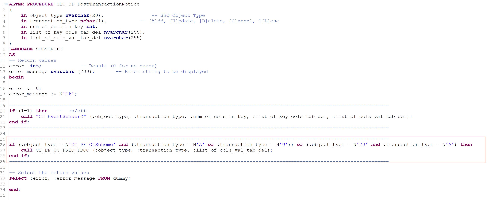
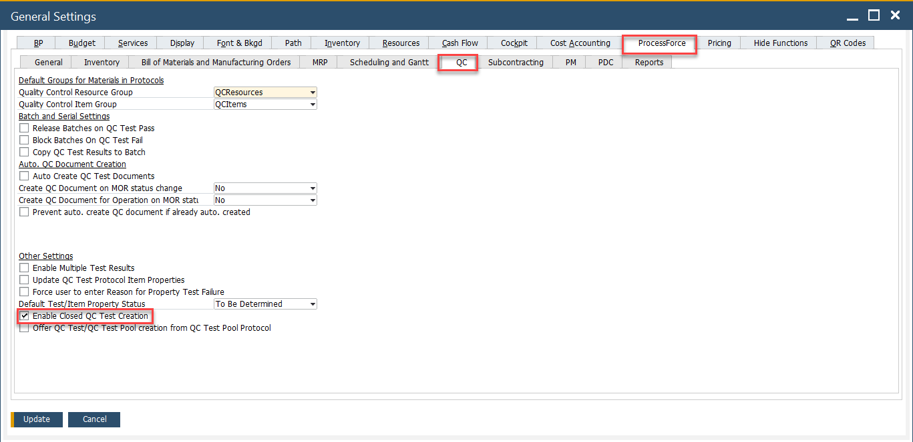
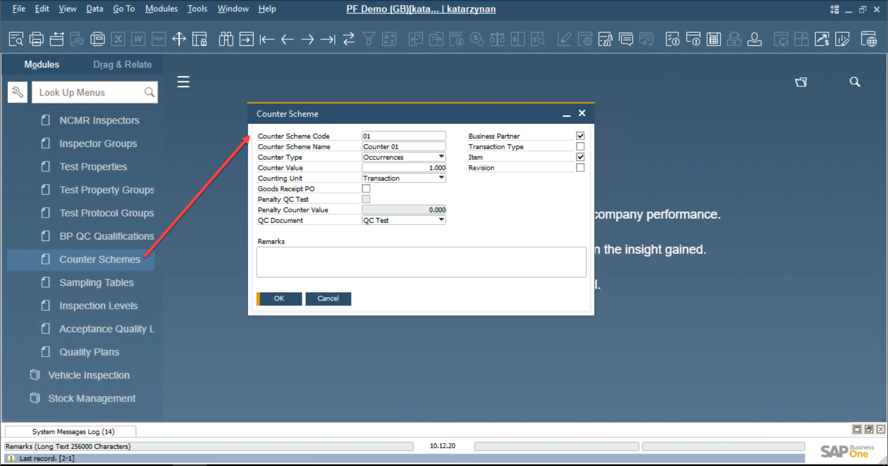
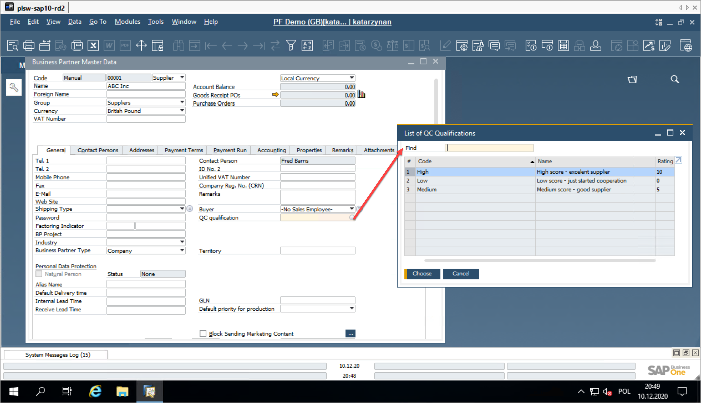
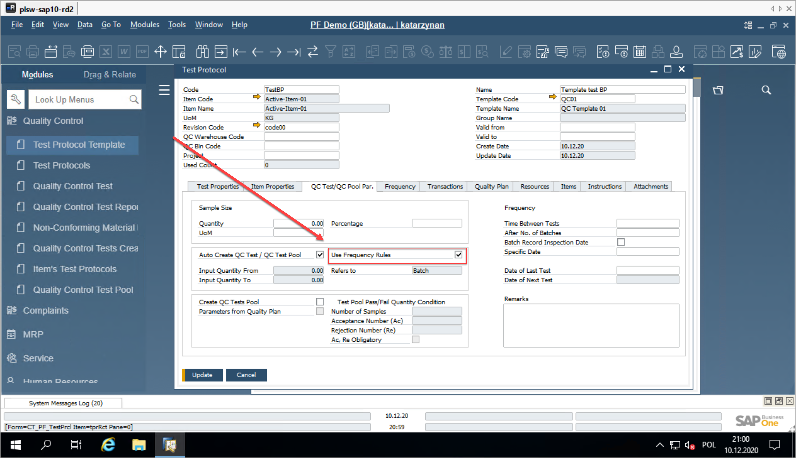
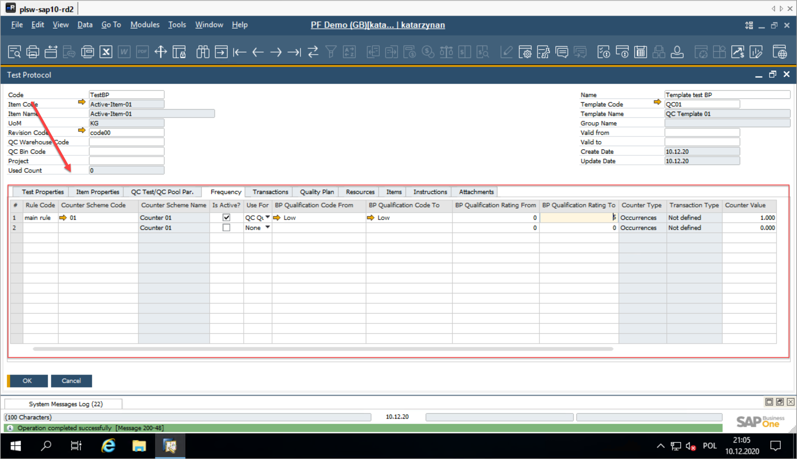

# Quality Control Frequency based on Supplier's Rating

This section outlines the Quality Control process based on the Supplier's rating, which evaluates the level of trust built through past collaborations. The generation of Quality Control Tests can be tied to and defined by this trust level.

In business, collaboration is essential - very few tasks can be completed alone. Building strong cooperative relationships is key to efficient process management. Another crucial principle that brings immense value is "trust and control." CompuTec ProcessForce enables you to integrate these principles by offering a supplier assessment card within the application, optimizing your business processes simultaneously.

Supplier scorecards are instrumental in tracking and evaluating a supplier's performance. These scorecards can range from simple to complex, with as many or as few criteria as necessary to achieve organizational goals. Proper use of supplier scorecards can strengthen relationships, reduce costs, and minimize errors. They also offer an objective method for assessing vendor performance.

Leveraging Quality Control Supplier Scorecards helps address the following:
    - Alignment of quality issues, errors, and mistakes with certified testing labs.
    - Implementation of an internal pre-shipment inspection system.

:::danger
    The current implementation supports this functionality for only one type of transaction: Goods Receipt PO, with the Counter Type set to Occurrences.

    It operates only when the "Enable Create Closed QC Tests from Frequency Rules" option is set to Yes (Administration → System Initialization → General Settings → ProcessForce tab → QC).
:::

:::caution
    Please note that for the correct operation of the function, the following piece of code has to be added to the PostTransactNotification database.

    <details>
        <summary>For SQL</summary>
        <div>
            ```sql title="Code to be added to Post transact procedure"
if (@object_type = N'CT_PF_CtScheme' and @transaction_type in (N'A', N'U')) or (@object_type = N'20' and @transaction_type = N'A')
begin
execute CT_PF_QC_FREQ_PROC @object_type, @transaction_type, @list_of_cols_val_tab_del
end
            ```
            
        </div>
    </details>

    <details>
        <summary>For HANA</summary>
        <div>
        ```sql title="Code to be added to Post transact procedure"
if (:object_type = N'CT_PF_CtScheme' and (:transaction_type = N'A' or :transaction_type = N'U')) or (:object_type = N'20' and :transaction_type = N'A') then
call CT_PF_QC_FREQ_PROC (:object_type, :transaction_type, :list_of_cols_val_tab_del);
end if;
            ```
            
        </div>
    </details>
:::

:::tip
    It is possible to set Auto-Creation of Test Protocol, which can be very useful in this functionality and is recommended to improve daily tasks on a customer's side.
:::

## General Settings

:::info Path
Administration → System Initialization → General Settings → ProcessForce tab → QC
:::

"Enable Create Closed QC Tests from Frequency Rules" option must be checked. QC Test, which not fulfills condition defined in Counter Schema (Counter Value), with ll be created with the status Closed. The system will generate QC Test for all transactions.



## BP QC Qualifications

:::info Path
    Administration → Setup → Quality Control → BP QC Qualifications
:::

To begin working with the Supplier Scorecard, you must first define the dictionary.

The initial step is to populate the BP QC Qualification with the data that represents the levels used to manage suppliers. The next step is to assign the QC Qualification to a Business Partner.

Below is an example of how this functionality can be implemented within the company.


## Counter Scheme

:::info Path
    Administration → Setup → Quality Control → Counter Scheme
:::

The Counter Scheme defines the framework for managing and controlling quality control processes (Quality Control Tests) at specific user-selected frequencies. Counters, based on the defined scheme, are milestones tied to QC Documents such as QC Tests or QC Pools. These counters are stored in a dedicated table.

    

The next step is to establish the Counter Scheme dictionary. This Counter is specifically designed to regulate quality control processes (Quality Control Tests) at the user-defined frequency. QC Documents, such as QC Tests and QC Pools, serve as key milestones for these counters.
The next thing is to define the Counter Scheme dictionary.

**Key Features of the Counter Scheme**

The Counter Scheme ensures proper scheduling and execution of quality control activities. Below is a detailed explanation of the fields and functionalities:

- **Counter Scheme Code**: A unique alphanumeric field used as the key identifier for the scheme.
- **Counter Schema Name**: A standard alphanumeric field for providing additional descriptive information about the counter.
- **Counter Type**: There are three main types of Counters:
        - Occurrences: Tracks the number of specific events (e.g., transactions, batches).
        - Amount of Time: Counts down the time until the next event (e.g., deadlines).
        - Date: Tracks events based on specific dates, such as Inspection Dates or Expiry Dates.
- **Occurrences**: Refers to counting units like Transactions, Batches, Serial Numbers, or Inventory UoM. Future options include After Time Period, After Specific Date, Before Expiry Date, and Before Inspection Date.
- **Counter Value**: Determines the threshold value of the defined unit of measure (UoM).
- **Counting Unit**: Specifies the unit to track, such as Transaction, Batch, Serial Number, Inventory UoM, Day, Week, or Month.
- **Counters counted on Transaction's base**: QC Tests or QC Pools are executed when the counted UoM Type value meets or exceeds the Counter Value after the last QC Test or QC Pool. For Occurrences, the UoM Type could include Transactions, Batches, Serial Numbers, or Inventory UoM.
- **Penalty QC Tests**: Defines the number of QC Tests to be executed as penalties when a QC Test fails (applicable for Counter Types: Occurrences, Time Period).
- **Penalty Counter Value**: Specifies the number of penalty QC Tests to be performed.
- **QC Document**: Represents the types of result documents used as milestones, such as QC Tests.
- **Business Partner**: When selected, it is included in the generated Counter ID and helps differentiate counters for a specific Frequency Rule.
- **Transaction Type**: When specified, it is included in the generated Counter ID and helps differentiate counters for a particular Frequency Rule.
- **Item**: If selected, this will be included in the generated Counter ID and used to differentiate counters for the frequency rule.
- **Revision**: If specified, it will be included in the generated Counter ID and will determine the distinction of counters for a particular frequency rule.

**Variable Components**:

The variable part of the Counter Scheme consists of:

- **Business Partner**: Derived from the transaction and filtered by the range defined in the Frequency Rule of the Test Protocol.
- **Item**: Derived from the transaction and filtered by the selection in the Test Protocol's header.
- **Revision**: Derived from the transaction and filtered by the selection in the Test Protocol's header.
- **Test Protocol**: Filtered based on the selection in the Test Protocol's header.
- **Batch**: Relevant for Batch Re-Tests.
- **Serial**: Relevant for Serial Re-Tests.

Examples of selectable criteria combinations:

| Business Partner | Transaction Type | Item  | Revision | Result: Counters will be counted for UoM Type per each: |
| :--------------: | :--------------: | :---: | :------: | :-----------------------------------------------------: |
|        x         |                  |       |          |                    Business Partner                     |
|        x         |        x         |       |          |           Business Partner & Transaction Type           |
|        x         |        x         |   x   |          |       Business Partner & Transaction Type & Item        |
|        x         |        x         |   x   |    x     |  Business Partner & Transaction Type & Item & Revision  |
|                  |                  |   x   |          |                 Business Partner & Item                 |
|                  |                  | ~~x~~ |  ~~x~~   |                  ~~Item & Revision\*~~                  |
|                  |      ~~x~~       | ~~x~~ |  ~~x~~   |        ~~Transaction Type & Item & Revision\*~~         |
|                  |      ~~x~~       |       |          |               ~~Transaction Type & TP\*~~               |

\* – options planned to be implemented in the next phase

## Business Partner Master Data

The Business Partner Master Data includes a field called QC Qualification, which must be completed to utilize the QC rating functionality. The available ratings are predefined in:

:::info Path
 Administration → Setup → Quality Control → QC Qualification.
:::



## Test Protocol

To effectively utilize Frequency Rules in your Quality Control (QC) process, it's essential to configure the Test Protocol correctly. This section guides you through the setup steps and explains each relevant field and function. Follow the steps below to ensure the setup is accurate.

1. Begin by enabling the "Use Frequency Rules" option within either the QC Test or QC Test Par section.

    

2. Navigate to the Frequency tab in the Test Protocol to define how and when QC tests are triggered.

    

**Key Fields in the Frequency Tab**:

- **Rule Code**: Unique alphanumeric code to identify the frequency rule.
- **Counter Scheme Code**: Selectable from existing predefined counter schemes.
- **Counter Schema Name**: Automatically derived from the selected Counter Scheme (UDS).
- **Active**: Indicates whether the rule is active (Yes/No).
- **Use For**: Defines how the rule applies. Options include:
        - QC Code: Based on a range of Business Partner QC Codes.
        - QC Rating: Based on a range of Business Partner QC Ratings.
        - None: Applies universally, ignoring partner qualification.
- **BP QC Code From / BP QC Code To**: Defines the range of BP QC qualification codes.
- **BP QC Rating From / BP QC Rating To**: Defines the range of BP QC ratings.
- **None**: Indicates that the rule applies universally, without BP QC considerations.
- **Counter Type**: Specifies the counter type, pulled from the Counter Scheme UDS.
- **Transaction Type**: The type selected from transactions configured in the TP/Frequency tab UDS.
- **Counter Value**:  A value defined within the Counter Scheme field.
- **Counting Unit**: A unit defined within the Counter Scheme UDS.
- **BP QC Code From / To (Business Partner Qualification)**: Specifies the range of qualification codes for the business partner.

**Close QC Tests Configuration**

The Close QC Tests functionality determines how tests are generated based on the frequency rule:

1. **Close QC Test = Yes**:
        - Tests are generated for all occurrences.
        - Tests that are not multiples of the Counter Value are automatically closed with Status = Closed and Test Status = Passed.
2. **Close QC Test = No**:
        - Tests are generated only for occurrences that are multiples of the Counter Value.

**Global Control**:

The Enable Create Closed QC Tests from Frequency Rules setting in General Settings globally toggles the above functionality. When enabled, it functions as described in the second configuration.

By properly configuring the Test Protocol and Frequency Rules, businesses can efficiently automate and manage QC processes, ensuring compliance and consistency in quality control.

## Counters Grid for Selected Rule

The Counters Grid provides detailed insights into various aspects of quality control tied to a selected rule. Below are the key attributes tracked in the grid:

- **Counter ID**: Unique identifier for the counter entry.
- **Current Counter**: The calculated count based on the Unit of Measure (UoM) type.
- **Current Penalty**: The calculated count of penalty QC Tests executed.
- **Total Counter**: The total count of all QC Tests conducted.
- **Total Penalty**: Total number of QC Tests conducted..
- **Business Partner**: The specific business partner instance that meets QC qualification ranges and Counter Scheme criteria.
- **Transaction Type**: The transaction type instance that satisfies the Counter Scheme criteria.
- **Item**: The item instance that matches the Counter Scheme criteria.
- **Revision**: The item revision instance that aligns with the Counter Scheme criteria.
- **Test Protocol**: The test protocol instance that fulfills the Counter Scheme criteria.
- **Planned Execution**:
        - For Counter Type = Time Period, it is calculated automatically.
        - For Counter Type = Specific Date, it is user-defined.
        - For Counter Type = Expiry Date or Inspection Date (Transaction Re-Test), it is imported from the Batch or Serial Record.
- **Number of Applications**: The calculated count of QC Tests performed, excluding penalty QC Tests.
- **First Execution**: The estimated date of the first QC Test.
- **Last Execution**: The estimated date of the most recent QC Test.

This grid provides a comprehensive overview, allowing businesses to monitor and analyze quality control performance effectively. It ensures compliance with the established QC rules and aids in maintaining consistent quality standards.

---
