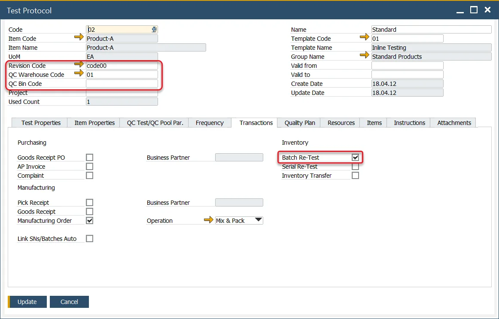
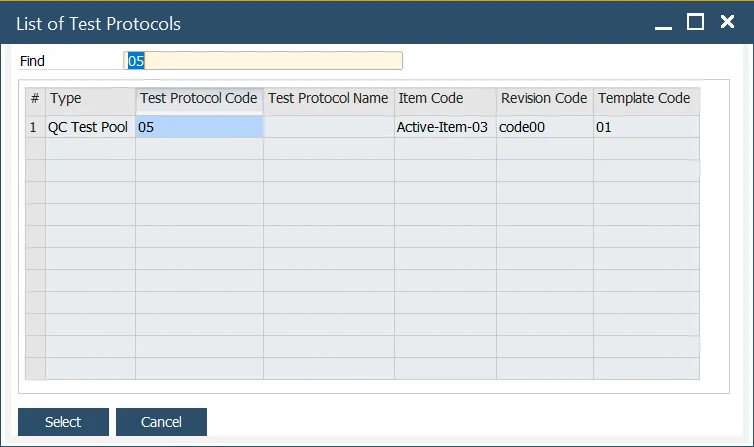

# Creating QC test from Batch Record

Quality assurance is a critical component of maintaining product standards, and the ability to generate a Quality Control Test directly from the Batch Master Data form simplifies this process. This feature, integrated into ProcessForce and SAP Business One, ensures consistency and accuracy by utilizing predefined Test Protocols tied to specific items, revisions, and warehouses.

---

## Master Data Setup

To define a Test Protocol for Quality Control, ensure the following parameters are configured:

- Item Code
- Item Revision
- Warehouse (and Bin, if applicable)
- Check the Batch Re-Test field within the Transactions tab
- QC Test/Pool Par. tab → Create QC Tests Pool – choose this option if you want to create a Quality Control Tests Pool instead of a single Quality Control Test.

## Creation

To create a Quality Control Test for a specific batch:

1. Open the Batch Master Data record.
2. From the context menu in the header, select Create Quality Control Test/Pool.
3. A list of available Test Protocols will be displayed, filtered by Item Code, Revision Code, and Warehouse.

    

    >Note: If the chosen Test Protocol is of [Quality Control Test Pool](../test-protocols/quality-control-tests-pool.md) type, you can either create a Quality Control Test or a Quality Control Test Pool based on the [General Settings](../../system-initialization/general-settings/qc-tab.md) option.
4. Select the Test Protocol, and the Quality Control Test / Quality Control Test Pool document will open.

    
5. The Batch Number from the Batch Master Data form is automatically populated in the Transaction Tab of the newly created Quality Control Test.

---
By integrating the creation of Quality Control Tests with Batch Master Data, this feature simplifies the quality assurance process while maintaining precision. Predefined Test Protocols and batch-specific parameters ensure that quality checks align with operational requirements, promoting efficiency and compliance throughout the testing workflow.
