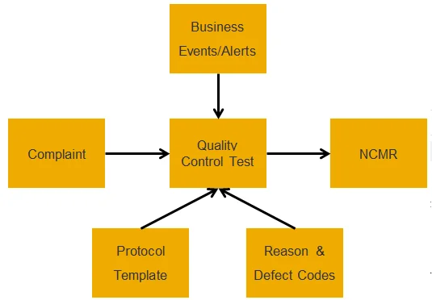
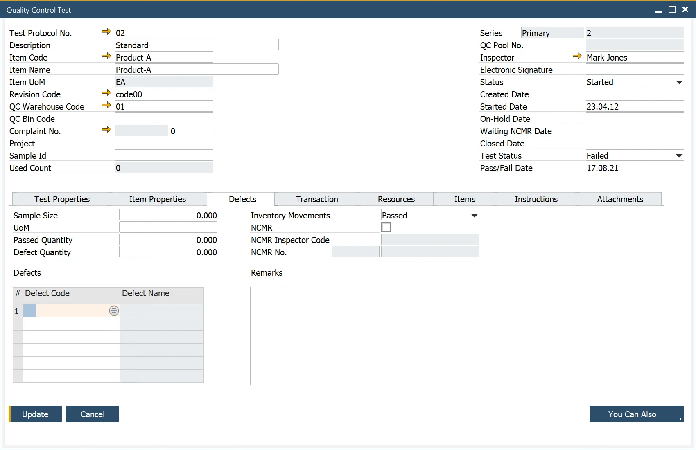
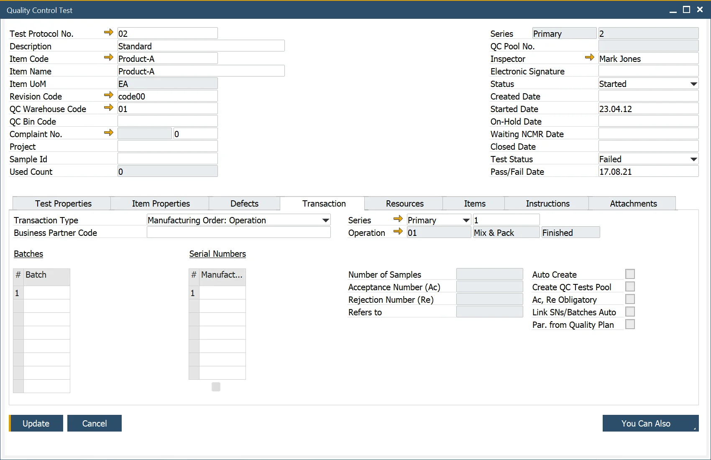
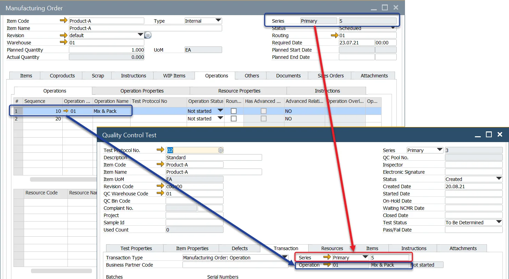
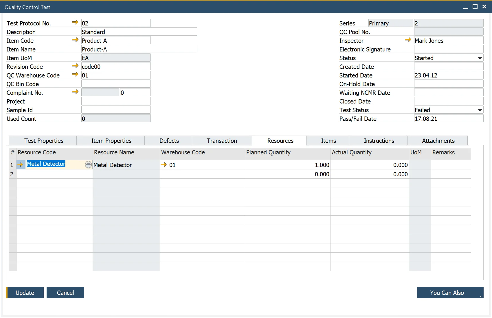
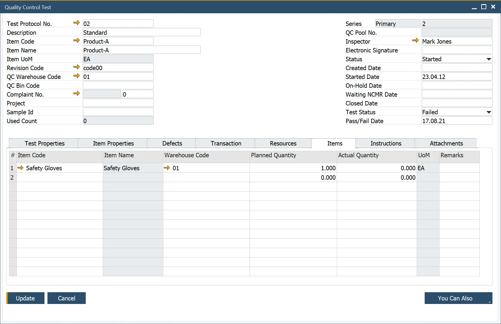
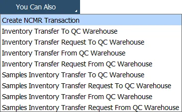

# Overview

## Introduction

The Quality Control Testing process is a seamlessly integrated solution that leverages CompuTec ProcessForce and SAP Business One data, processes, and technologies. This functionality utilizes business events and triggers, along with SAP Business One Alert features, to notify users when a Quality Control Test needs to be conducted.
The Quality Control Test Form provides all the essential information required to carry out the necessary activities efficiently.

---

:::info Path
    Quality Control → Quality Control Test
:::

## Header

This form allows the user to create a Quality Control Test.

1. Select and add a  [Test Protocol](../test-protocols/test-protocol-for-operation.md) Number. All data defined within the Test Protocol will be copied into the Quality Control Test.
2. Select and add a Document Series Number.
3. Select and add the Inspector responsible for conducting the test.
4. Select the appropriate status and date. (Created, Started, On-Hold, Waiting NCMR, Closed).

>Note: When moving the life cycle of the Quality Control Test, the system will require adding a date of the status change.

The Used Count field tracks how many times the Quality Control Test has been performed, useful for reporting and analysis.

Once the Test is complete, the Test Status can be marked as Pass or Fail, with the corresponding date entered.

## Test Properties

>Note: The Test and Item Properties are copied from the [Test Protocol](../test-protocols/overview.md). Additional Properties can be added and deleted from both tabs.

- The [Test Properties](../../quality-control/test-properties.md) tab allows the user to record the results of the Tests.
- Within the Tested Value and Tested Reference Code, the user enters the tested value and selects the Pass/Fail option.
- A Pass result will be highlighted in Green, while a Fail will appear in red.
- If the result is a Fail, users can enter a Reason Code and add any Remarks.

## Item Properties

The Item Properties tab enables users to record the results of the item properties tested. It functions similarly to the Test Properties tab.

## Defects

The Defects tab allows users to view the sample size and enter the quantities for both Passed and Defective results.

[Defect codes](../defects.md) can be added to categorize the failure, which aids in analysis and reporting Note that these codes are transferred to the NCMR transaction.

Once the Quality Control Test is complete, users can specify the type of inventory movement required. An alert will be sent to the designated user to perform the corresponding inventory transaction.

### Raising Non-Conforming Materials Report - NCMR

If a Quality Control Test fails, the user can initiate the creation of an NCMR. Click [here](../ncmr-non-conforming-materials-report.md) to find out more about NCMR.

To create an NCMR, the user must check the NCMR checkbox and select an NCMR Inspector Code in the Defects tab.

Click the "You Can Also" button and choose the Create NCMRTRansaction option.

## Transaction

The Transaction tab provides users with details about the transaction type, including where the testing should take place (i.e., Supplier or Customer).

Users can also record the associated batch and serial numbers.

Additionally, it is possible to [automatically change assigned Batches' status on passing Quality Control Test](../../../user-guide/system-initialization/general-settings/qc-tab.md).

### Creating Quality Control Test for an Operation on Manufacturing Order

A Quality Control Test can be created for a specific operation, with the resulting Quality Control Test document's Transaction tab automatically populated with data from the selected operation line.

#### Prerequisites

- A [Test Protocol](../test-protocols/overview.md#transactions) defined for a specific Operation.
- A Manufacturing Order must be in one of the following statuses: Scheduled, Released, Started, Finished.

#### Performance

Right-click on an operation line in the Manufacturing Order → Operations tab and choose Quality Control → Create Quality Control for Operation.

Next, select a Test Protocol from the list provided.

Alternatively, you can right-click on an operation line and choose Quality Control → Open Existing Quality Control Test for Operation to view previously created tests.

## Resources

The Resources tab allows users to view and record the resources and quantities utilized during the Quality Control Testing process. These resources typically refer to items such as tools used during the test.

On the Resources tab, only items assigned to the QCResources item group can be added, as this group is set by default for Quality Control Resources. You can find instructions on how to configure this Item Group [here](https://learn.computec.one/docs/processforce/user-guide/system-initialization/general-settings/qc-tab). By default, the QCResources group is used for this purpose.

## Items

The Items tab allows users to view and record the items and quantities used during the Quality Control Testing process, such as safety gloves.

Only items assigned to the QCItems group can be added in this tab. By default, the QCItems group is designated for this purpose. For more details on how to set up this Item Group, refer to the provided instructions.

## Instructions

The Instructions tab provides guidance on how to perform the Quality Control Test.

Users can also add notes to this section if needed.

## Attachments

The Attachments tab provides access to documents related to performing the Quality Control Test.

Users can also add additional attachments in this section if necessary.

## Inventory Transfer

Using the "You Can Also" button, you can create Inventory Transfer Requests and perform Inventory Transfers to or from the QC Warehouse specified in the header.

## Duplicate Option

The duplicate feature enables users to create a copy of the currently open document.

When duplicating, the content from all tabs and header data is copied, with the following modifications:

- The electronic signature field is cleared.
- The status field value is set to "Created".
- Test Status field value is set to "To Be Determined".
- Pass/Fail Date field value is cleared.
- Document Number is changed to the next one in a Series.

The duplicated document opens in adding mode, allowing users to make any necessary edits. Once all required details are updated, click the "Add" button to save the new record.

---
