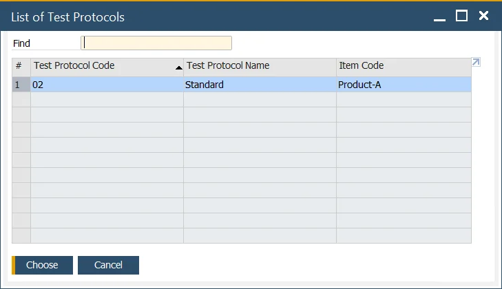
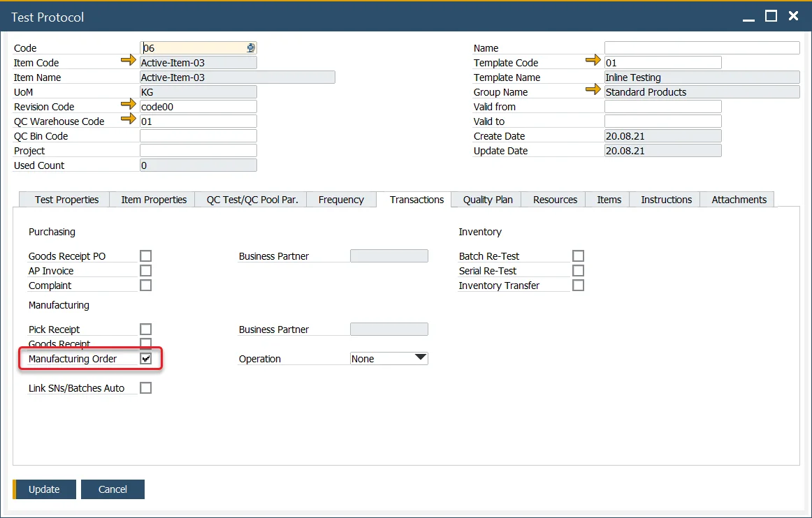
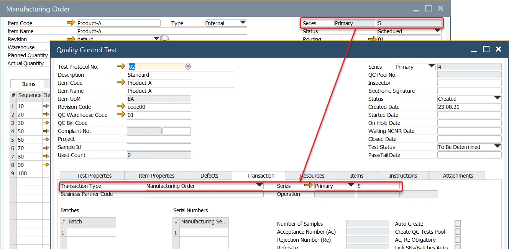
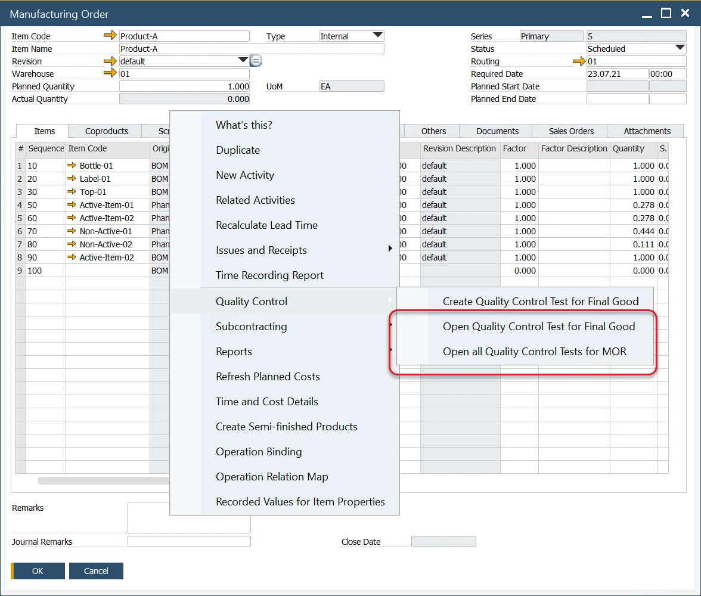
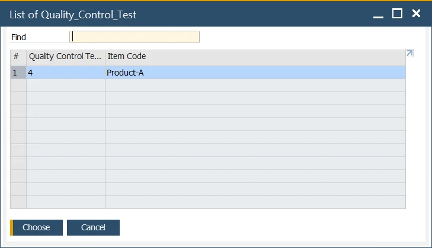

# Quality Control Tests from a Manufacturing Order

The Quality Control Tests creation process can also be initiated directly from the Manufacturing Order context menu. This method allows users to either create new Quality Control Tests or view those that have already been generated for a Manufacturing Order.

---

## Creating a Quality Control Test from a Manufacturing Order

1. To create a Quality Control Test, right-click on the Manufacturing Order form and select the Create Quality Control Test option:

    

2. A list of available Test Protocols will be shown:

    

3. Select the appropriate Test Protocol and click Choose.

    >Note: A Test Protocol must be created with the correct data and the Manufacturing Order checkbox checked to appear in this list. Click [here](../test-protocols/overview.md) to check how to create a Test Protocol.

    

4. A Quality Control Test will be created with corresponding data. Click Add button to post it.

    

## View Existing Quality Control Tests

1. You can also view Quality Control Tests for a specific Final Good or the entire Manufacturing Order.

    

2. A list of all associated Quality Control Tests will be displayed:

    

---
By following these steps, you can efficiently create and access Quality Control Tests directly from the Manufacturing Order, streamlining the quality assurance process within your production workflow.
