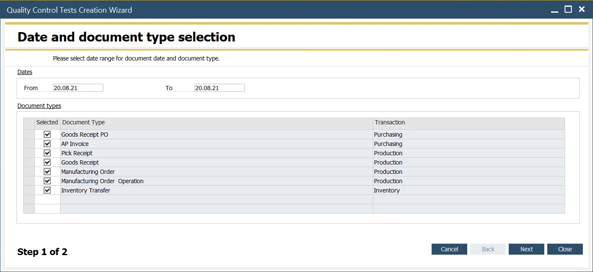

# Quality Control Tests Creation Wizard

This option allows for the mass creation of Quality Control Test documents. It can be useful, for example, for creating necessary documents that haven't been generated by any automatic process.

---

:::info Path
    Quality Control Test → Quality Control Tests Creation Wizard
:::

## Step 1. Document Types and Dates

Choose the document type(s) for which Quality Control Tests documents will be created and the date range (of base documents).

## Step 2. Choosing Specific Documents

In this step, you have a list of documents based on the filter conditions set in the previous step that does not have related Quality Control Tests created. Checking/unchecking checkboxes in the Selected column, choose the required documents. Click Run after that to create related Quality Control Documents.
