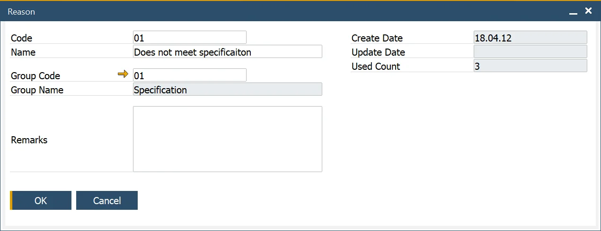
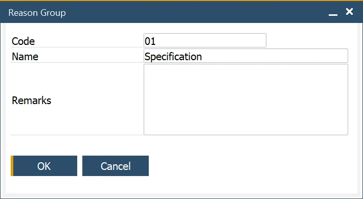
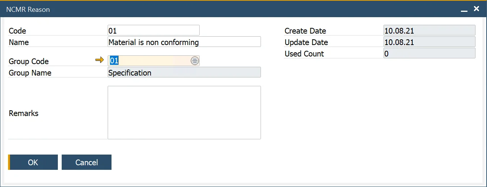

# Reason

In quality control, understanding why tests fail is crucial for driving improvements and preventing recurring issues. The Reason, Reason Groups, and NCMR Reason setups enable users to define, categorize, and analyze failure reasons within the quality control process.

---

:::info Path
    Administration → Setup → Quality Control → Reasons
:::

The Reason form allows the user to define the Reasons why a specific [Test Property](./test-properties.md) and [Item Property](../item-details/item-properties.md) fail during the Quality Control Test process. These defined reasons are critical for in-depth analysis and reporting.

Key features include:

- **Reason Codes**: Unique identifiers for documenting specific failure reasons.
- **Used Count**: Tracks how often each Reason Code is used, offering insights into recurring issues.

## Reason Groups

:::info Path
    Administration → Setup → Quality Control → Reason Groups
:::

The Reason Groups form enables users to categorize individual reasons into broader groups. These groupings simplify analysis and reporting, making it easier to identify patterns and prioritize corrective actions.

## NCMR Reason

:::info Path
    Quality Control → Reasons → NCMR Reasons
:::

The NCMR Reason form is used to define reasons for Non-Conformance Material Reports (NCMR) during the Quality Control Test process and is used for analysis and reporting purposes.

Key features include:

- **Reason Codes**: Specific to NCMR-related test failures.
- **Used Count**: Tracks the usage frequency of each NCMR Reason Code for better reporting.
- **Reason Groups**: NCMR Reasons can be assigned to specific groups for more detailed categorization.

---

Effectively managing failure reasons is vital for maintaining quality standards and driving continuous improvement. By leveraging the Reason, Reason Groups, and NCMR Reasons setups, organizations can identify recurring issues, improve reporting accuracy, and implement targeted corrective actions. This structured approach ensures that failure data becomes a valuable resource for enhancing product quality and operational efficiency.
